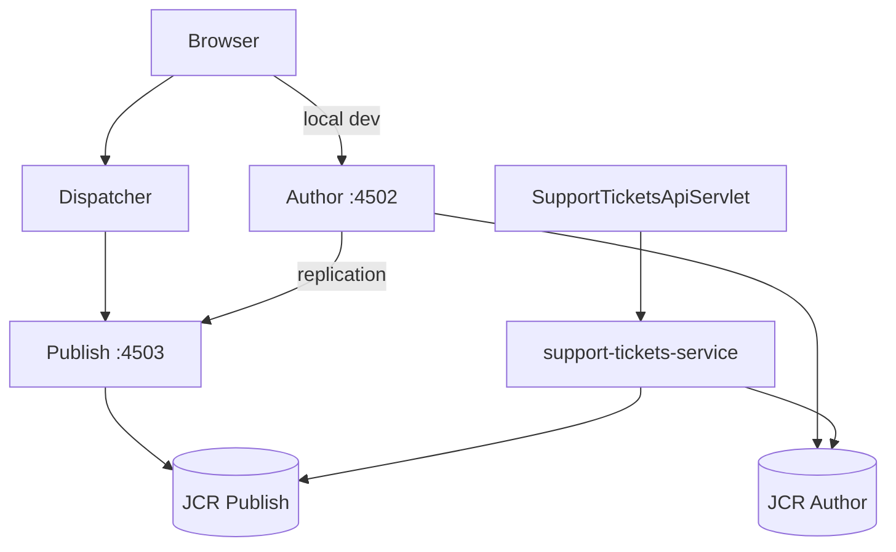
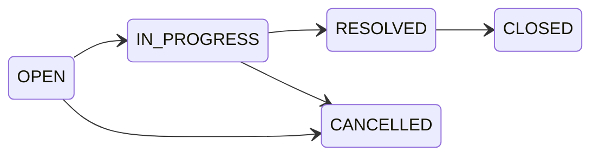

# Support Ticket Management System

**Platform:** Adobe Experience Manager as a Cloud Service (AEMaaCS)  
**Maven coordinates:** `com.supporttickets:support-tickets:1.0.0-SNAPSHOT`  
**Assessment:** AI Practical Assessment — lifecycle artifacts and Core implementation

---

## 1. Project overview

This repository contains an AEM-native **Support Ticket Management System**: a small internal application for creating, listing, updating, commenting on, searching, and filtering support tickets through a defined lifecycle.

The application includes:

- A **browser UI** (three HTL pages with Clientlibs JavaScript)
- A **JSON REST API** at `/bin/support-tickets`
- **JCR persistence** under `/content/support-tickets/tickets`
- **Repoinit** scripts for repository setup, service user, ACLs, and seeded users
- **Automated Core tests** (131 JUnit tests via AEM Mock)

The assessment evaluates AI-assisted engineering across the full lifecycle. Planning, design, testing, review, and implementation artifacts live alongside the code in this repository.

---

## 2. Business purpose

The system lets support staff:

- Create tickets with title, description, priority, creator, and optional assignee
- List and search tickets; filter by status
- View ticket detail including comments and allowed status transitions
- Update ticket fields (not status directly)
- Progress tickets through an enforced state machine
- Add comments to tickets

Users are **seeded AEM principals** only (no user-management UI). Authentication is **not implemented** in Core — the API is open to callers who can reach the servlet.

---

## 3. Technology stack

| Layer | Technology |
|-------|------------|
| Platform | AEM as a Cloud Service (local AEM SDK Quickstart) |
| Backend | Java 21 OSGi bundle (`core`) |
| API | Sling Servlets, Gson JSON |
| Persistence | JCR (Oak) — tickets and comments as `nt:unstructured` nodes |
| Frontend | HTL + Clientlibs (`clientlib-support-app`) — vanilla JavaScript |
| Build | Apache Maven 3.3.9+ |
| Unit / integration tests | JUnit 5, Mockito, io.wcm.testing AEM Mock 5.5.4 |
| Live integration tests | AEM Testing Clients (`it.tests`, requires running AEM) |
| UI tests | Cypress scaffolding (`ui.tests`; lint runs in build) |
| Dispatcher | Cloud-optimized Dispatcher config (`dispatcher`, `dispatcher.ams`) |
| Deployment target | Adobe Cloud Manager Full Stack Pipelines |

**AEM SDK API dependency** (parent `pom.xml`): `2026.8.27673.20260811T193135Z-260700`

---

## 4. AEM architecture



| Tier | Role |
|------|------|
| **Author** (`localhost:4502`) | Content authoring, local development, package install |
| **Publish** (`localhost:4503`) | Published content and app pages |
| **Dispatcher** | Caching, filtering, routing to Publish (port 80 in local SDK Docker setup) |

**Write path:** UI and API mutations persist via the `support-tickets-service` OSGi service user. Tickets are stored at `/content/support-tickets/tickets/{uuid}`.

**API routing:** `SupportTicketsApiServlet` handles `/bin/support-tickets.json`. Nested paths (`/users.json`, `/{id}.json`, etc.) are resolved by `SupportTicketsApiResourceProvider` (synthetic resources) and servlet binding on resource type `support-tickets/api`.

---

## 5. Repository / project structure

```
ai-practical-assessment/
├── pom.xml                          # Parent POM (reactor)
├── .cloudmanager/java-version       # Cloud Manager Java version (21)
├── core/                            # OSGi bundle — API, services, repository, tests
├── ui.apps/                         # HTL components, clientlibs, apps code
├── ui.apps.structure/               # Repository structure package
├── ui.config/                       # OSGi configs, repoinit, service-user mapping
├── ui.content/                      # Support-app pages, templates, sample content
├── all/                             # Aggregator content package for deployment
├── dispatcher/                      # Dispatcher cloud config
├── dispatcher.ams/                  # Dispatcher AMS variant
├── it.tests/                        # Live AEM integration tests (archetype samples)
├── ui.tests/                        # Cypress UI test module
├── ui.frontend.react.forms.af/      # Archetype Forms frontend (builds in reactor)
├── requirements-analysis.md         # Lifecycle: requirements
├── acceptance-criteria.md           # Lifecycle: 67 ACs
├── design-notes.md                  # Lifecycle: architecture
├── data-model.md                    # Lifecycle: JCR model
├── api-contract.md                  # Lifecycle: REST contract
├── ui-flow.md                       # Lifecycle: UI screens
├── implementation-plan.md           # Lifecycle: phased tasks
├── test-strategy.md                 # Lifecycle: test approach
├── test-results.md                  # Lifecycle: execution evidence
├── code-review-notes.md             # Lifecycle: formal review
├── review-fixes.md                  # Lifecycle: fix log
├── tool-workflow.md                 # Lifecycle: AI/tool usage
└── AGENTS.md                        # Agent/build guidance
```

---

## 6. Prerequisites

| Requirement | Details |
|-------------|---------|
| **JDK** | **Java 21** (`.cloudmanager/java-version` = `21`; compiler `<release>21</release>`) |
| **Maven** | 3.3.9 or higher (enforcer rule in parent POM) |
| **AEM SDK** | Local AEM Author/Publish Quickstart matching project SDK API version |
| **Network** | Maven access to Adobe public repository (configured in parent POM) |
| **Optional** | Dispatcher SDK / Docker for Dispatcher validation |
| **Optional** | Node.js (used by `ui.tests` and `ui.frontend.react.forms.af` during Maven build) |

**Verified build environment** ([test-results.md](test-results.md)): Windows 11, Java 21.0.9, Maven 3.9.14.

> **Note:** The machine may default to Java 11 via `JAVA_HOME`. Set `JAVA_HOME` to JDK 21 before building (see §12).

---

## 7. Java version

| Source | Version |
|--------|---------|
| `.cloudmanager/java-version` | `21` |
| `pom.xml` `maven-compiler-plugin` | `<release>21</release>` |
| Maven Enforcer | Requires Java **11+** to run Maven (message in POM) |

Cloud Manager pipelines use the version in `.cloudmanager/java-version`. Use the same locally.

---

## 8. Maven requirements

Common commands (from [AGENTS.md](AGENTS.md)):

| Command | Purpose |
|---------|---------|
| `mvn clean install` | Full reactor build |
| `mvn clean install -PautoInstallSinglePackage` | Build and deploy `all` package to local Author |
| `mvn clean install -PautoInstallSinglePackagePublish` | Deploy to local Publish |
| `mvn clean install -pl <module> -PautoInstallPackage` | Deploy single content package |
| `mvn clean install -pl core -PautoInstallBundle` | Deploy OSGi bundle only |
| `mvn -pl core test` | Run Core unit/integration tests |
| `mvn clean verify -Plocal` | Run live AEM ITs (`it.tests`; requires running instance) |

**Maven properties** (parent `pom.xml`, overridable with `-D`):

| Property | Default | Purpose |
|----------|---------|---------|
| `aem.host` | `localhost` | Author host |
| `aem.port` | `4502` | Author port |
| `aem.publish.host` | `localhost` | Publish host |
| `aem.publish.port` | `4503` | Publish port |
| `sling.user` / `vault.user` | `admin` | Package install credentials |
| `sling.password` / `vault.password` | `admin` | Package install credentials |

---

## 9. AEM SDK requirements

- Project targets **AEM as a Cloud Service** (`aemVersion=cloud` in archetype).
- SDK API artifact: `com.adobe.aem:aem-sdk-api:2026.8.27673.20260811T193135Z-260700`
- Install a compatible **AEM SDK Quickstart** locally for Author (`4502`) and optionally Publish (`4503`).
- Package deployment uses Package Manager at `http://localhost:4502/crx/packmgr/service.jsp` (Author) or `:4503` (Publish).

[Specific Quickstart JAR version used locally: not recorded in project artifacts]

---

## 10. Local AEM setup

1. Install **JDK 21** and set `JAVA_HOME` (PowerShell example):

   ```powershell
   $env:JAVA_HOME = "C:\Program Files\Java\jdk-21.0.9"
   $env:PATH = "$env:JAVA_HOME\bin;$env:PATH"
   java --version
   ```

2. Start **AEM Author** Quickstart on port `4502`.

3. Build and deploy:

   ```bash
   mvn clean install -PautoInstallSinglePackage
   ```

4. Verify repoinit ran: check OSGi console for `RepositoryInitializer~supporttickets` and users under `/home/users/support/`.

5. (Optional) Start **Publish** on `4503` and deploy with `-PautoInstallSinglePackagePublish`.

---

## 11. Author / Publisher / Dispatcher topology

| Component | Default URL | Purpose |
|-----------|-------------|---------|
| Author | `http://localhost:4502` | Development, package install, content editing |
| Publish | `http://localhost:4503` | Published app surface |
| Dispatcher | Port 80 (SDK Docker) | Filters, cache, routes to Publish |

**Design intent** ([design-notes.md](design-notes.md)): browser traffic in production flows **Dispatcher → Publish**. Author is the write master; content replicates to Publish.

**Known gap** ([code-review-notes.md](code-review-notes.md) CR-001): Dispatcher `default_filters.any` has `/bin/*` commented out — API calls through Dispatcher on Publish may need an explicit allow rule for `/bin/support-tickets`.

---

## 12. Build instructions

Full build:

```bash
mvn clean install
```

On Windows with multiple JDKs installed, set Java 21 first (see §10).

**Last recorded result** ([test-results.md](test-results.md)):

| Command | Result | Finished |
|---------|--------|----------|
| `mvn -B clean install` | **BUILD SUCCESS** | 2026-08-31T12:14:30+05:30 |
| `mvn -B -pl core test` | **BUILD SUCCESS**, 131 tests, 0 failures | 2026-08-31T12:08:46+05:30 |

---

## 13. Deployment / install instructions

### Full application (recommended)

```bash
mvn clean install -PautoInstallSinglePackage
```

Deploys `all/target/support-tickets.all-1.0.0-SNAPSHOT.zip` to Author Package Manager.

### Publish

```bash
mvn clean install -PautoInstallSinglePackagePublish
```

### Core bundle only (after Java changes)

```bash
mvn clean install -pl core -PautoInstallBundle
```

### Config only (repoinit / ACL changes)

```bash
mvn clean install -pl ui.config -PautoInstallPackage
```

[Result of `-PautoInstallSinglePackage` in project artifacts: not recorded in test-results.md]

---

## 14. Configuration

| Location | Purpose |
|----------|---------|
| `ui.config/.../RepositoryInitializer~supporttickets.cfg.json` | JCR paths, service user, seeded users, ACLs |
| `ui.config/.../ServiceUserMapperImpl.amended~supporttickets.cfg.json` | Maps `support-tickets.core:support-tickets-service` → `support-tickets-service` |
| `core/.../SupportAppPageModel.java` | Exposes API base and page URLs to HTL |
| `dispatcher/` | Dispatcher filters, cache rules, vhosts |

**Seeded users** (repoinit):

| Path | Role |
|------|------|
| `/home/users/support/agent1` | AGENT |
| `/home/users/support/agent2` | AGENT |
| `/home/users/support/supervisor1` | SUPERVISOR |

**Ticket storage:** `/content/support-tickets/tickets/{uuid}`

---

## 15. Environment variables

This project does **not** use application-level environment variables (no `.env` file).

| Mechanism | Usage |
|-----------|--------|
| `JAVA_HOME` | OS-level; must point to JDK 21 for local builds (developer responsibility) |
| Maven `-D` properties | Override `aem.host`, `aem.port`, credentials for package install |
| `it.tests` `-Plocal` | `it.author.url`, `it.author.user`, `it.author.password`, etc. (Maven properties, not env vars) |

Default local install credentials (`admin`/`admin`) are **AEM Quickstart defaults** in `pom.xml` — not for production.

---

## 16. How to run the application

### UI pages (after deploy to Author)

| Screen | URL |
|--------|-----|
| Ticket list | `http://localhost:4502/content/support-app.html` |
| Create ticket | `http://localhost:4502/content/support-app/create.html` |
| Ticket detail | `http://localhost:4502/content/support-app/ticket.html?id={ticket-uuid}` |

### API base

`http://localhost:4502/bin/support-tickets`

### Quick API checks (browser or curl)

```http
GET  /bin/support-tickets.json
GET  /bin/support-tickets.json?q=keyword&status=OPEN
POST /bin/support-tickets.json
GET  /bin/support-tickets/{id}.json
PUT  /bin/support-tickets/{id}.json
PATCH /bin/support-tickets/{id}/status.json
POST /bin/support-tickets/{id}/comments.json
GET  /bin/support-tickets/users.json
```

Mutating browser requests require a Granite CSRF token (`CSRF-Token` header). The UI fetches it from `/libs/granite/csrf/token.json`.

---

## 17. Ticket functionality

| Feature | API | UI |
|---------|-----|-----|
| Create | `POST /bin/support-tickets.json` → `201`, status forced `OPEN` | Create form |
| List | `GET /bin/support-tickets.json` | List table |
| Detail | `GET /bin/support-tickets/{id}.json` | Detail page |
| Update fields | `PUT /bin/support-tickets/{id}.json` (title, description, priority, assignedTo) | Detail save |
| **Not via PUT** | `status`, `createdBy` rejected with `400` | Status uses separate control |

**Priorities:** `LOW`, `MEDIUM`, `HIGH`, `CRITICAL`

**User references:** AEM paths (e.g. `/home/users/support/agent1`)

---

## 18. Comment functionality

| Feature | API |
|---------|-----|
| Add comment | `POST /bin/support-tickets/{id}/comments.json` → `201` |
| List on detail | Included in `GET /bin/support-tickets/{id}.json` (`comments` array) |

Comments are stored under each ticket at `comments/{comment-uuid}`. Adding a comment updates the parent ticket's `updatedAt`.

---

## 19. Search / filter functionality

**Endpoint:** `GET /bin/support-tickets.json`

| Parameter | Behaviour |
|-----------|-----------|
| `q` | Keyword search on **title and description** (case-insensitive in traversal fallback; see [code-review-notes.md](code-review-notes.md) CR-004 for QueryBuilder caveat) |
| `status` | Filter by `OPEN`, `IN_PROGRESS`, `RESOLVED`, `CLOSED`, or `CANCELLED` |
| Combined | AND logic when both provided |

Implementation: `TicketSearchServiceImpl` (Oak QueryBuilder with repository traversal fallback).

---

## 20. Status lifecycle / state machine

New tickets are always created with status **`OPEN`**. Status changes only via `PATCH /bin/support-tickets/{id}/status.json`.

### Valid transitions



| From | To |
|------|-----|
| `OPEN` | `IN_PROGRESS`, `CANCELLED` |
| `IN_PROGRESS` | `RESOLVED`, `CANCELLED` |
| `RESOLVED` | `CLOSED` |
| `CLOSED` | *(terminal — no outbound transitions)* |
| `CANCELLED` | *(terminal — no outbound transitions)* |

### Invalid transitions

All other transitions (e.g. `OPEN` → `CLOSED`, `RESOLVED` → `OPEN`, any transition from `CLOSED` or `CANCELLED`) are **rejected by the backend** with **HTTP 409 Conflict** and error code `INVALID_TRANSITION`.

The API returns `allowedTransitions` on ticket detail responses. Enforcement is in `TicketStateMachineServiceImpl` at the repository layer.

---

## 21. Validation / error handling

**Backend validation** (`TicketValidatorImpl`):

- Required: title, priority, createdBy on create; message and createdBy on comment
- User paths must exist under `/home/users/support/`
- Field length limits: title 200, description 5000, message 2000, search keyword 200
- `PUT` rejects `status` and `createdBy`

**Error responses** (JSON envelope):

| HTTP | Code | When |
|------|------|------|
| 400 | `VALIDATION_ERROR` | Invalid input |
| 404 | `NOT_FOUND` | Missing ticket |
| 409 | `INVALID_TRANSITION` | Illegal status change |
| 415 | `UNSUPPORTED_MEDIA_TYPE` | Non-JSON body |
| 405 | `METHOD_NOT_ALLOWED` | Wrong HTTP method |
| 500 | `INTERNAL_ERROR` | Unexpected server error |

**UI:** `clientlib-support-app` shows field errors and alert messages via `utils.js`.

---

## 22. Testing

| Tier | Location | Status |
|------|----------|--------|
| Unit + AEM Mock integration | `core/src/test/java` | **131 tests, all passed** ([test-results.md](test-results.md)) |
| Live AEM ITs | `it.tests` | Archetype `CreatePageIT`, `GetPageIT` only; **not executed** in recorded session |
| Cypress UI | `ui.tests` | Lint runs in build; **specs not executed** in recorded session |
| Manual UI | — | [Not recorded in project artifacts] |

See [test-strategy.md](test-strategy.md) for scope and [test-results.md](test-results.md) for evidence.

---

## 23. How to run tests

### Core (primary — no AEM instance required)

```bash
mvn -pl core test
```

### Full build (includes Core tests)

```bash
mvn clean install
```

### Live integration tests (requires running Author)

```bash
mvn clean verify -Plocal
```

Optional overrides: `-Dit.author.url=...`, `-Dit.author.user=...`, `-Dit.author.password=...`

### Dispatcher validation

```bash
cd dispatcher && ./bin/validate.sh src
```

[Result not available in project artifacts for this command on Windows]

---

## 24. Build / test validation results

From [test-results.md](test-results.md) (2026-08-31):

| Metric | Value |
|--------|-------|
| `mvn -B clean install` | **BUILD SUCCESS** (5:21 min) |
| Core tests | **131 run, 0 failures, 0 errors, 0 skipped** |
| Java | 21.0.9 |
| Maven | 3.9.14 |

**Not executed / not measured:** live `it.tests`, Cypress runs, manual UI, Dispatcher `validate.sh`, code coverage.

---

## 25. Known limitations

| Area | Limitation |
|------|------------|
| **Authentication** | No API auth or RBAC in Core (by design) |
| **Dispatcher** | `/bin/support-tickets` may be blocked on Publish without custom filter ([CR-001](code-review-notes.md)) |
| **Pagination** | List returns all matching tickets |
| **User management** | Seeded users only; no CRUD UI |
| **Delete** | No ticket or comment delete |
| **Live tests** | No support-ticket-specific `it.tests` or Cypress specs executed |
| **Docs drift** | `api-contract.md` still references `:cq_csrf_token`; code uses `CSRF-Token` only ([CR-007](code-review-notes.md)) |
| **Archetype residue** | HelloWorld, Forms frontend module, archetype IT/UI tests remain in reactor |
| **Concurrent updates** | Last-write-wins; no optimistic locking |

---

## 26. Future / stretch possibilities

Documented in [requirements-analysis.md](requirements-analysis.md) as **Stretch** (not implemented):

- Authentication (login, JWT/session, RBAC, protected routes)
- Full user CRUD and role management
- Priority/assignee filters, sorting, pagination
- OpenAPI / Swagger documentation
- Docker / CI automation
- Additional test tiers and E2E coverage

See [review-fixes.md](review-fixes.md) Part B for proposed hardening from code review.

---

## 27. Security / secrets guidance

- **Do not commit** production credentials, API keys, or tokens.
- Default `admin`/`admin` in `pom.xml` is for **local AEM Quickstart only**.
- Service user `support-tickets-service` has JCR ACLs defined in repoinit — review before production.
- CSRF: browser mutations must include valid Granite `CSRF-Token` header.
- UI renders dynamic text via `textContent` to mitigate XSS.
- Rotate any credentials if they were ever committed or shared.

---

## 28. AI-assisted development note

This project was built with **AI-assisted, spec-driven development** using Cursor. Specifications (`requirements-analysis.md`, `acceptance-criteria.md`, `design-notes.md`, etc.) were approved before implementation. AI-generated suggestions were reviewed by the developer; debugging and validation combined automated tests with manual AEM verification.

Full tool and workflow documentation: [tool-workflow.md](tool-workflow.md).

**Prompt history:** Stored in the Cursor agent session transcript for this project ([session transcript](13262a8d-8e65-407b-ab4b-200d6bdc9f58)); **not committed as a file in this repository**. [reflection.md: not present in repository]

---

## 29. Project artifacts / documentation structure

| Document | Purpose |
|----------|---------|
| [requirements-analysis.md](requirements-analysis.md) | Requirements decomposition (Core vs Stretch) |
| [acceptance-criteria.md](acceptance-criteria.md) | 67 testable acceptance criteria |
| [design-notes.md](design-notes.md) | Architecture decisions (17 areas) |
| [data-model.md](data-model.md) | JCR node structure, properties, seed data |
| [api-contract.md](api-contract.md) | REST API specification (7 endpoints) |
| [ui-flow.md](ui-flow.md) | Three-screen UI design |
| [implementation-plan.md](implementation-plan.md) | Phased build plan (48 Core tasks) |
| [test-strategy.md](test-strategy.md) | What to test and at which tier |
| [test-results.md](test-results.md) | Evidence-based execution results |
| [code-review-notes.md](code-review-notes.md) | Formal engineering review findings |
| [review-fixes.md](review-fixes.md) | Implemented and proposed fixes |
| [tool-workflow.md](tool-workflow.md) | AI/development tool usage |
| [AGENTS.md](AGENTS.md) | Build commands and AEM module overview |

---

## Additional resources

- [AEM as a Cloud Service documentation](https://experienceleague.adobe.com/en/docs/experience-manager-cloud-service/content/overview/architecture)
- [AEM Project Structure](https://experienceleague.adobe.com/en/docs/experience-manager-cloud-service/content/implementing/developing/aem-project-content-package-structure)
- Module-level README files under `core/`, `ui.apps/`, etc. (archetype-generated)
