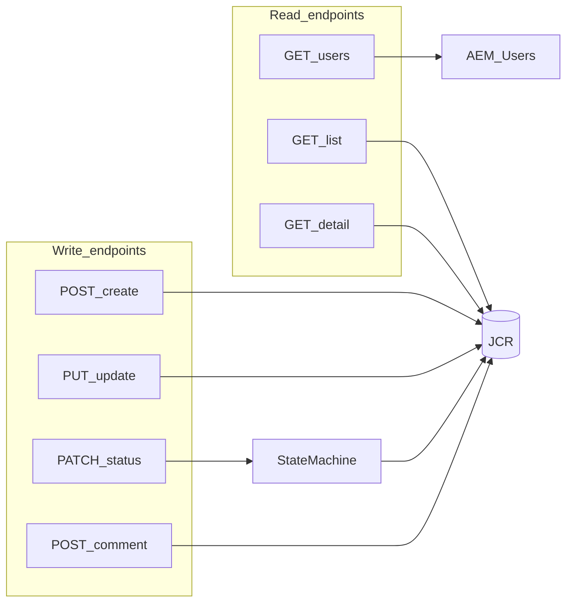
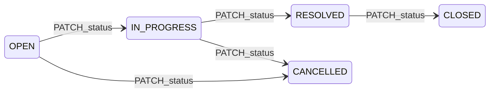

# API Contract — Support Ticket Management System

**Project:** AI Practical Assessment  
**Platform:** AEM as a Cloud Service (AEMaaCS)  
**Base path:** `/bin/support-tickets`  
**Source documents:** [requirements-analysis.md](requirements-analysis.md), [acceptance-criteria.md](acceptance-criteria.md), [design-notes.md](design-notes.md), [data-model.md](data-model.md)  
**Document version:** 1.0  
**Status:** Approved for implementation  
**Implementation:** Not yet implemented — contract only

---

## 1. Overview

### 1.1 Purpose

This document defines the **minimum Core REST API surface** for the Support Ticket Management System. All endpoints are implemented as **Sling Servlets** returning JSON.

### 1.2 Conventions

| Convention | Value |
|------------|-------|
| Content type | `application/json; charset=utf-8` for request and response bodies |
| URL suffix | `.json` selector (Sling convention) |
| Date/time | ISO-8601 UTC strings (e.g. `2026-08-27T10:30:00Z`) |
| Enum casing | `SCREAMING_SNAKE_CASE` |
| User references | AEM user path (e.g. `/home/users/support/agent1`) |
| Ticket IDs | UUID v4 (lowercase) |
| Idempotency | Not required for Core |
| API versioning | None for Core (unversioned paths) |

### 1.3 Core endpoint inventory

| # | Method | URL | Purpose |
|---|--------|-----|---------|
| 1 | `GET` | `/bin/support-tickets.json` | List tickets; keyword search; status filter |
| 2 | `POST` | `/bin/support-tickets.json` | Create ticket |
| 3 | `GET` | `/bin/support-tickets/{ticketId}.json` | Get ticket detail |
| 4 | `PUT` | `/bin/support-tickets/{ticketId}.json` | Update ticket fields (excludes status) |
| 5 | `PATCH` | `/bin/support-tickets/{ticketId}/status.json` | Change ticket status (state machine) |
| 6 | `POST` | `/bin/support-tickets/{ticketId}/comments.json` | Add comment |
| 7 | `GET` | `/bin/support-tickets/users.json` | List seeded users |



### 1.4 Status update separation

**`status` is intentionally excluded from `PUT /bin/support-tickets/{ticketId}.json`.**

| Concern | Rationale |
|---------|-----------|
| State machine isolation | Status changes flow only through `TicketStateMachineService` (AC-034, AC-040–057) |
| Distinct error semantics | Invalid transitions return `409 Conflict`, not `400 Bad Request` |
| Audit clarity | Status mutations are a separate operation in logs and tests |
| Acceptance criteria | AC-034 requires rejection of `status` in PUT |

There is **no strong architectural reason** to combine status into PUT for this system.

---

## 2. Authentication and Authorization (Core)

### 2.1 Authentication expectation

| Context | Expectation |
|---------|-------------|
| **Core API (all endpoints)** | **No end-user authentication required.** Auth is optional per assignment spec (Stretch: FR-S03). |
| **Author (port 4502)** | Anonymous or AEM session may access servlets; no login gate in Core. |
| **Publish / Dispatcher (port 80)** | Anonymous access allowed for Core. |
| **CSRF (browser mutations)** | Browser-originated `POST`, `PUT`, `PATCH` from the support-app clientlibs must include a valid Granite CSRF token via the `CSRF-Token` request header (platform layer, not application auth). |

### 2.2 Authorization expectation

| Layer | Core behaviour |
|-------|----------------|
| **HTTP / Servlet** | No role or ownership checks. Any caller who can reach the endpoint may invoke it. |
| **Service user** | Servlet uses OSGi `ResourceResolver` subservice `support-tickets-service` for JCR access. |
| **JCR ACLs** | Service user has read/write on `/content/support-tickets` only. |
| **`createdBy` / `assignedTo`** | Client-supplied user paths validated for existence, not for caller identity match. |

**Known Core limitation:** Open mutation API — document in threat model. Stretch may add AEM session checks and role-based rules.

### 2.3 CSRF (browser mutations via support-app clientlibs)

The implemented UI (`clientlib-support-app`) obtains a Granite CSRF token and sends it on every mutating request.

| Step | Detail |
|------|--------|
| **1. Fetch token** | `GET /libs/granite/csrf/token.json` with `credentials: same-origin` |
| **2. Parse response** | JSON body `{ "token": "<value>" }` |
| **3. Mutating request** | Set request header `CSRF-Token: <value>` on `POST`, `PUT`, `PATCH` |

| Header | Required when | Value |
|--------|---------------|-------|
| `CSRF-Token` | `POST`, `PUT`, `PATCH` from browser (support-app clientlibs) | Token from step 1–2 above |

**Implementation:** `ui.apps/.../clientlib-support-app/js/csrf.js` (`SupportTicketsCsrf.getToken`) and `api.js` (`headers['CSRF-Token'] = token`).

**Do not use** `:cq_csrf_token` as a `fetch()` request header — it is not a valid HTTP header name and causes a synchronous client-side error before the request is sent (see [review-fixes.md](review-fixes.md) RF-001).

Direct API calls (curl, Postman, server-to-server) may not require CSRF depending on AEM runmode and caller context; the browser UI always sends `CSRF-Token` on mutations.

---

## 3. Common Request Headers

### 3.1 All requests

| Header | Required | Value |
|--------|----------|-------|
| `Accept` | Recommended | `application/json` |
| `Content-Type` | Required for bodies | `application/json; charset=utf-8` |

### 3.2 Mutating requests (browser via support-app clientlibs)

| Header | Required | Value |
|--------|----------|-------|
| `CSRF-Token` | Yes (`POST`, `PUT`, `PATCH`) | Granite CSRF token from `GET /libs/granite/csrf/token.json` |

### 3.3 Response headers (all endpoints)

| Header | Value |
|--------|-------|
| `Content-Type` | `application/json; charset=utf-8` |
| `Cache-Control` | `no-store, no-cache` |
| `X-Content-Type-Options` | `nosniff` |

---

## 4. Error Response Format

All error responses use a **consistent JSON envelope**.

### 4.1 Schema

```json
{
  "code": "ERROR_CODE",
  "message": "Human-readable summary safe for UI display.",
  "fields": {
    "fieldName": "Field-specific error message."
  },
  "details": {
    "currentStatus": "OPEN",
    "requestedStatus": "CLOSED"
  }
}
```

| Field | Type | Required | Description |
|-------|------|----------|-------------|
| `code` | string | Yes | Machine-readable error code (see catalog) |
| `message` | string | Yes | User-safe message; no stack traces or JCR paths |
| `fields` | object | No | Field name → error message (validation errors) |
| `details` | object | No | Additional context (e.g. state machine) |

### 4.2 Error code catalog

| Code | HTTP status | When |
|------|-------------|------|
| `VALIDATION_ERROR` | `400` | Invalid or missing input fields |
| `NOT_FOUND` | `404` | Ticket or resource does not exist |
| `INVALID_TRANSITION` | `409` | State machine rejects status change |
| `METHOD_NOT_ALLOWED` | `405` | HTTP method not supported on endpoint |
| `UNSUPPORTED_MEDIA_TYPE` | `415` | Request body not `application/json` |
| `INTERNAL_ERROR` | `500` | Unexpected server failure |

### 4.3 Example validation error

```json
{
  "code": "VALIDATION_ERROR",
  "message": "Request validation failed.",
  "fields": {
    "title": "Title is required and must be between 1 and 200 characters.",
    "priority": "Priority must be one of: LOW, MEDIUM, HIGH, CRITICAL."
  }
}
```

### 4.4 Example business error (invalid transition)

```json
{
  "code": "INVALID_TRANSITION",
  "message": "Cannot transition from OPEN to CLOSED.",
  "details": {
    "currentStatus": "OPEN",
    "requestedStatus": "CLOSED",
    "allowedTransitions": ["IN_PROGRESS", "CANCELLED"]
  }
}
```

### 4.5 Example not-found error

```json
{
  "code": "NOT_FOUND",
  "message": "Ticket not found."
}
```

### 4.6 Example internal error

```json
{
  "code": "INTERNAL_ERROR",
  "message": "An unexpected error occurred. Please try again later."
}
```

---

## 5. Shared Schemas

### 5.1 Enums

**Priority:** `LOW` | `MEDIUM` | `HIGH` | `CRITICAL`

**Status:** `OPEN` | `IN_PROGRESS` | `RESOLVED` | `CLOSED` | `CANCELLED`

### 5.2 User object

```json
{
  "id": "/home/users/support/agent1",
  "name": "Alex Agent",
  "email": "agent1@example.com",
  "role": "AGENT"
}
```

| Field | Type | Description |
|-------|------|-------------|
| `id` | string | AEM user path (immutable identifier) |
| `name` | string | Display name |
| `email` | string | Email address |
| `role` | string | Seeded role metadata (`AGENT`, `SUPERVISOR`, etc.) |

### 5.3 Comment object

```json
{
  "id": "7c9e6679-7425-40de-944b-e07fc1f90ae7",
  "ticketId": "550e8400-e29b-41d4-a716-446655440000",
  "message": "Reproduced on Chrome 126.",
  "createdBy": "/home/users/support/agent1",
  "createdAt": "2026-08-27T10:45:00Z"
}
```

### 5.4 Ticket summary (list item)

```json
{
  "id": "550e8400-e29b-41d4-a716-446655440000",
  "title": "Cannot reset password",
  "description": "User reports password reset email never arrives.",
  "priority": "HIGH",
  "status": "OPEN",
  "assignedTo": "/home/users/support/agent1",
  "createdBy": "/home/users/support/agent2",
  "createdAt": "2026-08-27T09:00:00Z",
  "updatedAt": "2026-08-27T09:00:00Z"
}
```

`assignedTo` is `null` when unassigned.

### 5.5 Ticket detail (includes comments and transitions)

```json
{
  "id": "550e8400-e29b-41d4-a716-446655440000",
  "title": "Cannot reset password",
  "description": "User reports password reset email never arrives.",
  "priority": "HIGH",
  "status": "OPEN",
  "assignedTo": "/home/users/support/agent1",
  "createdBy": "/home/users/support/agent2",
  "createdAt": "2026-08-27T09:00:00Z",
  "updatedAt": "2026-08-27T10:45:00Z",
  "allowedTransitions": ["IN_PROGRESS", "CANCELLED"],
  "comments": [
    {
      "id": "7c9e6679-7425-40de-944b-e07fc1f90ae7",
      "ticketId": "550e8400-e29b-41d4-a716-446655440000",
      "message": "Reproduced on Chrome 126.",
      "createdBy": "/home/users/support/agent1",
      "createdAt": "2026-08-27T10:45:00Z"
    }
  ]
}
```

---

## 6. Endpoints

---

### 6.1 List Tickets

| Attribute | Value |
|-----------|-------|
| **HTTP method** | `GET` |
| **URL** | `/bin/support-tickets.json` |
| **Authentication** | None (Core) |
| **Authorization** | None (Core); open read |

#### Request headers

| Header | Required |
|--------|----------|
| `Accept` | Recommended: `application/json` |

#### Query parameters

| Parameter | Required | Type | Description |
|-----------|----------|------|-------------|
| `q` | No | string | Case-insensitive keyword; matches `title` OR `description` (max 200 chars) |
| `status` | No | string | Exact status filter; must be valid status enum |

**Combination logic:** `q` AND `status` when both present; neither returns all tickets sorted by `updatedAt` desc.

#### Request body

None.

#### Success response

| HTTP status | Body |
|-------------|------|
| `200 OK` | JSON array of ticket summary objects |

#### Example success response

```json
[
  {
    "id": "550e8400-e29b-41d4-a716-446655440000",
    "title": "Cannot reset password",
    "description": "User reports password reset email never arrives.",
    "priority": "HIGH",
    "status": "OPEN",
    "assignedTo": "/home/users/support/agent1",
    "createdBy": "/home/users/support/agent2",
    "createdAt": "2026-08-27T09:00:00Z",
    "updatedAt": "2026-08-27T10:45:00Z"
  }
]
```

Empty result:

```json
[]
```

#### HTTP status codes

| Status | When |
|--------|------|
| `200` | Success (including zero results) |
| `400` | Invalid `status` enum value |
| `500` | Unexpected error |

#### Validation errors

| Condition | Status | `fields` |
|-----------|--------|----------|
| Invalid `status` query value | `400` | `{ "status": "..." }` |
| `q` exceeds max length | `400` | `{ "q": "..." }` |

#### Business errors

None for list endpoint.

#### Not-found behavior

Not applicable — empty array returned when no matches (AC-073).

#### Example error response

```json
{
  "code": "VALIDATION_ERROR",
  "message": "Invalid query parameter.",
  "fields": {
    "status": "Status must be one of: OPEN, IN_PROGRESS, RESOLVED, CLOSED, CANCELLED."
  }
}
```

**Traceability:** AC-010, AC-070 – AC-073, AC-080 – AC-082

---

### 6.2 Create Ticket

| Attribute | Value |
|-----------|-------|
| **HTTP method** | `POST` |
| **URL** | `/bin/support-tickets.json` |
| **Authentication** | None (Core); `CSRF-Token` on browser mutations |
| **Authorization** | None (Core) |

#### Request headers

| Header | Required |
|--------|----------|
| `Content-Type` | `application/json` |
| `Accept` | Recommended: `application/json` |
| `CSRF-Token` | Yes (browser via support-app clientlibs) |

#### Request body

```json
{
  "title": "Login issue",
  "description": "Cannot reset password",
  "priority": "HIGH",
  "createdBy": "/home/users/support/agent1",
  "assignedTo": "/home/users/support/agent2"
}
```

| Field | Required | Type | Constraints |
|-------|----------|------|-------------|
| `title` | **Yes** | string | 1–200 chars after trim |
| `description` | No | string | Max 5000 chars |
| `priority` | **Yes** | string | `LOW`, `MEDIUM`, `HIGH`, `CRITICAL` |
| `createdBy` | **Yes** | string | Must reference existing seeded user path |
| `assignedTo` | No | string | Must reference existing user if provided; omit or `null` for unassigned |
| `status` | Ignored | string | **Always forced to `OPEN`** on create (AC-006) |

#### Query parameters

None.

#### Success response

| HTTP status | Body |
|-------------|------|
| `201 Created` | Ticket detail object (without `comments`; `allowedTransitions` included) |

#### Example success response

```json
{
  "id": "a3f1c8d2-1b4e-4f9a-9c2d-8e7f6a5b4c3d",
  "title": "Login issue",
  "description": "Cannot reset password",
  "priority": "HIGH",
  "status": "OPEN",
  "assignedTo": "/home/users/support/agent2",
  "createdBy": "/home/users/support/agent1",
  "createdAt": "2026-08-27T11:00:00Z",
  "updatedAt": "2026-08-27T11:00:00Z",
  "allowedTransitions": ["IN_PROGRESS", "CANCELLED"],
  "comments": []
}
```

#### HTTP status codes

| Status | When |
|--------|------|
| `201` | Ticket created |
| `400` | Validation failure |
| `415` | Non-JSON content type |
| `500` | Unexpected error |

#### Validation errors

| Condition | `fields` key |
|-----------|--------------|
| Missing/blank `title` | `title` |
| Invalid `priority` | `priority` |
| Missing `createdBy` | `createdBy` |
| Unknown `createdBy` user | `createdBy` |
| Unknown `assignedTo` user | `assignedTo` |
| `description` too long | `description` |

#### Business errors

None beyond validation.

#### Not-found behavior

Not applicable on create.

#### Example error response

```json
{
  "code": "VALIDATION_ERROR",
  "message": "Request validation failed.",
  "fields": {
    "title": "Title is required and must be between 1 and 200 characters."
  }
}
```

**Traceability:** AC-001, AC-002, AC-003 – AC-006

---

### 6.3 Get Ticket Detail

| Attribute | Value |
|-----------|-------|
| **HTTP method** | `GET` |
| **URL** | `/bin/support-tickets/{ticketId}.json` |
| **Authentication** | None (Core) |
| **Authorization** | None (Core) |

#### Path parameters

| Parameter | Required | Type | Description |
|-----------|----------|------|-------------|
| `ticketId` | Yes | UUID string | Ticket identifier |

#### Request headers

| Header | Required |
|--------|----------|
| `Accept` | Recommended: `application/json` |

#### Query parameters

None.

#### Request body

None.

#### Success response

| HTTP status | Body |
|-------------|------|
| `200 OK` | Ticket detail object with `comments` and `allowedTransitions` |

#### Example success response

```json
{
  "id": "550e8400-e29b-41d4-a716-446655440000",
  "title": "Cannot reset password",
  "description": "User reports password reset email never arrives.",
  "priority": "HIGH",
  "status": "IN_PROGRESS",
  "assignedTo": "/home/users/support/agent1",
  "createdBy": "/home/users/support/agent2",
  "createdAt": "2026-08-27T09:00:00Z",
  "updatedAt": "2026-08-27T10:30:00Z",
  "allowedTransitions": ["RESOLVED", "CANCELLED"],
  "comments": [
    {
      "id": "7c9e6679-7425-40de-944b-e07fc1f90ae7",
      "ticketId": "550e8400-e29b-41d4-a716-446655440000",
      "message": "Reproduced on Chrome 126.",
      "createdBy": "/home/users/support/agent1",
      "createdAt": "2026-08-27T10:45:00Z"
    }
  ]
}
```

#### HTTP status codes

| Status | When |
|--------|------|
| `200` | Ticket found |
| `404` | Ticket not found |
| `400` | Malformed `ticketId` |
| `500` | Unexpected error |

#### Validation errors

| Condition | Status |
|-----------|--------|
| `ticketId` not valid UUID format | `400` |

#### Business errors

None.

#### Not-found behavior

Ticket node does not exist in JCR → `404 NOT_FOUND`.

#### Example error response

```json
{
  "code": "NOT_FOUND",
  "message": "Ticket not found."
}
```

**Traceability:** AC-020 – AC-022, AC-023

---

### 6.4 Update Ticket Fields

| Attribute | Value |
|-----------|-------|
| **HTTP method** | `PUT` |
| **URL** | `/bin/support-tickets/{ticketId}.json` |
| **Authentication** | None (Core); `CSRF-Token` on browser mutations |
| **Authorization** | None (Core) |

> **Status changes are NOT permitted on this endpoint.** Use `PATCH .../status.json`.

#### Path parameters

| Parameter | Required | Type |
|-----------|----------|------|
| `ticketId` | Yes | UUID string |

#### Request headers

| Header | Required |
|--------|----------|
| `Content-Type` | `application/json` |
| `CSRF-Token` | Yes (browser via support-app clientlibs) |

#### Request body

Partial update — include only fields to change:

```json
{
  "title": "Updated title",
  "description": "Updated description",
  "priority": "CRITICAL",
  "assignedTo": "/home/users/support/agent1"
}
```

| Field | Required | Mutable | Constraints |
|-------|----------|---------|-------------|
| `title` | No | Yes | 1–200 chars if present |
| `description` | No | Yes | Max 5000 chars |
| `priority` | No | Yes | Valid enum |
| `assignedTo` | No | Yes | Valid user path, or `null` to unassign |
| `status` | **Rejected** | **No** | Presence → `400` (AC-034) |
| `createdBy` | **Rejected** | **No** | Presence → `400` (AC-007) |
| `id`, `createdAt` | Ignored | No | — |

#### Query parameters

None.

#### Success response

| HTTP status | Body |
|-------------|------|
| `200 OK` | Updated ticket detail object |

#### Example success response

```json
{
  "id": "550e8400-e29b-41d4-a716-446655440000",
  "title": "Updated title",
  "description": "Updated description",
  "priority": "CRITICAL",
  "status": "IN_PROGRESS",
  "assignedTo": "/home/users/support/agent1",
  "createdBy": "/home/users/support/agent2",
  "createdAt": "2026-08-27T09:00:00Z",
  "updatedAt": "2026-08-27T11:15:00Z",
  "allowedTransitions": ["RESOLVED", "CANCELLED"],
  "comments": []
}
```

#### HTTP status codes

| Status | When |
|--------|------|
| `200` | Updated successfully |
| `400` | Validation failure (including `status` or `createdBy` in body) |
| `404` | Ticket not found |
| `415` | Non-JSON content type |
| `500` | Unexpected error |

#### Validation errors

| Condition | `fields` key |
|-----------|--------------|
| `status` present in body | `status` — "Status cannot be updated via this endpoint. Use PATCH /status.json." |
| `createdBy` present in body | `createdBy` — "createdBy is immutable." |
| Invalid `priority` | `priority` |
| Invalid `assignedTo` | `assignedTo` |
| Blank `title` when provided | `title` |

#### Business errors

None beyond validation.

#### Not-found behavior

Unknown `ticketId` → `404 NOT_FOUND`.

#### Example error response (status in PUT)

```json
{
  "code": "VALIDATION_ERROR",
  "message": "Request validation failed.",
  "fields": {
    "status": "Status cannot be updated via this endpoint. Use PATCH /bin/support-tickets/{ticketId}/status.json."
  }
}
```

**Traceability:** AC-030 – AC-034, AC-007

---

### 6.5 Change Ticket Status (State Machine)

| Attribute | Value |
|-----------|-------|
| **HTTP method** | `PATCH` |
| **URL** | `/bin/support-tickets/{ticketId}/status.json` |
| **Authentication** | None (Core); `CSRF-Token` on browser mutations |
| **Authorization** | None (Core); enforced by state machine only |

> **Dedicated status endpoint** — sole API path for status mutations.

#### Path parameters

| Parameter | Required | Type |
|-----------|----------|------|
| `ticketId` | Yes | UUID string |

#### Request headers

| Header | Required |
|--------|----------|
| `Content-Type` | `application/json` |
| `CSRF-Token` | Yes (browser via support-app clientlibs) |

#### Request body

```json
{
  "status": "IN_PROGRESS"
}
```

| Field | Required | Type | Constraints |
|-------|----------|------|-------------|
| `status` | **Yes** | string | Valid enum; valid transition from current status |

#### Valid transitions

| From | Allowed `status` values |
|------|-------------------------|
| `OPEN` | `IN_PROGRESS`, `CANCELLED` |
| `IN_PROGRESS` | `RESOLVED`, `CANCELLED` |
| `RESOLVED` | `CLOSED` |
| `CLOSED` | *(none — terminal)* |
| `CANCELLED` | *(none — terminal)* |

#### Query parameters

None.

#### Success response

| HTTP status | Body |
|-------------|------|
| `200 OK` | Updated ticket detail object with new `status` and `allowedTransitions` |

#### Example success response

```json
{
  "id": "550e8400-e29b-41d4-a716-446655440000",
  "title": "Cannot reset password",
  "description": "User reports password reset email never arrives.",
  "priority": "HIGH",
  "status": "IN_PROGRESS",
  "assignedTo": "/home/users/support/agent1",
  "createdBy": "/home/users/support/agent2",
  "createdAt": "2026-08-27T09:00:00Z",
  "updatedAt": "2026-08-27T11:20:00Z",
  "allowedTransitions": ["RESOLVED", "CANCELLED"],
  "comments": []
}
```

#### HTTP status codes

| Status | When |
|--------|------|
| `200` | Valid transition applied |
| `400` | Missing/invalid `status` enum (not a transition issue) |
| `404` | Ticket not found |
| `409` | Invalid transition for current status |
| `500` | Unexpected error |

#### Validation errors

| Condition | Status | Code |
|-----------|--------|------|
| Missing `status` field | `400` | `VALIDATION_ERROR` |
| Unknown enum (e.g. `INVALID`) | `400` | `VALIDATION_ERROR` |

#### Business errors (state machine)

| Condition | Status | Code |
|-----------|--------|------|
| Transition not allowed (e.g. `OPEN` → `CLOSED`) | `409` | `INVALID_TRANSITION` |
| Transition from terminal state | `409` | `INVALID_TRANSITION` |
| Same status (no-op) | `409` | `INVALID_TRANSITION` |

#### Not-found behavior

Unknown `ticketId` → `404` (checked before transition validation).

#### Example error response (invalid transition)

```json
{
  "code": "INVALID_TRANSITION",
  "message": "Cannot transition from OPEN to CLOSED.",
  "details": {
    "currentStatus": "OPEN",
    "requestedStatus": "CLOSED",
    "allowedTransitions": ["IN_PROGRESS", "CANCELLED"]
  }
}
```

#### Example error response (terminal state)

```json
{
  "code": "INVALID_TRANSITION",
  "message": "Cannot transition from CLOSED to IN_PROGRESS.",
  "details": {
    "currentStatus": "CLOSED",
    "requestedStatus": "IN_PROGRESS",
    "allowedTransitions": []
  }
}
```

**Traceability:** AC-040 – AC-044, AC-050 – AC-057, AC-102

---

### 6.6 Add Comment

| Attribute | Value |
|-----------|-------|
| **HTTP method** | `POST` |
| **URL** | `/bin/support-tickets/{ticketId}/comments.json` |
| **Authentication** | None (Core); `CSRF-Token` on browser mutations |
| **Authorization** | None (Core) |

#### Path parameters

| Parameter | Required | Type |
|-----------|----------|------|
| `ticketId` | Yes | UUID string |

#### Request headers

| Header | Required |
|--------|----------|
| `Content-Type` | `application/json` |
| `CSRF-Token` | Yes (browser via support-app clientlibs) |

#### Request body

```json
{
  "message": "Customer confirmed issue is resolved.",
  "createdBy": "/home/users/support/agent1"
}
```

| Field | Required | Type | Constraints |
|-------|----------|------|-------------|
| `message` | **Yes** | string | 1–2000 chars after trim |
| `createdBy` | **Yes** | string | Must reference existing seeded user |
| `ticketId` | Ignored | string | Set from path by server |

#### Query parameters

None.

#### Success response

| HTTP status | Body |
|-------------|------|
| `201 Created` | Created comment object |

#### Example success response

```json
{
  "id": "b2c3d4e5-f6a7-8901-bcde-f23456789012",
  "ticketId": "550e8400-e29b-41d4-a716-446655440000",
  "message": "Customer confirmed issue is resolved.",
  "createdBy": "/home/users/support/agent1",
  "createdAt": "2026-08-27T11:25:00Z"
}
```

Side effect: parent ticket `updatedAt` is refreshed.

#### HTTP status codes

| Status | When |
|--------|------|
| `201` | Comment created |
| `400` | Validation failure |
| `404` | Parent ticket not found |
| `415` | Non-JSON content type |
| `500` | Unexpected error |

#### Validation errors

| Condition | `fields` key |
|-----------|--------------|
| Missing/blank `message` | `message` |
| Missing `createdBy` | `createdBy` |
| Unknown `createdBy` | `createdBy` |
| `message` too long | `message` |

#### Business errors

None beyond validation.

#### Not-found behavior

Parent ticket does not exist → `404 NOT_FOUND` (no orphan comment created).

#### Example error response

```json
{
  "code": "VALIDATION_ERROR",
  "message": "Request validation failed.",
  "fields": {
    "message": "Message is required and must be between 1 and 2000 characters."
  }
}
```

**Traceability:** AC-060 – AC-062, AC-063

---

### 6.7 List Seeded Users

| Attribute | Value |
|-----------|-------|
| **HTTP method** | `GET` |
| **URL** | `/bin/support-tickets/users.json` |
| **Authentication** | None (Core) |
| **Authorization** | None (Core) |

#### Request headers

| Header | Required |
|--------|----------|
| `Accept` | Recommended: `application/json` |

#### Query parameters

None for Core.

#### Request body

None.

#### Success response

| HTTP status | Body |
|-------------|------|
| `200 OK` | JSON array of user objects |

#### Example success response

```json
[
  {
    "id": "/home/users/support/agent1",
    "name": "Alex Agent",
    "email": "agent1@example.com",
    "role": "AGENT"
  },
  {
    "id": "/home/users/support/agent2",
    "name": "Sam Support",
    "email": "agent2@example.com",
    "role": "AGENT"
  },
  {
    "id": "/home/users/support/supervisor1",
    "name": "Pat Supervisor",
    "email": "supervisor1@example.com",
    "role": "SUPERVISOR"
  }
]
```

#### HTTP status codes

| Status | When |
|--------|------|
| `200` | Success (may be empty array if misconfigured seed) |
| `500` | Unexpected error |

#### Validation errors

None.

#### Business errors

None.

#### Not-found behavior

Not applicable — returns array (possibly empty).

**Traceability:** AC-120, AC-121

---

## 7. State Machine Reference



| Transition | HTTP result |
|------------|-------------|
| Valid (table in §6.5) | `200 OK` |
| Invalid / skip / backward / terminal | `409 INVALID_TRANSITION` |
| Unknown enum | `400 VALIDATION_ERROR` |

---

## 8. HTTP Status Code Summary

| Status | Usage across API |
|--------|------------------|
| `200 OK` | Successful GET, PUT, PATCH |
| `201 Created` | Successful POST (ticket, comment) |
| `400 Bad Request` | Validation errors, malformed input, forbidden fields in PUT |
| `404 Not Found` | Unknown `ticketId` |
| `405 Method Not Allowed` | Wrong HTTP method on servlet |
| `409 Conflict` | Invalid status transition only |
| `415 Unsupported Media Type` | Missing or wrong `Content-Type` on body requests |
| `500 Internal Server Error` | Unhandled exception (safe message only) |

**Not used in Core:** `401 Unauthorized`, `403 Forbidden` (no auth in Core).

---

## 9. Out of Scope (Core API)

The following are **not** part of the minimum Core surface:

| Operation | Notes |
|-----------|-------|
| Delete ticket | Not in acceptance criteria |
| Delete / edit comment | Not in Core |
| User CRUD | Seeded only (FR-C09) |
| Filter by priority or assignee | Stretch FR-S04 |
| Sorting / pagination query params | Stretch FR-S04 |
| `PATCH` partial ticket update | Core uses `PUT` for field updates |
| Webhooks / async events | Not required |
| OpenAPI runtime endpoint | Stretch FR-S05 |

---

## 10. Dispatcher and Caching Notes

| Path pattern | Dispatcher rule |
|--------------|-----------------|
| `/bin/support-tickets*` | Allow; **deny cache** |
| `/content/support-app*` | Allow; **deny cache** |

All API responses include `Cache-Control: no-store, no-cache`.

---

## 11. Traceability Matrix

| Endpoint | Acceptance criteria |
|----------|---------------------|
| `GET /bin/support-tickets.json` | AC-010, AC-070 – AC-073, AC-080 – AC-082 |
| `POST /bin/support-tickets.json` | AC-001, AC-002, AC-003 – AC-006 |
| `GET /bin/support-tickets/{id}.json` | AC-020 – AC-023 |
| `PUT /bin/support-tickets/{id}.json` | AC-030 – AC-034, AC-007 |
| `PATCH /bin/support-tickets/{id}/status.json` | AC-040 – AC-057, AC-102 |
| `POST /bin/support-tickets/{id}/comments.json` | AC-060 – AC-063 |
| `GET /bin/support-tickets/users.json` | AC-120 |

---

## 12. Document History

| Version | Date | Author | Changes |
|---------|------|--------|---------|
| 1.0 | 2026-08-27 | AI-assisted | Initial Core API contract |
