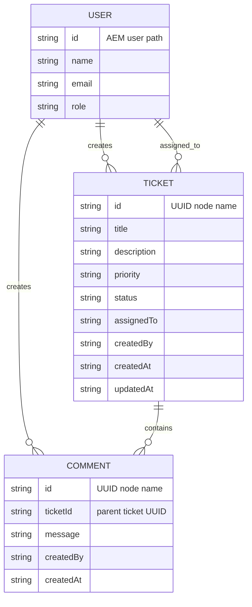
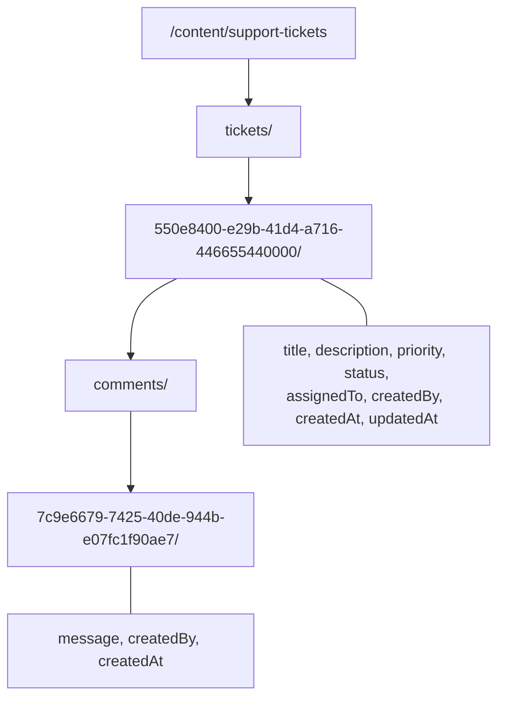
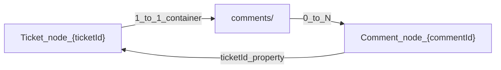
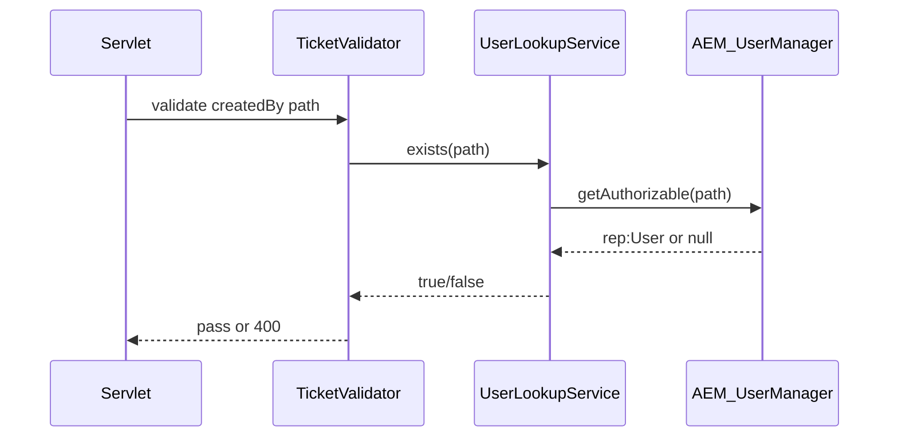
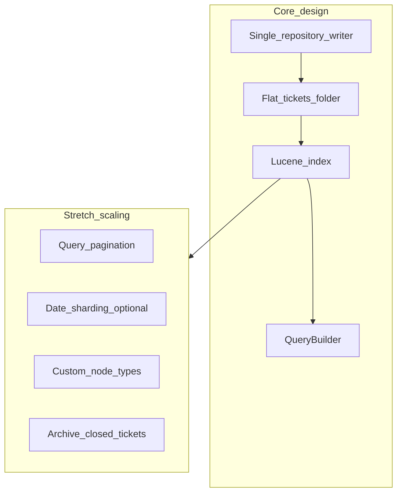

# Data Model — Support Ticket Management System (JCR)

**Project:** AI Practical Assessment  
**Platform:** AEM as a Cloud Service (AEMaaCS)  
**Source documents:** [requirements-analysis.md](requirements-analysis.md), [acceptance-criteria.md](acceptance-criteria.md), [design-notes.md](design-notes.md)  
**Document version:** 1.0  
**Status:** Approved for implementation

---

## Purpose

This document defines the **JCR data model** for Ticket and Comment persistence, the **reference model** for seeded Users (AEM principals), validation constraints, search behaviour, and seed-data representation. No Java implementation is included.

### Design principles

| Principle | Application |
|-----------|-------------|
| Single write path | Only `TicketRepository` creates or mutates ticket/comment nodes |
| Immutable identifiers | Ticket and comment node names are UUIDs; never renamed |
| Flat ticket list | All tickets are siblings under `tickets/` — no date/category sub-trees |
| Users are not ticket nodes | Users are AEM OOTB principals; tickets store references only |
| Search via index | Oak Lucene index supports QueryBuilder predicates at scale |

---

## Entity Overview



---

## 1. Recommended JCR Hierarchy

### Root structure

```
/content/support-tickets/                          # Application data root (repoinit)
└── tickets/                                     # Container for all ticket nodes
    └── {ticket-uuid}/                           # One node per ticket
        ├── [ticket properties on this node]     # Properties stored on ticket node directly
        └── comments/                            # Container for comment child nodes
            └── {comment-uuid}/                  # One node per comment
                └── [comment properties on this node]

/content/support-app/                            # UI page(s) — separate from ticket data
    └── ...                                      # HTL page referencing Clientlibs

/home/users/support/                             # Seeded AEM users (repoinit)
    ├── agent1/
    ├── agent2/
    └── supervisor1/
```

### Why this hierarchy

| Decision | Rationale |
|----------|-----------|
| `/content/support-tickets` root | Replicable to Publish; separate from UI pages; visible in CRX for debugging |
| Flat `tickets/{uuid}` | Simple list queries; no path-based partitioning needed at assessment scale |
| Properties on ticket node (not `jcr:content` child) | Tickets are data nodes, not pages; avoids page-like `cq:Page` / `jcr:content` pattern |
| `comments/` as intermediate container | Clear parent for comment nodes; simplifies "list comments for ticket" traversal |
| Users under `/home/users/support/` | AEM OOTB user tree; group-scoped seed users |

### Alternatives considered

| Alternative | Trade-off | Verdict |
|-------------|-----------|---------|
| `/var/support-tickets` | Operational data separation | Rejected — less familiar replication; `/content` is sufficient with non-page resource type |
| `tickets/{yyyy}/{mm}/{uuid}` | Date partitioning | Rejected — complicates list-all queries; premature for Core scope |
| Ticket properties on `jcr:content` child | Matches page pattern | Rejected — tickets are not pages |
| Comments as separate tree `/content/support-tickets/comments/{uuid}` | Flat comment index | Rejected — loses natural parent-child; requires `ticketId` integrity checks on every write |

### Hierarchy diagram



---

## 2. Node Types

### Ticket and comment nodes

| Node | `jcr:primaryType` | `jcr:mixinTypes` | `sling:resourceType` |
|------|-------------------|------------------|----------------------|
| `/content/support-tickets` | `sling:Folder` | — | — |
| `/content/support-tickets/tickets` | `sling:OrderedFolder` or `sling:Folder` | — | — |
| `/content/support-tickets/tickets/{uuid}` | `nt:unstructured` | — | `support-tickets/components/ticket` |
| `.../comments` | `sling:Folder` | — | — |
| `.../comments/{uuid}` | `nt:unstructured` | — | `support-tickets/components/comment` |

### User principals (not application nodes)

| Node | `jcr:primaryType` | Notes |
|------|-------------------|-------|
| `/home/users/support/{username}` | `rep:User` | Created via repoinit; standard AEM user |

### Node type strategy

| Option | Description | Recommendation |
|--------|-------------|----------------|
| **`nt:unstructured` only** | Schema enforced in `TicketValidator` + `TicketRepository` | **Recommended for Core** |
| **Custom CND (`support:Ticket`, `support:Comment`)** | Repository-level property definitions | Optional Stretch — stronger schema, more setup |
| **`cq:Page` for tickets** | Page-based tickets | Rejected — conflates CMS content with operational data |

**Why `nt:unstructured`:** Sufficient for assessment scope; all validation rules are enforced in the repository layer (AC-132). A CND can be added later without changing the hierarchy.

### Optional future CND (Stretch reference only)

```
[support:Ticket] > nt:unstructured
  - title (string) mandatory
  - description (string)
  - priority (string) mandatory
  - status (string) mandatory
  - assignedTo (string)
  - createdBy (string) mandatory
  - createdAt (string) mandatory
  - updatedAt (string) mandatory

[support:Comment] > nt:unstructured
  - message (string) mandatory
  - createdBy (string) mandatory
  - createdAt (string) mandatory
  - ticketId (string) mandatory
```

---

## 3. Properties

### Ticket properties

Stored on node `/content/support-tickets/tickets/{id}`:

| Property | JCR type | API field | Description |
|----------|----------|-----------|-------------|
| *(node name)* | `NAME` | `id` | UUID v4; immutable; same as API `id` |
| `title` | `STRING` | `title` | Short summary of the issue |
| `description` | `STRING` | `description` | Full issue description |
| `priority` | `STRING` | `priority` | Enum: `LOW`, `MEDIUM`, `HIGH`, `CRITICAL` |
| `status` | `STRING` | `status` | Enum: `OPEN`, `IN_PROGRESS`, `RESOLVED`, `CLOSED`, `CANCELLED` |
| `assignedTo` | `STRING` | `assignedTo` | AEM user path of assignee; empty if unassigned |
| `createdBy` | `STRING` | `createdBy` | AEM user path of creator; immutable after create |
| `createdAt` | `STRING` | `createdAt` | ISO-8601 UTC (e.g. `2026-08-26T10:30:00Z`) |
| `updatedAt` | `STRING` | `updatedAt` | ISO-8601 UTC; updated on field change and new comment |
| `sling:resourceType` | `STRING` | — | `support-tickets/components/ticket` |

**Not stored as properties:** `ticketId` on ticket node (redundant with node name).

### Comment properties

Stored on node `.../tickets/{ticketId}/comments/{id}`:

| Property | JCR type | API field | Description |
|----------|----------|-----------|-------------|
| *(node name)* | `NAME` | `id` | UUID v4; immutable |
| `ticketId` | `STRING` | `ticketId` | Parent ticket UUID (denormalized for query/debug) |
| `message` | `STRING` | `message` | Comment body text |
| `createdBy` | `STRING` | `createdBy` | AEM user path of comment author |
| `createdAt` | `STRING` | `createdAt` | ISO-8601 UTC |
| `sling:resourceType` | `STRING` | — | `support-tickets/components/comment` |

### User fields (not JCR properties on ticket tree)

Exposed via API from AEM `rep:User` node; **not** duplicated under `/content/support-tickets`:

| API field | AEM source | Example |
|-----------|------------|---------|
| `id` | User node path | `/home/users/support/agent1` |
| `name` | `profile/givenName` + `profile/familyName`, or `rep:authorizableId` | `Alex Agent` |
| `email` | `profile/email` | `agent1@example.com` |
| `role` | `profile/aboutMe` or custom `profile/role` property | `AGENT`, `SUPERVISOR` |

**Role storage on user:** Use a custom property `profile/role` on the rep:User node set via repoinit, since AEM has no built-in `role` field on users.

---

## 4. Child-Node Relationships



| Relationship | Cardinality | Rule |
|--------------|-------------|------|
| `tickets/` → ticket node | 1:N | Each ticket is a direct child of `tickets/` |
| Ticket → `comments/` | 1:1 | Created automatically when first comment is added; empty folder allowed |
| `comments/` → comment node | 1:N | Comments never exist outside their parent ticket |
| Ticket → User (`createdBy`) | N:1 | Reference by path string; not a JCR reference property |
| Ticket → User (`assignedTo`) | N:1 | Optional reference by path string |
| Comment → User (`createdBy`) | N:1 | Reference by path string |

### Integrity rules

| Rule | Enforcement |
|------|-------------|
| Comment must have existing parent ticket | `TicketRepository.addComment(ticketId, ...)` verifies ticket node exists |
| `comment.ticketId` must match parent ticket node name | Set by repository on create; never client-supplied |
| Comments cannot be moved between tickets | No move operation in Core API |
| Deleting ticket deletes comments | No ticket delete in Core; if added in Stretch, cascade delete `comments/` subtree |

---

## 5. Naming Conventions

| Element | Convention | Example |
|---------|------------|---------|
| Ticket node name | Lowercase UUID v4 (RFC 4122) | `550e8400-e29b-41d4-a716-446655440000` |
| Comment node name | Lowercase UUID v4 | `7c9e6679-7425-40de-944b-e07fc1f90ae7` |
| Comments container | Fixed name `comments` | Always literal `comments` |
| Property names | camelCase | `createdAt`, `assignedTo` |
| Enum values | `SCREAMING_SNAKE_CASE` | `IN_PROGRESS`, `CRITICAL` |
| User path | `/home/users/support/{username}` | `/home/users/support/agent1` |
| Application root | kebab-case path segment | `/content/support-tickets` |
| `sling:resourceType` | Reverse domain + component | `support-tickets/components/ticket` |

### Rules

- **Never rename** ticket or comment nodes after creation (IDs are node names).
- **Never encode** title, status, or date in node names.
- **UUID generation:** Application generates UUID before node creation; node name = `id`.
- **Comment ordering:** Sort by `createdAt` property at read time; do not rely on node name for order.

---

## 6. Required vs Optional Properties

### Ticket

| Property | Required on create | Required on update | Mutable | Notes |
|----------|-------------------|-------------------|---------|-------|
| `id` (node name) | Yes (system) | — | No | Generated by repository |
| `title` | **Yes** | Yes | Yes | Cannot be blank |
| `description` | No | No | Yes | May be empty string |
| `priority` | **Yes** | Yes | Yes | Must be valid enum |
| `status` | Yes (system) | Via status endpoint only | Via state machine | Always `OPEN` on create |
| `assignedTo` | No | No | Yes | Null/omit = unassigned |
| `createdBy` | **Yes** | — | **No** | AC-007 |
| `createdAt` | Yes (system) | — | No | Set on create |
| `updatedAt` | Yes (system) | Yes (system) | Auto | Bumped on every mutation |

### Comment

| Property | Required on create | Mutable | Notes |
|----------|-------------------|---------|-------|
| `id` (node name) | Yes (system) | No | Generated by repository |
| `ticketId` | Yes (system) | No | Set from parent path |
| `message` | **Yes** | No (Core) | Cannot be blank or whitespace-only |
| `createdBy` | **Yes** | No | Must reference existing seeded user |
| `createdAt` | Yes (system) | No | Set on create |

### User (seeded)

| Field | Required in seed | Notes |
|-------|------------------|-------|
| `id` (path) | Yes | repoinit `create user` |
| `name` | Yes | Profile property |
| `email` | Yes | Profile property |
| `role` | Yes | Custom `profile/role` property |

---

## 7. Validation Constraints

Validation is enforced in `TicketValidator` before `TicketRepository` writes. Invalid data is never persisted (AC-132).

### Ticket — create

| Field | Constraint | Error code |
|-------|------------|------------|
| `title` | Required; trim; length 1–200 | `VALIDATION_ERROR` |
| `description` | Optional; max length 5000 | `VALIDATION_ERROR` |
| `priority` | Required; one of `LOW`, `MEDIUM`, `HIGH`, `CRITICAL` | `VALIDATION_ERROR` |
| `status` | Ignored if supplied; forced to `OPEN` | — |
| `createdBy` | Required; must exist in `UserLookupService` | `VALIDATION_ERROR` |
| `assignedTo` | If present; must exist in `UserLookupService` | `VALIDATION_ERROR` |

### Ticket — update (PUT)

| Field | Constraint | Error code |
|-------|------------|------------|
| `title` | If present; length 1–200 | `VALIDATION_ERROR` |
| `description` | If present; max length 5000 | `VALIDATION_ERROR` |
| `priority` | If present; valid enum | `VALIDATION_ERROR` |
| `assignedTo` | If present; valid user or empty to unassign | `VALIDATION_ERROR` |
| `status` | **Rejected if present** | `VALIDATION_ERROR` (AC-034) |
| `createdBy` | **Rejected if present** or silently ignored | `VALIDATION_ERROR` (AC-007) |
| `id`, `createdAt` | Ignored | — |

### Ticket — status change (PATCH)

| Field | Constraint | Error code |
|-------|------------|------------|
| `status` | Required; valid enum; valid transition from current | `INVALID_TRANSITION` → 409 |

### Comment — create

| Field | Constraint | Error code |
|-------|------------|------------|
| `message` | Required; trim; length 1–2000 | `VALIDATION_ERROR` |
| `createdBy` | Required; must exist | `VALIDATION_ERROR` |
| Parent ticket | Must exist | `NOT_FOUND` → 404 |

### String normalization

| Rule | Application |
|------|-------------|
| Enum uppercase | `priority` and `status` normalized to uppercase on ingest |
| Trim whitespace | `title`, `message` trimmed before length check |
| Empty `assignedTo` | Stored as absent property or `""`; API returns `null` |

---

## 8. How Users Should Be Referenced

### Recommendation: store AEM user path as STRING property

| Approach | Description | Verdict |
|----------|-------------|---------|
| **A — User path string** | `createdBy = "/home/users/support/agent1"` | **Recommended** |
| B — `rep:authorizableId` | Short ID like `agent1` | Rejected — ambiguous across folders |
| C — `PATH` or `WEAKREFERENCE` JCR reference | Typed reference to user node | Rejected — complicates service-user resolver; users not under ticket tree |
| D — Email as key | `createdBy = "agent1@example.com"` | Rejected — email can change; not AEM-native |

### Reference format

```
/home/users/support/{username}
```

### Validation flow



### API user list (for UI dropdowns)

`GET /bin/support-tickets/users.json` returns seeded users:

```json
[
  {
    "id": "/home/users/support/agent1",
    "name": "Alex Agent",
    "email": "agent1@example.com",
    "role": "AGENT"
  }
]
```

**Core behaviour:** Client selects `createdBy` from dropdown (AC-001). No session binding. Stretch may override with `request.getResourceResolver().getUserID()`.

---

## 9. How Comments Should Be Persisted

### Recommendation: child nodes under `comments/` folder

```
/content/support-tickets/tickets/{ticketId}/comments/{commentId}
```

### Create flow

1. Verify parent ticket node exists.
2. Ensure `comments/` folder exists (create on first comment if absent).
3. Generate `commentId` (UUID).
4. Create node `comments/{commentId}` with properties.
5. Set `ticketId` property = parent ticket UUID (denormalized).
6. Bump parent ticket `updatedAt`.
7. Commit session; replicate ticket subtree.

### Read flow

1. Load ticket node `tickets/{ticketId}`.
2. Iterate `comments/` children.
3. Sort by `createdAt` ascending.
4. Map to API `comments[]` array on detail response.

### Alternatives considered

| Option | Pros | Cons | Verdict |
|--------|------|------|---------|
| **Child nodes** | Natural hierarchy; cascade scope; simple parent lookup | Many nodes under busy tickets | **Recommended** |
| Multi-value property on ticket | Fewer nodes | Size limits; poor concurrency; hard to paginate | Rejected |
| Separate flat comment tree | Global comment index | Orphan risk; integrity checks on every write | Rejected |
| Oak `nt:resource` blobs | — | Overkill | Rejected |

### Core scope boundaries

| Operation | Core |
|-----------|------|
| Add comment | Yes (AC-060) |
| List comments on detail | Yes (AC-021) |
| Edit comment | No |
| Delete comment | No |
| Search comments by keyword | No (title + description only) |

---

## 10. How Search Should Work

### Query requirements (from acceptance criteria)

| Parameter | Behaviour | AC |
|-----------|-----------|-----|
| `q` | Case-insensitive match on `title` OR `description` | AC-070 – AC-073 |
| `status` | Exact match on `status` property | AC-080 – AC-081 |
| `q` + `status` | AND combined | AC-082 |
| Neither | Return all tickets, sorted by `updatedAt` desc | AC-010 |

### Recommended query mechanism: Oak QueryBuilder + custom Lucene index

**Not in scope for Core:** comment search, assignee filter, priority filter, pagination (Stretch FR-S04).

### Oak index definition

Location: `ui.apps/src/main/content/jcr_root/oak:index/supportTicketsIndex`

| Index setting | Value |
|---------------|-------|
| `compatVersion` | `2` |
| `type` | `lucene` |
| `evaluatePathRestrictions` | `true` |
| Indexed path | `/content/support-tickets/tickets` |
| `includePropertyTypes` | `[String]` |

**Indexed properties:**

| Property | Index type | Purpose |
|----------|------------|---------|
| `status` | `PropertyIndex` | Status filter (exact match) |
| `title` | `analyzed` + `nodeScopeIndex` | Keyword search |
| `description` | `analyzed` + `nodeScopeIndex` | Keyword search |
| `updatedAt` | `PropertyIndex` | Default sort |
| `sling:resourceType` | `PropertyIndex` | Restrict to ticket nodes |

### QueryBuilder predicate construction

| Parameter | Predicate |
|-----------|-----------|
| Base path | `path=/content/support-tickets/tickets` |
| Node type filter | `type=nt:unstructured` |
| Resource type | `property=sling:resourceType`, `value=support-tickets/components/ticket` |
| Status filter | `property=status`, `value=<STATUS>` |
| Keyword | `group OR`: `like` on `title` + `like` on `description` with `%term%` |
| Sort | `orderby=@updatedAt`, `sort=desc` |

### LIKE escaping

Escape JCR LIKE metacharacters in user input before query:

| Character | Escape |
|-----------|--------|
| `%` | `\%` |
| `_` | `\_` |
| `\` | `\\` |
| `'` | Doubled or parameterized |

### Is QueryBuilder appropriate?

**Yes — recommended for this system.**

| Factor | Assessment |
|--------|------------|
| Query complexity | Low — property match, LIKE, AND; QueryBuilder is well-suited |
| Index support | QueryBuilder integrates with Oak Lucene indexes |
| AEM-native | Standard pattern in AEM service development |
| Testability | Predicates can be unit-tested (Stretch) |
| Volume | Handles thousands of tickets with proper index |

#### Alternatives and trade-offs

| Mechanism | Pros | Cons | Fit |
|-----------|------|------|-----|
| **QueryBuilder + Lucene index** | Indexed; composable predicates; AEM standard | Requires index definition and reindex on deploy | **Best fit** |
| JCR-SQL2 direct | Readable SQL-like syntax | Easy to write non-indexed traversal queries; bypasses index if careless | Acceptable with index hints; less idiomatic in AEM services |
| XPath | Compact for simple queries | Deprecated direction; LIKE case-sensitivity issues | Not recommended |
| Oak fulltext `rep:excerpt` on `/content` | Simple fulltext | Scans unrelated content; poor performance | Rejected |
| Load-all + in-memory filter | Trivial to code | O(n) memory; fails AC at scale | Rejected |
| Content Fragment GraphQL | Modern headless | Wrong storage model for comment tree | Rejected |

#### QueryBuilder limitations to plan for

| Limitation | Mitigation |
|------------|------------|
| LIKE is case-sensitive on some Oak versions | Use `fn:lower-case()` in SQL2 fallback, or store normalized lowercase copy (Stretch), or use Lucene analyzed field with lowercase filter |
| No built-in pagination in Core scope | Load all for assessment volume; add `p.limit` in Stretch |
| Index lag after write | Commit before query; Oak near-real-time is sufficient for assessment |
| Path depth | Flat `tickets/{uuid}` keeps `path` restriction efficient |

**Case-insensitivity recommendation:** Define Lucene analyzers with lowercase filter on `title` and `description` in the index definition; query lowercase-normalized `q` term. Meets AC-072 without post-filtering.

---

## 11. How Seed Data Should Be Represented

### Two mechanisms

| Data | Mechanism | Package |
|------|-----------|---------|
| Path structure + ACLs | `repoinit` | `ui.config` or `ui.apps` |
| AEM users | `repoinit` | `ui.config` |
| Oak index | Content XML | `ui.apps` |
| Seed tickets | Vault content XML | `ui.content` |
| App UI page | Vault content XML | `ui.content` |

### repoinit — paths and users (illustrative)

```
create path /content/support-tickets(t:sling:Folder)
create path /content/support-tickets/tickets(t:sling:Folder)

set ACL on /content/support-tickets
    allow jcr:read,rep:write,jcr:versionManagement,jcr:lockManagement,crx:replicate for user support-tickets-service

create path /home/users/support(t:rep:AuthorizableFolder)
create user agent1
create path /home/users/support/agent1/profile(nt:unstructured)
set properties on /home/users/support/agent1/profile
    set givenName to "Alex", set familyName to "Agent", set email to "agent1@example.com", set role to "AGENT"
```

*(Exact repoinit syntax per AEM SDK documentation.)*

### Seed ticket content XML

File: `ui.content/src/main/content/jcr_root/content/support-tickets/tickets/550e8400-e29b-41d4-a716-446655440000/.content.xml`

```xml
<?xml version="1.0" encoding="UTF-8"?>
<jcr:root xmlns:sling="http://sling.apache.org/jcr/sling/1.0"
    xmlns:jcr="http://www.jcp.org/jcr/1.0"
    jcr:primaryType="nt:unstructured"
    sling:resourceType="support-tickets/components/ticket"
    title="Cannot reset password"
    description="User reports password reset email never arrives."
    priority="HIGH"
    status="OPEN"
    assignedTo="/home/users/support/agent1"
    createdBy="/home/users/support/agent2"
    createdAt="2026-08-26T09:00:00Z"
    updatedAt="2026-08-26T09:00:00Z"/>
```

### Seed ticket coverage (AC-081)

| Ticket UUID (example) | Status | Purpose |
|-----------------------|--------|---------|
| `...440000` | `OPEN` | Default create state; search tests |
| `...440001` | `IN_PROGRESS` | Status filter; transition tests |
| `...440002` | `RESOLVED` | Status filter |
| `...440003` | `CLOSED` | Terminal state tests |
| `...440004` | `CANCELLED` | Terminal state tests |

Include at least one seed comment on one ticket for AC-021.

### Seed comment content XML

File: `.../tickets/550e8400-e29b-41d4-a716-446655440000/comments/a1b2c3d4-e5f6-7890-abcd-ef1234567890/.content.xml`

```xml
<?xml version="1.0" encoding="UTF-8"?>
<jcr:root xmlns:sling="http://sling.apache.org/jcr/sling/1.0"
    xmlns:jcr="http://www.jcp.org/jcr/1.0"
    jcr:primaryType="nt:unstructured"
    sling:resourceType="support-tickets/components/comment"
    ticketId="550e8400-e29b-41d4-a716-446655440000"
    message="Reproduced on Chrome 126."
    createdBy="/home/users/support/agent1"
    createdAt="2026-08-26T09:15:00Z"/>
```

### Deployment order

1. Install `ui.config` (repoinit: paths, users, ACLs)
2. Install `ui.apps` (Oak index, components)
3. Install `ui.content` (seed tickets, app page)
4. Activate seed content Author → Publish (AC-091, CR-44)

---

## 12. Maintainability as Ticket Volume Grows

### Current design limits (Core)

| Dimension | Expected Core volume | Design headroom |
|-----------|---------------------|-----------------|
| Tickets | 10–500 (seed + manual) | Flat list + index handles 10,000+ |
| Comments per ticket | 1–20 | Child nodes; no practical limit for assessment |
| Concurrent writers | Low (assessment) | Last-write-wins documented |

### Scalability strategies built into this model



| Strategy | How this model supports it |
|----------|---------------------------|
| **Indexed search** | Oak Lucene index avoids full traversal as ticket count grows |
| **Flat ticket folder** | QueryBuilder `path` restriction on `tickets/` is O(index) not O(tree depth) |
| **UUID node names** | No hot-spot from sequential IDs; even distribution in Oak |
| **Denormalized `ticketId` on comments** | Enables future flat comment queries without tree walk (Stretch) |
| **Single repository writer** | Schema changes localized to one class |
| **Replication per ticket node** | Activate single `tickets/{uuid}` subtree — not entire root |
| **Separate UI from data** | `/content/support-app` vs `/content/support-tickets` — independent lifecycle |

### Growth thresholds and future actions

| Volume | Symptom | Recommended action |
|--------|---------|-------------------|
| < 1,000 tickets | None | Current design sufficient |
| 1,000 – 10,000 | List API slow without pagination | Add `offset`/`limit` to QueryBuilder (Stretch FR-S04) |
| 10,000+ | Large `comments/` folders | Paginate comments on detail; or cap comment fetch |
| 10,000+ | Oak index size | Monitor reindex time; consider dedicated Oak composite store (Cloud Service ops) |
| High write rate | Replication lag | Batch activation or Sling Jobs async replication (Stretch) |

### Anti-patterns to avoid as volume grows

| Anti-pattern | Why it breaks |
|--------------|---------------|
| Load all tickets into memory | Memory pressure; slow list API |
| Unindexed `contains` on `/content` | Full repository scan |
| Deep category sub-folders (`tickets/2026/08/...`) | Complicates list-all without benefit at small scale; only add with clear partition strategy |
| Storing comments as JSON property on ticket | Property size limits; merge conflicts |
| Multiple JCR writers bypassing repository | Schema drift; validation gaps |

---

## Property-to-API Mapping Summary

| Entity | API representation | JCR storage |
|--------|-------------------|-------------|
| Ticket `id` | JSON string | Node name under `tickets/` |
| Ticket fields | JSON object properties | Same-name STRING properties on ticket node |
| Comment `id` | JSON string | Node name under `comments/` |
| Comment `ticketId` | JSON string | STRING property (denormalized) + parent path |
| User `id` | JSON string | AEM user path (not under ticket tree) |
| User `name`, `email`, `role` | JSON from user API | AEM profile properties |

---

## Replication Scope

On ticket mutation, activate the minimum subtree:

```
/content/support-tickets/tickets/{ticketId}
```

This includes the ticket node and all `comments/` children. No need to activate the entire `tickets/` folder on every comment.

---

## ACL Model (summary)

| Principal | `/content/support-tickets` | Notes |
|-----------|---------------------------|-------|
| `support-tickets-service` | read, write, replicate | Service user for repository |
| `content-readers` (Publish) | read | Anonymous read if needed for servlets |
| `admin` | all | Dev only; not used by application code |

---

## Traceability

| Data model section | Acceptance criteria |
|------------------|---------------------|
| Ticket create properties | AC-001, AC-002, AC-006 |
| Validation constraints | AC-003 – AC-005, AC-057, AC-062, AC-132 |
| Immutable `createdBy` | AC-007 |
| Status on dedicated endpoint | AC-034, AC-040 – AC-057 |
| Comments child nodes | AC-021, AC-060 – AC-063 |
| Search predicates | AC-070 – AC-073, AC-082 |
| Status filter | AC-080 – AC-081 |
| Persistence / JCR | AC-090 – AC-092 |
| Seed data | AC-091, AC-120 |
| User references | AC-005, AC-120 |

---

## Document History

| Version | Date | Author | Changes |
|---------|------|--------|---------|
| 1.0 | 2026-08-27 | AI-assisted | Initial JCR data model from approved architecture |
