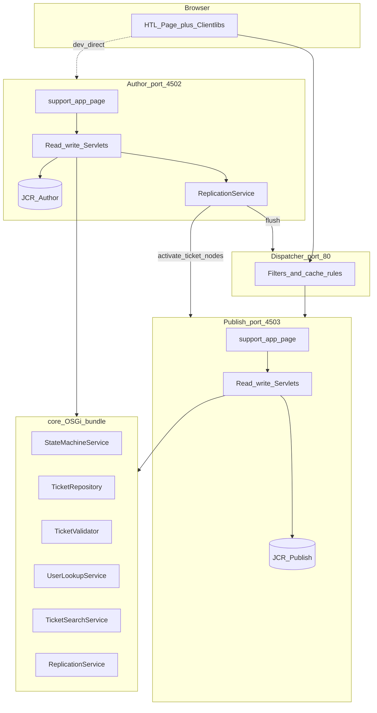
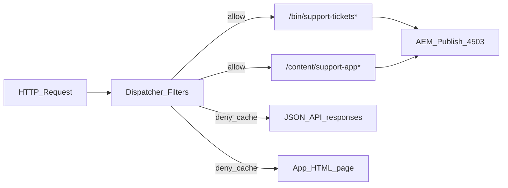
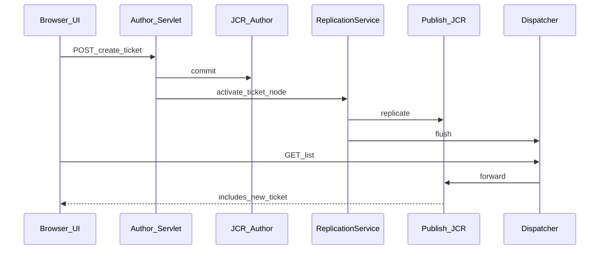
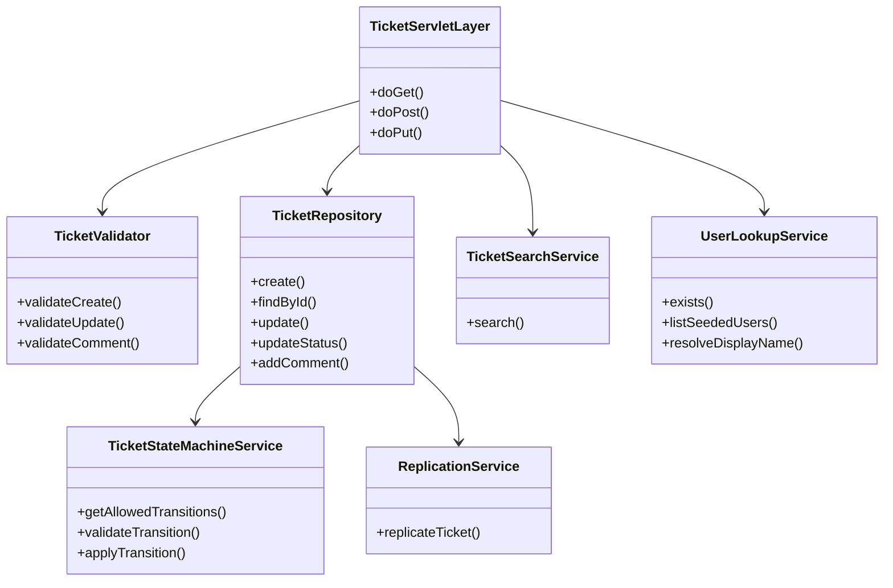
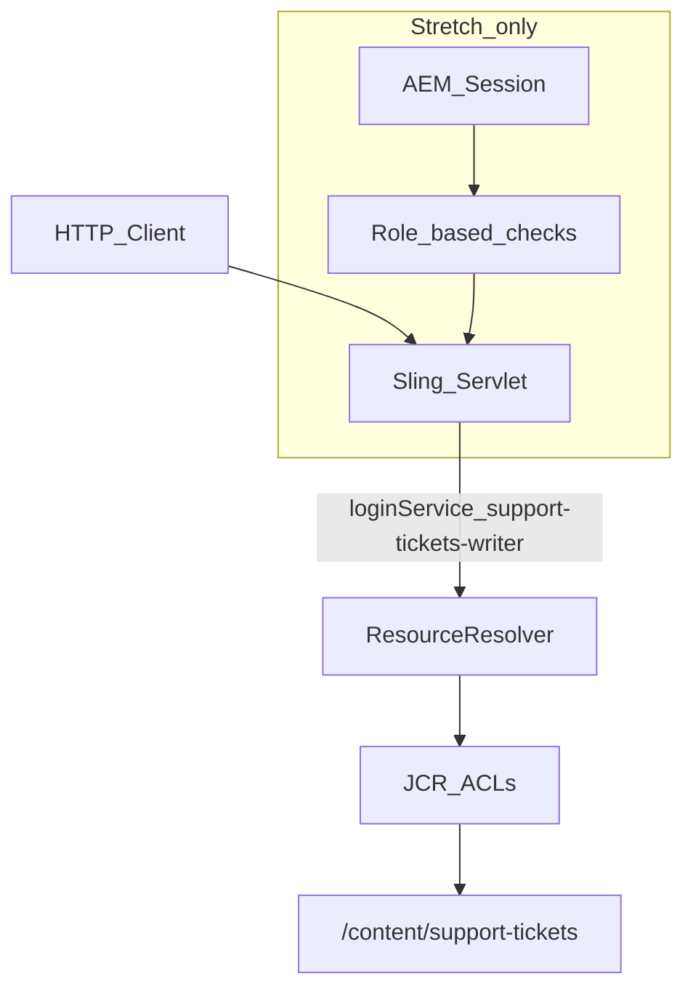
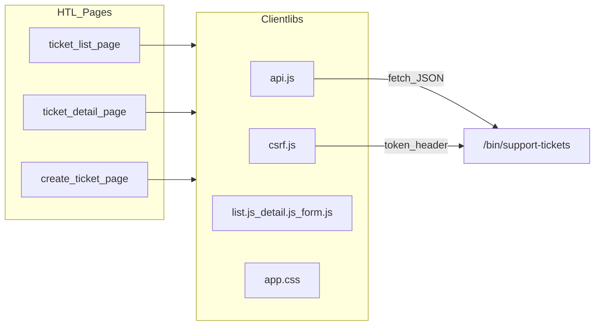
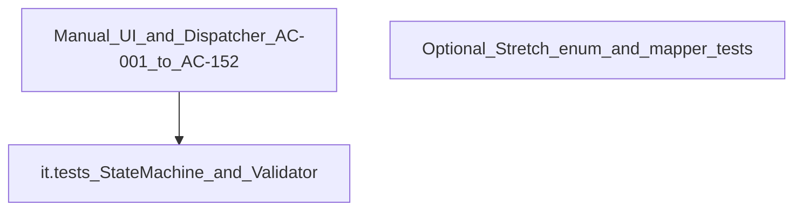
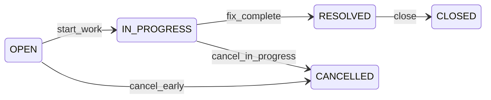
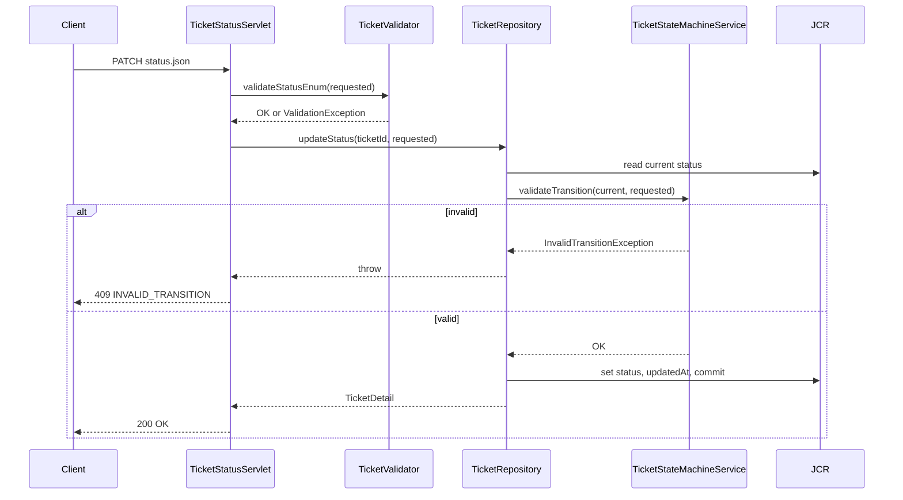
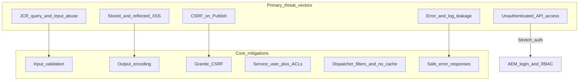

# Design Notes — Support Ticket Management System Architecture

**Project:** AI Practical Assessment  
**Platform:** AEM as a Cloud Service (AEMaaCS)  
**Source documents:** [requirements-analysis.md](requirements-analysis.md), [acceptance-criteria.md](acceptance-criteria.md)  
**Document version:** 1.0  
**Status:** Approved for implementation planning

---

## Purpose

This document defines the **target architecture** for the Support Ticket Management System on AEMaaCS. For each decision it records alternatives, trade-offs, the recommended choice, and rationale. No implementation code is included.

### Constraints (fixed)

- AEM as a Cloud Service, latest AEMaaCS SDK
- Topology: 1 Author + 1 Publisher + 1 Dispatcher
- JCR persistence (no external database)
- No unnecessary external services
- Custom Sling Servlet JSON API (approved)
- UI on Author and Publish/Dispatcher (approved)

---

## Architecture Overview



**Write path (recommended):** All mutations execute on **Author** JCR via servlets → `TicketRepository` commits → `ReplicationService` activates ticket nodes to Publish → Dispatcher flush. Publish servlets support read and write for local SDK parity; in production-minded design, Author remains source of truth.

---

## 1. AEM Maven Module Structure

### Alternatives

| Option | Description |
|--------|-------------|
| **A — Standard AEM multi-module** | `parent` → `core`, `ui.apps`, `ui.content`, `ui.config`, `it.tests`, `dispatcher` |
| **B — Minimal three-module** | `core`, `ui.apps`, `ui.content` only; Dispatcher config in `dispatcher/` folder without Maven module |
| **C — Monolithic single module** | All code and content in one package (anti-pattern for AEM) |

### Trade-offs

| Option | Pros | Cons |
|--------|------|------|
| A | Industry standard; separates concerns; SDK archetype alignment; `it.tests` isolated | More modules to maintain |
| B | Fewer POMs | No isolated test module; Dispatcher not first-class |
| C | Simplest file count | Violates AEM conventions; hard to test and deploy |

### Recommendation: **Option A**

```
support-tickets/
├── pom.xml                          # parent POM (SDK BOM)
├── core/                            # OSGi bundle: Java services, servlets, models
├── ui.apps/                         # apps/support-tickets: components, clientlibs, cnd, indexes
├── ui.content/                      # content/support-tickets: pages, seed tickets
├── ui.config/                       # OSGi configs: service user, runmode servlet bindings
├── it.tests/                        # Sling Mock / AEM context integration tests
└── dispatcher/                      # Dispatcher farm, filters, cache rules
```

**Why:** Matches AEMaaCS SDK archetype, supports runmode OSGi config (`ui.config`), isolates mandatory state-machine tests in `it.tests`, and packages Dispatcher rules for AC-152. Aligns with required repo layout (`src/` can wrap or mirror this structure per submission convention).

---

## 2. `core` Module Responsibilities

### Alternatives

| Option | Description |
|--------|-------------|
| **A — Rich core, thin servlets** | All business logic, JCR, validation, state machine in OSGi services; servlets are HTTP adapters only |
| **B — Servlet-centric** | JCR and validation inline in servlet classes |
| **C — Split into multiple bundles** | `core-api`, `core-impl`, `core-servlets` |

### Trade-offs

| Option | Pros | Cons |
|--------|------|------|
| A | Testable; single responsibility; meets AC-160–162 | More classes |
| B | Fewer files | Untestable state machine; fails engineering review |
| C | Clean layering at scale | Over-engineered for assessment scope |

### Recommendation: **Option A**

**`core` owns:**

| Package / area | Responsibility |
|----------------|----------------|
| `.../api/` | DTOs, enums (`TicketStatus`, `Priority`), exception types |
| `.../repository/` | `TicketRepository`, `CommentRepository` — sole JCR writers |
| `.../service/` | `TicketStateMachineService`, `TicketSearchService`, `UserLookupService`, `ReplicationService` |
| `.../validation/` | `TicketValidator` |
| `.../servlet/` | Thin Sling Servlets (parse request → call service → write JSON) |
| `.../model/` | Sling Models for HTL (read-only page shell) |
| `.../util/` | JSON mapping, date formatting, error response builder |

**Does not own:** HTL templates, Clientlibs, content paths, Dispatcher config, seed XML.

---

## 3. `ui.apps` Module Responsibilities

### Alternatives

| Option | Description |
|--------|-------------|
| **A — HTL components + Clientlibs** | Traditional AEM component under `apps/support-tickets` |
| **B — SPA Editor / React** | Frontend SPA with separate build pipeline |
| **C — Static Clientlib only** | No HTL components; bare page template |

### Trade-offs

| Option | Pros | Cons |
|--------|------|------|
| A | AEM-native; no Node build required; XSS via HTL context | More AEM-specific knowledge |
| B | Modern UX | Extra toolchain; not simplest AEM-native |
| C | Minimal | Poor content structure; harder Author preview |

### Recommendation: **Option A**

**`ui.apps` owns:**

| Path | Content |
|------|---------|
| `apps/support-tickets/components/` | `page`, `ticket-list`, `ticket-detail`, `ticket-form` HTL components |
| `apps/support-tickets/clientlibs/` | `support-tickets.app` (JS + CSS), `support-tickets.csrf` (token helper) |
| `apps/support-tickets/config/` | Oak index definition for ticket search |
| `apps/support-tickets/config/.../repoinit/` | Path + ACL initialization (or in `ui.config`) |
| `META-INF/vault/filter.xml` | Package filters |

**Also hosts:** Servlet registrations via `@Component` in `core` (code in core, deployed via ui.apps dependency) — standard pattern: Java in `core`, package installed as part of apps bundle embedding or separate core package.

> **Note:** In standard AEM archetype, `core` is a separate OSGi bundle package (`support-tickets.core`). Both `core` and `ui.apps` are separate installable packages; `ui.apps` depends on `core`.

---

## 4. `ui.content` Module Responsibilities

### Alternatives

| Option | Description |
|--------|-------------|
| **A — Content package with seed data** | Pages + sample tickets + user references |
| **B — repoinit-only seed** | Structure via repoinit; no sample tickets |
| **C — Runtime seed servlet** | Servlet creates data on first boot |

### Trade-offs

| Option | Pros | Cons |
|--------|------|------|
| A | Reproducible (AC-091); versioned; activatable to Publish | Package size |
| B | Good for paths/ACLs | No sample tickets without extra step |
| C | Easy to hack | Not reproducible; fails AC-091 |

### Recommendation: **Option A** for pages and seed tickets; **repoinit** (in `ui.config`) for users and path ACLs

**`ui.content` owns:**

| Path | Content |
|------|---------|
| `content/support-app/` | Application page(s) embedding ticket components |
| `content/support-tickets/tickets/` | Seed ticket nodes (3–5 samples across statuses) |
| `conf/support-tickets/` | Optional editable template / policies if needed |

**Does not own:** Java code, Clientlibs, Oak index definitions.

---

## 5. Dispatcher Responsibilities

### Alternatives

| Option | Description |
|--------|-------------|
| **A — Explicit filter + cache rules** | Allow `/bin/support-tickets`, deny cache for API and app page |
| **B — Default Dispatcher config only** | No customization |
| **C — Route all traffic to Author** | Dispatcher → Author for mutations |

### Trade-offs

| Option | Pros | Cons |
|--------|------|------|
| A | AC-152 passes; correct cache behaviour | Requires Dispatcher module maintenance |
| B | Zero config | AC-152 fails; stale data (CR-36) |
| C | Single source of truth | Violates Publish topology requirement |

### Recommendation: **Option A**

**Dispatcher module owns:**



| Rule | Purpose |
|------|---------|
| `/filter { /url "/bin/support-tickets*" /type "allow" }` | AC-152: servlet access through Dispatcher |
| `/cache /cache /rules { /deny .../bin/support-tickets }` | Prevent stale ticket list (AC-011, CR-36) |
| `/cache /cache /rules { /deny .../content/support-app }` | Dynamic page not cached |
| CSRF not blocked | Allow POST/PUT/PATCH with Granite token header |
| `/invalidate` or flush agent | Replication flush after Author activate |

**Does not own:** Business logic, JCR writes, UI rendering.

---

## 6. Author Responsibilities

### Alternatives

| Option | Description |
|--------|-------------|
| **A — Author as write master** | All mutations on Author; replicate to Publish |
| **B — Author UI only; API on Publish** | Split write path |
| **C — Author for content editing only; API writes on both** | Dual write |

### Trade-offs

| Option | Pros | Cons |
|--------|------|------|
| A | Clear source of truth; standard AEM pattern | Must replicate after each write |
| B | Confusing topology | Data drift |
| C | Seems convenient | CR-01; dual-source conflicts |

### Recommendation: **Option A**

**Author is responsible for:**

| Responsibility | Detail |
|----------------|--------|
| Primary development target | Package install via Maven profiles |
| Write authority | All create/update/status/comment mutations commit to Author JCR first |
| Replication trigger | `ReplicationService` activates `/content/support-tickets/tickets/{id}` and parent paths after mutation |
| Content authoring | Support app page lives here first; activated to Publish |
| CRX/Package Manager | Seed package installation |
| Dev access | `:4502` direct access for debugging without Dispatcher |

**Author is not responsible for:** Public end-user traffic in production topology (that is Dispatcher → Publish).

---

## 7. Publisher Responsibilities

### Alternatives

| Option | Description |
|--------|-------------|
| **A — Read-optimized replica** | Receive replicated ticket nodes; serve UI + API reads; writes optional for SDK local dev |
| **B — Publish write-through to Author** | Publish servlet proxies to Author |
| **C — Publish fully independent** | No replication |

### Trade-offs

| Option | Pros | Cons |
|--------|------|------|
| A | Standard AEM; AC-151 satisfied | Requires replication discipline |
| B | Always consistent | Complex; latency; not needed for assessment |
| C | Simple local hack | AC-151/152 fail |

### Recommendation: **Option A** (with local SDK write on Publish for parity)

**Publish is responsible for:**

| Responsibility | Detail |
|----------------|--------|
| Serving end-user UI | `/content/support-app.html` via Dispatcher |
| Serving JSON API | `/bin/support-tickets*.json` for list, detail, search |
| Holding replicated JCR | Ticket nodes activated from Author |
| CSRF enforcement | AEM platform validates token on mutating requests from browser |
| Same code deployment | `core` + `ui.apps` packages installed on Publish |

**Replication flow:**



---

## 8. OSGi Service Boundaries

### Alternatives

| Option | Description |
|--------|-------------|
| **A — Layered services** | Repository → Domain services → Servlets |
| **B — God service** | Single `TicketService` does everything |
| **C — Micro-bundle services** | One bundle per service |

### Trade-offs

| Option | Pros | Cons |
|--------|------|------|
| A | Testable; clear boundaries; AC-160 targets `StateMachineService` | More interfaces |
| B | Few files | Hard to test; mixed concerns |
| C | Extreme isolation | Overkill |

### Recommendation: **Option A**



| Service | Boundary rule |
|---------|---------------|
| `TicketStateMachineService` | **Only** component that knows valid transitions; no JCR access |
| `TicketRepository` | **Only** component that writes ticket/comment JCR nodes; calls state machine for status changes |
| `TicketValidator` | **Only** component with field-level validation rules |
| `TicketSearchService` | **Only** component that builds Oak/QueryBuilder queries |
| `UserLookupService` | **Only** component that reads AEM `UserManager` |
| `ReplicationService` | **Only** component that calls `Replicator` |

---

## 9. Servlet Boundaries

### Alternatives

| Option | Description |
|--------|-------------|
| **A — Resource-type-bound servlets** | `sling.servlet.resourceTypes` + selectors |
| **B — Path-bound `/bin` servlets** | Fixed paths under `/bin/support-tickets` |
| **C — Sling POST to content nodes** | POST to ticket node directly |

### Trade-offs

| Option | Pros | Cons |
|--------|------|------|
| A | RESTful on content | Harder URL contract for assessment |
| B | Clear API contract (AC-002); easy Dispatcher rules | Less "pure" REST on resources |
| C | Very Sling-native | Leaky JCR structure to clients |

### Recommendation: **Option B** (approved)

| Servlet | Path | Methods | Delegates to |
|---------|------|---------|--------------|
| `TicketListServlet` | `/bin/support-tickets` | GET, POST | `TicketSearchService`, `TicketRepository` |
| `TicketDetailServlet` | `/bin/support-tickets/{id}` | GET, PUT | `TicketRepository`, `TicketValidator` |
| `TicketStatusServlet` | `/bin/support-tickets/{id}/status` | PATCH | `TicketRepository` → `StateMachineService` |
| `TicketCommentServlet` | `/bin/support-tickets/{id}/comments` | POST | `TicketRepository`, `TicketValidator` |
| `UserListServlet` | `/bin/support-tickets/users` | GET | `UserLookupService` |

**Servlet rules:**

- Parse JSON / query params only; no business logic
- Map exceptions to HTTP status (`400`, `404`, `409`, `500`)
- Set `Cache-Control: no-store` on all responses
- Never use `admin` resource resolver

---

## 10. Sling Model Usage

### Alternatives

| Option | Description |
|--------|-------------|
| **A — Minimal models for page shell** | Sling Models set page title, clientlib paths; data via AJAX |
| **B — Full server-side models** | Models fetch all tickets server-side in HTL |
| **C — No Sling Models** | Pure static HTML + JS |

### Trade-offs

| Option | Pros | Cons |
|--------|------|------|
| A | Clean separation; API is single data source; HTL handles XSS shell | Two data paths if not careful |
| B | Works without JS | Duplicates API logic; harder to test |
| C | Simplest | No AEM component patterns |

### Recommendation: **Option A**

| Model | Purpose |
|-------|---------|
| `SupportAppPageModel` | Exposes `apiBase`, `csrfTokenUrl`, `pageTitle` to HTL |
| `TicketListPageModel` | Optional: initial status filter from query string in HTL |
| `TicketDetailPageModel` | Exposes `ticketId` from URL selector or query param |

**Sling Models do not:** Load ticket lists, enforce state machine, or write JCR. All ticket data flows through JSON API (keeps UI and API in sync; satisfies AC-010–AC-011).

---

## 11. JCR Persistence Approach

### Alternatives

| Option | Description |
|--------|-------------|
| **A — `nt:unstructured` + repository discipline** | Flexible nodes; validation in Java |
| **B — Custom CND node types** | Schema in repository |
| **C — Content Fragments** | Structured CF models |
| **D — `/var` operational store** | Non-content path |

### Trade-offs

| Option | Pros | Cons |
|--------|------|------|
| A | Fast to implement; sufficient for assessment | No repo-level schema enforcement |
| B | Strong typing in JCR | CND maintenance; Oak index complexity |
| C | AEM headless pattern | CF API overhead; less natural for comments tree |
| D | Clear operational separation | Less familiar replication path |

### Recommendation: **Option A** with optional CND later (Stretch)

**JCR structure:**

```
/content/support-tickets/
├── tickets/
│   └── {uuid}/
│       ├── jcr:primaryType = nt:unstructured
│       ├── sling:resourceType = support-tickets/components/ticket
│       ├── title, description, priority, status
│       ├── assignedTo, createdBy
│       ├── createdAt, updatedAt  (string ISO-8601 or Date)
│       └── comments/
│           └── {commentUuid}/
│               ├── message, createdBy, createdAt
```

| Rule | Rationale |
|------|-----------|
| Node name = ticket UUID | Immutable ID (AC-092, CR-05) |
| `status` set only via `TicketRepository.updateStatus()` | State machine isolation (AC-034) |
| `createdBy` set only on `create()` | AC-007 |
| `comments/` as child nodes | Natural hierarchy (FR-C06) |
| `commit()` on every mutation | AC-090 |

**Initialization:** `repoinit` creates `/content/support-tickets/tickets` with ACLs; seed tickets in `ui.content`.

---

## 12. Search Strategy

### Alternatives

| Option | Description |
|--------|-------------|
| **A — Oak QueryBuilder + custom Lucene index** | Predicate queries on indexed properties |
| **B — JCR-SQL2 traversal** | No index |
| **C — Oak fulltext on `/content`** | Broad fulltext |
| **D — In-memory filter after load-all** | Load all tickets, filter in Java |

### Trade-offs

| Option | Pros | Cons |
|--------|------|------|
| A | Performant; correct for assessment scale | Requires index definition |
| B | No index setup | Slow; fails at scale (CR-27) |
| C | Easy query | Performance anti-pattern |
| D | Trivial code | Does not scale; poor engineering |

### Recommendation: **Option A**

**Query behaviour (AC-070–AC-082):**

| Parameter | Behaviour |
|-----------|-----------|
| `q` | Case-insensitive `LIKE` on `title` OR `description` |
| `status` | Exact match on `status` property |
| Both | AND combined |
| Neither | Return all tickets (ordered by `updatedAt` desc) |

**Oak index** (`ui.apps`):

- Indexed properties: `status`, `title`, `description`, `updatedAt`
- Node type: `nt:unstructured` under `/content/support-tickets/tickets`

**`TicketSearchService`** builds QueryBuilder predicates; escapes `LIKE` special characters (CR-29).

---

## 13. User Lookup Strategy

### Alternatives

| Option | Description |
|--------|-------------|
| **A — AEM `UserManager` + seeded users** | Real AEM users under `/home/users/support/` |
| **B — JSON user file in content** | Users as content nodes, not AEM principals |
| **C — Hardcoded user map in OSGi** | Static Java map |

### Trade-offs

| Option | Pros | Cons |
|--------|------|------|
| A | Aligns with FR-C09; validates real paths; Stretch auth ready | Requires repoinit user setup |
| B | Easy to seed | Not AEM OOTB user management |
| C | Trivial | Fails AC-005 realism; not AEM-native |

### Recommendation: **Option A**

| Operation | Implementation |
|-----------|----------------|
| Seed users | `repoinit` creates `agent1`, `agent2`, `admin` under `support` folder with groups |
| Validate `createdBy` / `assignedTo` | `UserLookupService.exists(path)` via `UserManager.getAuthorizable` |
| Populate UI dropdown | `GET /bin/support-tickets/users.json` returns `{ id, name, email, role }` |
| Core identity | Client sends `createdBy` path (AC-001); no session binding in Core |

**User path format:** `/home/users/support/agent1` (stored as-is in ticket properties).

---

## 14. Authorization Approach

### Alternatives

| Option | Description |
|--------|-------------|
| **A — Open API + service user + JCR ACLs** | No end-user auth in Core; servlet uses service subservice |
| **B — AEM login required** | Session-bound user for all operations |
| **C — Dispatcher IP allowlist only** | Network-level restriction |

### Trade-offs

| Option | Pros | Cons |
|--------|------|------|
| A | Meets Core spec (auth optional); simple | Anyone with URL can mutate (documented) |
| B | Secure | Stretch scope; more UI work |
| C | Quick local lockdown | Not portable; not real auth |

### Recommendation: **Option A** for Core



| Layer | Core behaviour |
|-------|----------------|
| HTTP / Servlet | No session check; input validation only |
| Service user | `support-tickets-service` mapped in OSGi; subservice name in `TicketRepository` |
| JCR ACLs | Service user: read/write on `/content/support-tickets`; deny anonymous direct JCR |
| Dispatcher | Allow required methods; no admin paths exposed |
| CSRF | Required for browser mutations on Publish (platform layer) |

**Threat model note:** Document open mutation API in this file and `design-notes.md` for reviewers (SEC-C01 known limitation).

---

## 15. Frontend Architecture

### Alternatives

| Option | Description |
|--------|-------------|
| **A — HTL shell + Clientlibs + fetch API** | Vanilla JS modules call JSON servlets |
| **B — SPA Editor (React)** | `@adobe/aem-react-editable-components` |
| **C — Granite UI / Coral in clientlibs** | Adobe Coral components |

### Trade-offs

| Option | Pros | Cons |
|--------|------|------|
| A | Simplest; no Node build; HTL XSS encoding | Manual DOM updates |
| B | Rich UX | Build pipeline; more moving parts |
| C | AEM look-and-feel | Heavier; learning curve |

### Recommendation: **Option A**



| Screen | Route | Key behaviours |
|--------|-------|----------------|
| List | `/content/support-app.html` | Search box, status filter, ticket table |
| Detail | `.../ticket.html?id={uuid}` | Fields, comments, status dropdown from `allowedTransitions` |
| Create | `.../create.html` | Form with acting-as user selector |

**XSS:** HTL `@context='text'` for any server-rendered values; JS uses `textContent` only (AC-110, CR-41).

**CSRF:** `csrf.js` fetches `/libs/granite/csrf/token.json`; attaches `:cq_csrf_token` header on POST/PUT/PATCH (AC-152, CR-39).

**Error UX:** Parse `{ code, message, fields }`; show banner + field errors (AC-110).

---

## 16. Testing Architecture

### Alternatives

| Option | Description |
|--------|-------------|
| **A — Sling Mock unit/integration in `it.tests`** | `AemContext`; no running AEM |
| **B — AEM Test Context with running SDK** | Integration against live instance |
| **C — HTTP client tests only** | RestAssured against deployed servlets |

### Trade-offs

| Option | Pros | Cons |
|--------|------|------|
| A | `mvn test` fast; AC-160–162; CI-ready | No end-to-end servlet HTTP |
| B | Full fidelity | Slow; flaky; reviewer may not run |
| C | Tests real HTTP | Requires running AEM |

### Recommendation: **Option A** primary; **manual** for UI/Dispatcher

**Test pyramid:**



| Test class | Scope | AC coverage |
|------------|-------|-------------|
| `TicketStateMachineServiceTest` | 5 valid + 8+ invalid transitions | AC-040–057, AC-160–162 |
| `TicketValidatorTest` | Field validation (Stretch P1) | AC-003–005, AC-062 |
| `TicketRepositoryTest` | JCR read/write (Stretch) | AC-090–092 |
| Manual checklist in `test-results.md` | UI, CSRF, Dispatcher, restart | Remaining P0 |

**Run command:** `mvn clean test` from project root (documented in README).

---

## 17. Seed Data Strategy

### Alternatives

| Option | Description |
|--------|-------------|
| **A — repoinit users + ui.content tickets** | Idempotent structure + activatable sample data |
| **B — Groovy Console script** | Manual one-off |
| **C — Servlet @Activate seed** | Runtime seed on bundle start |

### Trade-offs

| Option | Pros | Cons |
|--------|------|------|
| A | AC-091; reproducible; standard AEM | Two mechanisms (repoinit + content) |
| B | Quick | Not reproducible (CR-43) |
| C | Automatic | Side effects on restart; not transparent |

### Recommendation: **Option A**

| Data | Mechanism | Location |
|------|-----------|----------|
| JCR path `/content/support-tickets` | `repoinit` | `ui.config/src/main/content/jcr_root/apps/support-tickets/config/...` |
| ACLs for service user | `repoinit` | Same |
| AEM users (agent1, agent2) | `repoinit` | `create path`, `create user`, `set ACL` |
| Seed tickets (5 samples) | Content XML | `ui.content/.../tickets/{uuid}/.content.xml` |
| App page | Content XML | `ui.content/.../support-app/.content.xml` |
| Oak index | Nodetype XML | `ui.apps/.../oak:index/supportTickets` |

**Seed ticket coverage:** At least one ticket per status (OPEN, IN_PROGRESS, RESOLVED, CLOSED, CANCELLED) for AC-081.

**Publish deployment:** Maven profile `autoInstallPackagePublish` or manual activate seed package to Publish after Author install (AC-091, CR-44).

**Idempotency:** repoinit uses `create path ...` (fails silently if exists); content package versioned; no duplicate UUIDs in seed XML.

---

## Decision Summary Table

| # | Topic | Recommendation | Key reason |
|---|-------|----------------|------------|
| 1 | Maven modules | Standard archetype + `it.tests` + `dispatcher` | AEM conventions; test isolation |
| 2 | core | Rich services, thin servlets | AC-160 testability |
| 3 | ui.apps | HTL + Clientlibs + Oak index | Simplest AEM-native UI |
| 4 | ui.content | Pages + seed tickets | AC-091 reproducibility |
| 5 | Dispatcher | Allow `/bin`; deny cache | AC-152; no stale data |
| 6 | Author | Write master + replication | CR-01 source of truth |
| 7 | Publish | Replicated read/write surface | AC-151 topology |
| 8 | OSGi boundaries | 6 focused services | Single responsibility |
| 9 | Servlets | `/bin/support-tickets` paths | Approved API contract |
| 10 | Sling Models | Page shell only | API as single data source |
| 11 | JCR | `nt:unstructured` + repository | Simple; sufficient |
| 12 | Search | QueryBuilder + Lucene index | AC-070–082 performance |
| 13 | Users | AEM UserManager + repoinit | FR-C09 compliance |
| 14 | Authorization | Service user; no Core auth | Spec allows; document threat |
| 15 | Frontend | HTL + vanilla JS Clientlibs | No external build |
| 16 | Testing | Sling Mock in `it.tests` | AC-160–162 without SDK boot |
| 17 | Seed data | repoinit + ui.content package | Reproducible setup |

---

## Downstream Artifacts

| This document informs | Next steps |
|-----------------------|------------|
| `api-contract.md` | Servlet paths, request/response schemas, error codes |
| `data-model.md` | JCR properties, enums, user path format |
| `ui-flow.md` | Screen routes, CSRF flow, error display |
| `test-strategy.md` | Test matrix from Section 16 |
| `implementation-plan.md` | Phased build order from recommendations |

---

## 18. Ticket Lifecycle and State Machine Design

### 18.1 Lifecycle review

#### Allowed transitions (authoritative spec)



| From | To | Business meaning |
|------|-----|------------------|
| `OPEN` | `IN_PROGRESS` | Work has started on the ticket |
| `IN_PROGRESS` | `RESOLVED` | Issue fixed; awaiting confirmation/closure |
| `RESOLVED` | `CLOSED` | Ticket closed (terminal) |
| `OPEN` | `CANCELLED` | Withdrawn before work started (terminal) |
| `IN_PROGRESS` | `CANCELLED` | Withdrawn while in progress (terminal) |

#### Terminal states

| Status | Outbound transitions |
|--------|---------------------|
| `CLOSED` | None |
| `CANCELLED` | None |

#### Implicit lifecycle rules (derived)

| Rule | Enforcement |
|------|-------------|
| New tickets start as `OPEN` | `TicketRepository.create()` — client cannot set initial status |
| `status` not mutable via `PUT` | `TicketValidator` rejects field; repository has no `updateStatus` on general update |
| Only `TicketRepository.updateStatus()` writes `status` to JCR | Single persistence path |
| UI shows `allowedTransitions` from API | UX hint only; not enforcement |
| Same-status request is invalid | Treated as `INVALID_TRANSITION` (409), not no-op success |

#### Invalid transition categories

| Category | Examples |
|----------|----------|
| Skip-level | `OPEN` → `RESOLVED`, `OPEN` → `CLOSED` |
| Backward | `IN_PROGRESS` → `OPEN`, `RESOLVED` → `IN_PROGRESS` |
| Wrong branch | `RESOLVED` → `CANCELLED` |
| Terminal escape | `CLOSED` → `OPEN`, `CANCELLED` → `IN_PROGRESS` |
| No-op | `OPEN` → `OPEN` |
| Unknown enum | `OPEN` → `INVALID` (400 validation, not 409) |

---

### 18.2 Implementation approach comparison

#### Approach A — Static transition map (recommended)

A pure domain OSGi service holds a **static `Map<TicketStatus, Set<TicketStatus>>`** (or equivalent) defining allowed edges. Methods:

- `Set<TicketStatus> getAllowedTransitions(TicketStatus current)`
- `void validateTransition(TicketStatus current, TicketStatus requested)` — throws domain exception
- `TicketStatus applyTransition(TicketStatus current, TicketStatus requested)` — validate then return new status

No JCR, no HTTP, no servlet imports.

| Pros | Cons |
|------|------|
| Trivially unit-testable (pure Java) | Transition table is code, not config |
| Zero AEM coupling | Adding status requires code change + tests (acceptable) |
| O(1) lookup | — |
| Easy to read and review | — |
| Single class owns all rules | — |

#### Approach B — Enum-embedded transitions

Each `TicketStatus` enum constant declares `Set<TicketStatus> allowedTargets` or implements `canTransitionTo(TicketStatus)`.

| Pros | Cons |
|------|------|
| Co-locates status with its edges | Enum becomes heavier; harder to visualize full graph |
| Still testable | Circular enum dependencies if not careful |
| Type-safe | Adding status touches enum definition |

#### Approach C — Externalized rules (OSGi config / JSON file)

Transitions loaded from `ui.config` or classpath JSON at activation.

| Pros | Cons |
|------|------|
| Change rules without recompile (theoretically) | Overkill for 5 states / 5 transitions |
| — | Runtime misconfiguration risk |
| — | Harder to test (need config fixture) |
| — | Assessment scope does not need runtime rule changes |

#### Approach D — Rules in servlet or repository inline

`if (current == OPEN && requested == IN_PROGRESS)` scattered in servlet or repository.

| Pros | Cons |
|------|------|
| Fast to hack | **Fails all six requirements** |
| — | Untestable in isolation |
| — | Duplicated in UI possible |
| — | Tight HTTP/JCR coupling |

### Recommendation: **Approach A (static transition map service)**

**Why:** Best balance of clarity, testability, and extensibility for Core. Approach B is acceptable but Approach A keeps the **entire graph visible in one place** — important for review and AC-160–162. Approach C is over-engineered. Approach D must be rejected.

**Extensibility pattern for future status/transition:**

1. Add value to `TicketStatus` enum.
2. Add row/column to transition map in `TicketStateMachineService`.
3. Add unit tests for new edges.
4. Update `api-contract.md` and acceptance criteria.
5. No servlet or repository signature changes required.

---

### 18.3 Domain behavior

| Responsibility | Owner | NOT owner |
|----------------|-------|-----------|
| Know valid transitions | `TicketStateMachineService` | Servlet, UI, Validator |
| Persist `status` to JCR | `TicketRepository` | State machine service |
| Validate enum syntax | `TicketValidator` | State machine (assumes valid enum) |
| Read current status before transition | `TicketRepository` | Servlet |
| Return `allowedTransitions` in API | Repository delegates to state machine | Servlet computes transitions |

#### Sequence: status change (authoritative path)



#### Invariants (must always hold)

1. **Single writer:** Only `TicketRepository.updateStatus()` sets the `status` property.
2. **Validate before persist:** State machine runs on **persisted** current status, not request cache.
3. **No bypass:** `PUT` cannot carry `status`; repository `update()` must not accept status parameter.
4. **Backend authority:** UI may hide invalid options; API must reject if client sends them anyway (AC-111).

---

### 18.4 Service boundary

#### `TicketStateMachineService` (OSGi)

**Public API (conceptual):**

| Method | Input | Output | Side effects |
|--------|-------|--------|--------------|
| `getAllowedTransitions` | `TicketStatus current` | `Set<TicketStatus>` | None |
| `validateTransition` | `current`, `requested` | void or throws | None |
| `applyTransition` | `current`, `requested` | `TicketStatus` newStatus | None |

**Dependencies:** `TicketStatus` enum only. No `ResourceResolver`, no `SlingHttpServletRequest`, no JSON.

**Consumers:**

| Consumer | Usage |
|----------|-------|
| `TicketRepository` | Calls `validateTransition` / `applyTransition` inside `updateStatus` |
| `TicketRepository` | Calls `getAllowedTransitions` when building detail DTO |
| `TicketStatusServlet` | Does **not** call state machine directly — goes through repository |

#### `TicketRepository.updateStatus(ticketId, TicketStatus requested)`

1. Load ticket; if missing → `TicketNotFoundException`.
2. Read **current** status from JCR (refresh if needed for concurrency).
3. Call `stateMachine.validateTransition(current, requested)`.
4. On success: persist new status, bump `updatedAt`, commit, replicate.
5. Return updated ticket DTO with fresh `allowedTransitions`.

---

### 18.5 Exception and error strategy

#### Domain exceptions (in `core` API package)

| Exception | When | HTTP mapping |
|-----------|------|--------------|
| `InvalidTransitionException` | Valid enum but disallowed edge | `409` `INVALID_TRANSITION` |
| `ValidationException` | Missing/blank status, unknown enum | `400` `VALIDATION_ERROR` |
| `TicketNotFoundException` | Unknown ticket ID | `404` `NOT_FOUND` |

#### `InvalidTransitionException` payload

| Field | Example |
|-------|---------|
| `currentStatus` | `OPEN` |
| `requestedStatus` | `CLOSED` |
| `allowedTransitions` | `["IN_PROGRESS", "CANCELLED"]` |
| `message` | `"Cannot transition from OPEN to CLOSED."` |

#### Layer responsibilities

| Layer | Responsibility |
|-------|----------------|
| `TicketStateMachineService` | Throw `InvalidTransitionException` only |
| `TicketValidator` | Throw `ValidationException` for null/unknown enum |
| `TicketRepository` | Propagate domain exceptions; wrap `RepositoryException` → `InternalServiceException` |
| `TicketStatusServlet` | Catch domain exceptions → map to JSON error envelope |
| Servlet | **Never** catch `InvalidTransitionException` and convert to 400 |

#### Logging

| Level | What |
|-------|------|
| `WARN` | Invalid transition attempts (include ticketId, current, requested) |
| `ERROR` | Unexpected `RepositoryException` (full stack server-side only) |
| `DEBUG` | Successful transitions |

---

### 18.6 HTTP mapping

| Condition | HTTP status | `code` | Servlet |
|-----------|-------------|--------|---------|
| Valid transition | `200` | — | `TicketStatusServlet` |
| Invalid transition | `409` | `INVALID_TRANSITION` | `TicketStatusServlet` |
| Missing `status` in body | `400` | `VALIDATION_ERROR` | `TicketStatusServlet` |
| Unknown status enum | `400` | `VALIDATION_ERROR` | `TicketStatusServlet` |
| Ticket not found | `404` | `NOT_FOUND` | `TicketStatusServlet` |
| `status` in PUT body | `400` | `VALIDATION_ERROR` | `TicketDetailServlet` |
| Unhandled error | `500` | `INTERNAL_ERROR` | Any |

**Response body for 409** (per `api-contract.md`):

```json
{
  "code": "INVALID_TRANSITION",
  "message": "Cannot transition from OPEN to CLOSED.",
  "details": {
    "currentStatus": "OPEN",
    "requestedStatus": "CLOSED",
    "allowedTransitions": ["IN_PROGRESS", "CANCELLED"]
  }
}
```

**Frontend contract:** Detail GET includes `allowedTransitions` for dropdown population. On PATCH failure, display `message` and refresh detail to sync state.

---

### 18.7 Unit test cases (`TicketStateMachineServiceTest`)

Pure JUnit 5; no AEM context. Run in `it.tests` or `core` with `mvn test`.

#### Valid transitions (must pass)

| # | Current | Requested | Expected |
|---|---------|-----------|----------|
| UT-V01 | `OPEN` | `IN_PROGRESS` | Returns `IN_PROGRESS` |
| UT-V02 | `IN_PROGRESS` | `RESOLVED` | Returns `RESOLVED` |
| UT-V03 | `RESOLVED` | `CLOSED` | Returns `CLOSED` |
| UT-V04 | `OPEN` | `CANCELLED` | Returns `CANCELLED` |
| UT-V05 | `IN_PROGRESS` | `CANCELLED` | Returns `CANCELLED` |

#### Invalid transitions (must throw `InvalidTransitionException`)

| # | Current | Requested | Notes |
|---|---------|-----------|-------|
| UT-I01 | `OPEN` | `RESOLVED` | Skip-level |
| UT-I02 | `OPEN` | `CLOSED` | Skip-level |
| UT-I03 | `IN_PROGRESS` | `OPEN` | Backward |
| UT-I04 | `RESOLVED` | `IN_PROGRESS` | Backward |
| UT-I05 | `RESOLVED` | `CANCELLED` | Wrong branch |
| UT-I06 | `CLOSED` | `OPEN` | Terminal |
| UT-I07 | `CLOSED` | `IN_PROGRESS` | Terminal |
| UT-I08 | `CANCELLED` | `IN_PROGRESS` | Terminal |
| UT-I09 | `CANCELLED` | `OPEN` | Terminal |
| UT-I10 | `OPEN` | `OPEN` | No-op |
| UT-I11 | `RESOLVED` | `CLOSED` | *(valid — separate from I05)* |

#### `getAllowedTransitions` tests

| # | Current | Expected set |
|---|---------|--------------|
| UT-A01 | `OPEN` | `{IN_PROGRESS, CANCELLED}` |
| UT-A02 | `IN_PROGRESS` | `{RESOLVED, CANCELLED}` |
| UT-A03 | `RESOLVED` | `{CLOSED}` |
| UT-A04 | `CLOSED` | `{}` |
| UT-A05 | `CANCELLED` | `{}` |

#### Exception content tests

| # | Assertion |
|---|-----------|
| UT-E01 | `InvalidTransitionException` contains `currentStatus` and `requestedStatus` |
| UT-E02 | `InvalidTransitionException` contains `allowedTransitions` matching `getAllowedTransitions(current)` |

---

### 18.8 Integration test cases

Integration tests verify **repository + state machine collaboration** and/or **servlet HTTP mapping**. Core mandatory tier focuses on state machine service (AC-160). Recommended additional integration tests:

#### Service + repository (`TicketRepositoryStatusIT` — Stretch recommended)

| # | Scenario | Expected |
|---|----------|----------|
| IT-01 | `updateStatus` valid transition persists to JCR | Status changed after commit |
| IT-02 | `updateStatus` invalid transition | No JCR change; exception thrown |
| IT-03 | `updateStatus` on missing ticket | `TicketNotFoundException` |
| IT-04 | Detail after transition | `allowedTransitions` updated |

Uses `AemContext` with in-memory or mock JCR.

#### Servlet HTTP (`TicketStatusServletIT` — recommended P1)

| # | HTTP | Body | Expected |
|---|------|------|----------|
| IT-H01 | `PATCH .../status.json` | `{ "status": "IN_PROGRESS" }` on OPEN ticket | `200` |
| IT-H02 | `PATCH .../status.json` | `{ "status": "CLOSED" }` on OPEN ticket | `409` + `INVALID_TRANSITION` |
| IT-H03 | `PATCH .../status.json` | `{ "status": "INVALID" }` | `400` |
| IT-H04 | `PUT .../{id}.json` | `{ "status": "IN_PROGRESS" }` | `400`; status unchanged |
| IT-H05 | `PATCH .../missing-id/status.json` | valid body | `404` |

#### End-to-end lifecycle path (manual / Stretch)

| # | Path | Final status |
|---|------|--------------|
| IT-E01 | OPEN → IN_PROGRESS → RESOLVED → CLOSED | `CLOSED` |
| IT-E02 | OPEN → CANCELLED | `CANCELLED` |
| IT-E03 | OPEN → IN_PROGRESS → CANCELLED | `CANCELLED` |

---

### 18.9 Edge cases

| Edge case | Expected behaviour | Layer |
|-----------|-------------------|-------|
| **Concurrent status PATCH** | Two requests race; second validates against **post-commit** current status; one may get 409 | Repository re-reads before validate |
| **PATCH after ticket deleted** | 404 | Repository |
| **Null `status` in PATCH body** | 400 `VALIDATION_ERROR` | Validator |
| **Empty string `status`** | 400 | Validator |
| **Lowercase `"open"` in body** | Normalized to `OPEN` or 400 if strict — recommend normalize | Validator |
| **Status in PUT** | 400; JCR unchanged | Validator + repository |
| **Create with `status: CLOSED`** | Ignored; created as `OPEN` | Repository create |
| **UI sends transition UI hid** | 409 from API | State machine |
| **GET detail on CLOSED ticket** | `allowedTransitions: []` | State machine |
| **Comment on CLOSED ticket** | Allowed in Core (no status gate on comment) | Policy decision — document in `data-model.md` |
| **Field update on CLOSED ticket** | Allowed in Core (no terminal lock on fields) | Policy decision |
| **Replication lag on Publish** | Publish may briefly show old status until replicate completes | Operational — not state machine bug |
| **Invalid enum after future downgrade** | Ticket with orphaned status in JCR | Repository read should fail safe or map to validation error (Stretch) |

---

### 18.10 Anti-patterns to reject

| Anti-pattern | Why |
|--------------|-----|
| `if` chain in servlet | Not testable; coupled to HTTP |
| UI disables button = enforcement | Fails AC-111 |
| `status` property set in `repository.update()` | Bypasses state machine |
| 400 for invalid transition | Wrong semantics; use 409 |
| State machine reads JCR | Couples domain to persistence |
| Single test for "one invalid transition" | Fails AC-162 comprehensiveness |

---

## 19. Pre-Implementation Security Review

Security assessment of the proposed AEMaaCS Support Ticket Management System **before implementation**. Recommendations are practical for the assessment scope — Core accepts an open internal API per spec; mitigations focus on safe defaults without over-engineering.

### 19.1 Risk summary

| Tier | Count | Meaning |
|------|-------|---------|
| **Core — must mitigate** | 12 | Implement before submission |
| **Core — document as accepted risk** | 3 | Known limitations per spec |
| **Stretch** | 8 | Auth, RBAC, hardening when time permits |



---

### 19.2 AEM authentication

| ID | Concern |
|----|---------|
| **SEC-A01** | No end-user authentication in Core |

**Risk:** Any network client that can reach the Publish/Dispatcher URL can create, read, update tickets and add comments without proving identity.

**Attack / impact:** Anonymous abuse — ticket spam, fraudulent `createdBy` impersonation (client picks any seeded user from dropdown), data tampering. In a real deployment, internal support data would be exposed to anyone on the network path.

**Mitigation:**

| Priority | Action |
|----------|--------|
| Core | **Document as accepted risk** in threat model (spec explicitly makes auth Stretch). Restrict network access in local SDK (localhost/Dispatcher only). |
| Core | Validate `createdBy` references exist (not caller identity) — limits impersonation to seeded user list only. |
| Stretch | Require AEM login; bind `createdBy` to `request.getResourceResolver().getUserID()`; protect app page with closed user group. |

**Core or Stretch:** Accepted risk **Core**; login **Stretch** (FR-S03, SEC-S01).

---

### 19.3 AEM users and groups

| ID | Concern |
|----|---------|
| **SEC-U01** | Seeded users with predictable paths |
| **SEC-U02** | No group-based access control |

**Risk:** Users under `/home/users/support/` with default passwords (if any) or weak repoinit credentials; all users visible via `GET /users.json`.

**Attack / impact:** Attacker enumerates valid `createdBy`/`assignedTo` paths from users API; impersonates agents in ticket metadata. Compromised seed user credentials grant AEM console access if passwords are set.

**Mitigation:**

| Priority | Action |
|----------|--------|
| Core | Create users via repoinit **without** passwords for Publish-facing principals, or use disabled login — users exist only as reference IDs. |
| Core | Do not expose password or credential material in content packages. |
| Core | `GET /users.json` returns only `id`, `name`, `email`, `role` — no internal AEM metadata. |
| Stretch | Map AEM groups (`support-agents`, `support-supervisors`) to roles; restrict user list to authenticated agents. |

**Core or Stretch:** Safe seeding **Core**; groups/RBAC **Stretch** (FR-S02, SEC-S02).

---

### 19.4 Authorization

| ID | Concern |
|----|---------|
| **SEC-Z01** | No application-level authorization |
| **SEC-Z02** | Client-supplied `createdBy` not bound to session |

**Risk:** Authorization is validation-only (user exists), not permission-based (caller allowed to act as that user).

**Attack / impact:** Any API caller assigns any ticket to any seeded user and attributes comments to any agent. No ownership checks on edit.

**Mitigation:**

| Priority | Action |
|----------|--------|
| Core | **Document accepted risk.** Treat `createdBy` as audit metadata, not security boundary. |
| Core | Backend still enforces state machine and field validation — limits blast radius to ticket domain. |
| Stretch | Check session user is in `support-agents` group; only supervisors reassign; API returns `403` for unauthorized operations. |

**Core or Stretch:** Accepted risk **Core**; RBAC **Stretch** (SEC-S02, SEC-S03).

---

### 19.5 Resource permissions (JCR ACLs)

| ID | Concern |
|----|---------|
| **SEC-P01** | Overly broad ACLs on ticket path |
| **SEC-P02** | Servlet uses admin session |

**Risk:** Wide-open `/content` ACLs or `admin` resource resolver allow privilege escalation if servlet is compromised.

**Attack / impact:** Compromised servlet code or injection could read/write arbitrary repository content, including `/apps`, user profiles, or OSGi config.

**Mitigation:**

| Priority | Action |
|----------|--------|
| Core | Dedicated **service user** `support-tickets-service` mapped in OSGi (`ui.config`). |
| Core | repoinit ACLs: service user **only** `jcr:read`, `jcr:write`, `crx:replicate` on `/content/support-tickets` and descendants. |
| Core | **Never** use `admin` or requesting user's resolver for ticket JCR operations. |
| Core | Deny anonymous `jcr:write` on ticket path (writes go through servlet + service user only). |
| Stretch | Fine-grained ACEs per operation if multi-tenant (out of scope). |

**Core or Stretch:** **Core** (SEC-R01, SEC-R03).

---

### 19.6 Servlet exposure

| ID | Concern |
|----|---------|
| **SEC-SV01** | `/bin` servlets publicly reachable |
| **SEC-SV02** | Unrestricted HTTP methods |
| **SEC-SV03** | Servlet bound on both Author and Publish |

**Risk:** Attackers invoke JSON API directly (bypass UI), use unexpected methods, or target Author instance if exposed.

**Attack / impact:** Automated ticket flooding, direct PUT/PATCH without UI, reconnaissance of API surface. Author exposure increases attack surface in misconfigured networks.

**Mitigation:**

| Priority | Action |
|----------|--------|
| Core | Register servlets on **fixed paths** only (`/bin/support-tickets`, etc.) — no wildcard resource-type bindings on `/content`. |
| Core | Servlet `doGet`/`doPost`/`doPut`/`doPatch` explicitly — reject others with `405`. |
| Core | Dispatcher: allow only required paths and methods (see §19.12). |
| Core | README: do not expose Author `:4502` to public networks in production patterns. |
| Stretch | Runmode config to disable mutating servlets on Publish if Author-proxy pattern adopted. |

**Core or Stretch:** Path discipline and method allowlist **Core**; runmode hardening **Stretch**.

---

### 19.7 CSRF

| ID | Concern |
|----|---------|
| **SEC-CS01** | Browser mutations without CSRF token on Publish |

**Risk:** Cross-site request forgery — malicious site triggers ticket create/update in victim's browser while session cookies are sent.

**Attack / impact:** Victim unknowingly creates tickets, changes status, or adds comments if they are logged into AEM or anonymous CSRF policy applies.

**Mitigation:**

| Priority | Action |
|----------|--------|
| Core | Clientlibs fetch Granite token from `/libs/granite/csrf/token.json` before POST/PUT/PATCH. |
| Core | Send `:cq_csrf_token` header on all mutating fetch calls from UI. |
| Core | Verify mutations work through Dispatcher in manual test checklist (AC-152). |
| Core | Do not disable CSRF filter in Dispatcher for `/bin/support-tickets`. |

**Core or Stretch:** **Core** (platform requirement for Publish browser use).

---

### 19.8 XSS (cross-site scripting)

| ID | Concern |
|----|---------|
| **SEC-X01** | Stored XSS in title, description, comments |
| **SEC-X02** | Reflected XSS in search query display |

**Risk:** Malicious HTML/JS in ticket fields executes in other users' browsers when rendered.

**Attack / impact:** Session hijacking (if auth added later), defacement, phishing content in internal app, keylogging via injected script.

**Mitigation:**

| Priority | Action |
|----------|--------|
| Core | HTL: `@context='text'` for any server-rendered ticket fields. |
| Core | JavaScript: render user content with `textContent` only — **never** `innerHTML` for title, description, comments, search terms. |
| Core | Optional defense-in-depth: strip HTML tags on input server-side (not required if output encoding is correct). |
| Stretch | Content Security Policy header via Dispatcher for app pages. |

**Core or Stretch:** Output encoding **Core** (SEC-R02); CSP **Stretch**.

---

### 19.9 Request validation

| ID | Concern |
|----|---------|
| **SEC-V01** | Missing server-side validation |
| **SEC-V02** | Oversized payloads (DoS) |
| **SEC-V03** | JSON deserialization abuse |

**Risk:** Invalid or malicious input corrupts JCR, bypasses business rules, or causes resource exhaustion.

**Attack / impact:** Megabyte descriptions fill repository; invalid status via PUT if not rejected; type confusion in JSON parsing.

**Mitigation:**

| Priority | Action |
|----------|--------|
| Core | `TicketValidator` OSGi service — all writes validated before JCR commit. |
| Core | Enforce length limits: title 200, description 5000, comment 2000, search `q` 200. |
| Core | Reject unknown enum values; reject `status` in PUT; reject `createdBy` on update. |
| Core | Parse JSON with size limit (servlet `Content-Length` check or max body reader). |
| Core | Validate user paths via `UserManager` — reject path traversal (`../`) in `createdBy`/`assignedTo`. |

**Core or Stretch:** **Core** (FR-C10, NFR-C04, AC-132).

---

### 19.10 Output encoding

| ID | Concern |
|----|---------|
| **SEC-O01** | JSON responses embed unescaped user content consumed by unsafe UI |
| **SEC-O02** | `Content-Type` sniffing |

**Risk:** Even with safe UI today, unsafe client or future change introduces XSS; MIME sniffing bypasses JSON assumptions.

**Mitigation:**

| Priority | Action |
|----------|--------|
| Core | Servlet sets `Content-Type: application/json; charset=utf-8`. |
| Core | Set `X-Content-Type-Options: nosniff` on API responses. |
| Core | Use standard JSON serializer (Gson/Jackson) — do not manually concatenate JSON strings with user input. |
| Core | UI encoding policy documented in `ui-flow.md` and enforced in Clientlibs. |

**Core or Stretch:** **Core**.

---

### 19.11 JCR access

| ID | Concern |
|----|---------|
| **SEC-J01** | Path traversal via `ticketId` |
| **SEC-J02** | Writing outside ticket root |
| **SEC-J03** | Session commit failures silently ignored |

**Risk:** Attacker supplies `../../../etc/passwd` as ID or repository builds paths from unsanitized input.

**Attack / impact:** Read/write outside `/content/support-tickets`; data loss or corruption.

**Mitigation:**

| Priority | Action |
|----------|--------|
| Core | Validate `ticketId` as **UUID format** before building JCR path. |
| Core | Build paths only as `/content/support-tickets/tickets/` + validated UUID — no string concat from raw user input. |
| Core | `TicketRepository` is sole writer; no alternate code paths. |
| Core | Always `commit()` in try/finally; log and return 500 on `PersistenceException`. |

**Core or Stretch:** **Core**.

---

### 19.12 Query injection (JCR / Oak)

| ID | Concern |
|----|---------|
| **SEC-Q01** | JCR-SQL2 / XPath string concatenation with user `q` |
| **SEC-Q02** | LIKE wildcard abuse |

**Risk:** User search input breaks out of query predicate or causes expensive full-repository scan.

**Attack / impact:** Query syntax errors (DoS), unintended data exposure via crafted `q`, performance collapse with `%` wildcards.

**Mitigation:**

| Priority | Action |
|----------|--------|
| Core | Use **QueryBuilder API** with parameterized predicates — never concatenate user input into JCR-SQL2/XPath strings. |
| Core | Escape LIKE metacharacters (`%`, `_`, `\`) in `q` before predicate. |
| Core | Restrict query path to `/content/support-tickets/tickets` always. |
| Core | Custom Oak Lucene index — avoid traversal queries. |
| Core | Cap `q` length at 200 characters. |

**Core or Stretch:** **Core**.

---

### 19.13 Dispatcher rules

| ID | Concern |
|----|---------|
| **SEC-D01** | Default deny blocks `/bin` API |
| **SEC-D02** | Overly permissive `/filter` rules |
| **SEC-D03** | Author accessible through Dispatcher |

**Risk:** Misconfiguration exposes admin paths, blocks legitimate API, or allows methods that should be restricted.

**Attack / impact:** Full AEM attack surface on Publish; or broken app masking security gaps.

**Mitigation:**

| Priority | Action |
|----------|--------|
| Core | Explicit **allow** filter for `/bin/support-tickets` and `/content/support-app` only (not blanket `/bin`). |
| Core | Do **not** allow `/crx`, `/system`, `/libs/granite` beyond CSRF token endpoint needed for app. |
| Core | Deny cache for API paths (see §19.14). |
| Core | Document Dispatcher config in README; include in submission `dispatcher/` module. |
| Stretch | IP allowlist for assessment demo environments. |

**Core or Stretch:** Minimal allow rules **Core**; IP restriction **Stretch** (local demo only).

---

### 19.14 API caching

| ID | Concern |
|----|---------|
| **SEC-CA01** | Dispatcher or browser caches ticket JSON |
| **SEC-CA02** | Stale data after mutation appears as security issue |

**Risk:** Cached responses leak ticket content to subsequent users on shared caches (less likely on localhost) or serve stale data after updates.

**Attack / impact:** Shared proxy cache returns another user's ticket list; sensitive internal titles/descriptions exposed on shared terminal. Primarily integrity/confidentiality on shared infrastructure.

**Mitigation:**

| Priority | Action |
|----------|--------|
| Core | Dispatcher: `/cache /rules` **deny** for `/bin/support-tickets*` and `/content/support-app*`. |
| Core | Servlet response headers: `Cache-Control: no-store, no-cache`. |
| Core | Invalidate Dispatcher on replication after writes. |

**Core or Stretch:** **Core** (AC-152, CR-36).

---

### 19.15 Sensitive data

| ID | Concern |
|----|---------|
| **SEC-DA01** | Ticket content may contain PII |
| **SEC-DA02** | User email exposed in users API |

**Risk:** Support tickets naturally contain names, emails, account details in free-text description/comments.

**Attack / impact:** Over-exposure if API is open on network; compliance concern in real deployment.

**Mitigation:**

| Priority | Action |
|----------|--------|
| Core | **Document** that app is for internal assessment; no real customer PII in seed data. |
| Core | Do not log full description/comment bodies at INFO level. |
| Core | Users API returns only fields needed for UI dropdowns. |
| Stretch | Auth + network segmentation; field-level redaction; retention policy. |

**Core or Stretch:** Documentation **Core**; PII controls **Stretch**.

---

### 19.16 Secrets

| ID | Concern |
|----|---------|
| **SEC-SE01** | Credentials in Git repository |
| **SEC-SE02** | Service user password in OSGi config |

**Risk:** Committed API keys, AEM admin passwords, or service user credentials enable repository takeover.

**Attack / impact:** Full AEM compromise; Cloud Service pipeline secret leakage.

**Mitigation:**

| Priority | Action |
|----------|--------|
| Core | **No secrets in repo** (AC-134). Use `.gitignore` for `crx-quickstart`, `.env`, local SDK secrets. |
| Core | Service user mapping via **repo-init or OSGi config without passwords** — use `UserMapper`/amended identity, not embedded credentials. |
| Core | README references environment variables for local SDK admin password — never commit values. |
| Core | Run `git secrets` or manual review before submit. |

**Core or Stretch:** **Core** (NFR-C09, SEC-C01).

---

### 19.17 Error messages

| ID | Concern |
|----|---------|
| **SEC-EM01** | Stack traces in JSON responses |
| **SEC-EM02** | JCR paths or internal IDs leaked |

**Risk:** Verbose errors reveal framework versions, file paths, query strings, aiding further attacks.

**Attack / impact:** Information disclosure — attacker maps internal structure, Oak query failures expose node paths.

**Mitigation:**

| Priority | Action |
|----------|--------|
| Core | Servlet catch-all: log full exception server-side; return generic `INTERNAL_ERROR` message to client. |
| Core | Map known domain exceptions to safe `code` + `message` only. |
| Core | Do not include `RepositoryException.getMessage()` in API body. |
| Core | `409 INVALID_TRANSITION` may include `currentStatus`/`requestedStatus` — acceptable business context. |

**Core or Stretch:** **Core** (SEC-R05, AC-101).

---

### 19.18 Logging

| ID | Concern |
|----|---------|
| **SEC-L01** | Sensitive data in logs |
| **SEC-L02** | Insufficient security event logging |

**Risk:** Passwords, tokens, or full ticket bodies written to `error.log`; no audit trail for mutations.

**Attack / impact:** Log file access exposes PII; cannot investigate abuse without audit entries.

**Mitigation:**

| Priority | Action |
|----------|--------|
| Core | Log at INFO: ticket ID, operation, status transition, outcome — **not** full description/comment text. |
| Core | Log at WARN: validation failures, invalid transitions (ticketId + statuses). |
| Core | Never log CSRF tokens, service user credentials, or request bodies at DEBUG in production config. |
| Stretch | Structured audit log: who (session user), what, when; export to SIEM. |

**Core or Stretch:** Safe logging **Core**; full audit **Stretch**.

---

### 19.19 Core security checklist (implement before submit)

| # | Item | Ref |
|---|------|-----|
| 1 | Service user + scoped JCR ACLs on `/content/support-tickets` | SEC-P01, SEC-J02 |
| 2 | No admin resolver in servlets | SEC-P02 |
| 3 | Server-side validation on all writes | SEC-V01 |
| 4 | UUID validation for ticket IDs | SEC-J01 |
| 5 | QueryBuilder + LIKE escaping (no string-built queries) | SEC-Q01 |
| 6 | CSRF token on Publish mutations | SEC-CS01 |
| 7 | Output encoding (HTL text context, JS textContent) | SEC-X01, SEC-O01 |
| 8 | Safe error responses (no stack traces) | SEC-EM01 |
| 9 | `Cache-Control: no-store` + Dispatcher deny cache | SEC-CA01 |
| 10 | Dispatcher allow only app + API paths | SEC-D01 |
| 11 | No secrets in repository | SEC-SE01 |
| 12 | Threat model documents open API (no auth) | SEC-A01, SEC-Z01 |

---

### 19.20 Stretch security backlog

| Item | Addresses |
|------|-----------|
| AEM login required for app pages | SEC-A01 |
| Bind `createdBy` to session user | SEC-Z02 |
| Role-based reassignment and status change | SEC-Z01, SEC-U02 |
| `403 Forbidden` on unauthorized API calls | SEC-Z01 |
| Content Security Policy headers | SEC-X01 |
| IP allowlist on Dispatcher | SEC-D02 |
| Audit logging with user identity | SEC-L02 |
| Rate limiting / CAPTCHA on create | SEC-SV01 abuse |

---

### 19.21 Accepted risks (Core — document, do not fix for spec compliance)

| Risk | Rationale |
|------|-----------|
| Unauthenticated API | Explicitly optional auth in assignment |
| Client-selected `createdBy` | No session in Core; seeded user dropdown |
| No ownership-based edit permissions | Out of Core scope |
| Open `GET /users.json` | Required for UI dropdowns |

---

## Document History

| Version | Date | Author | Changes |
|---------|------|--------|---------|
| 1.0 | 2026-08-26 | AI-assisted | Initial architecture design from approved requirements and acceptance criteria |
| 1.1 | 2026-08-27 | AI-assisted | Added Section 18: ticket lifecycle and state machine design |
| 1.2 | 2026-08-27 | AI-assisted | Added Section 19: pre-implementation security review |
