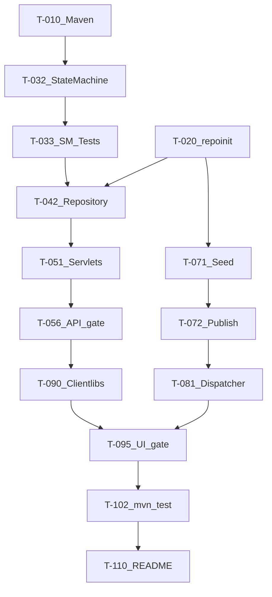

# Implementation Plan — Support Ticket Management System

**Project:** AI Practical Assessment  
**Platform:** AEM as a Cloud Service (AEMaaCS SDK)  
**Source documents:** [requirements-analysis.md](requirements-analysis.md), [acceptance-criteria.md](acceptance-criteria.md), [design-notes.md](design-notes.md), [data-model.md](data-model.md), [api-contract.md](api-contract.md), [ui-flow.md](ui-flow.md)  
**Document version:** 1.0  
**Status:** Approved — ready for execution  
**Scope:** Core mandatory; Stretch deferred to backlog

---

## 1. Purpose

This plan breaks Core implementation into **small, independently verifiable tasks** ordered so each phase leaves the project **buildable**. Every task maps to acceptance criteria and references the approved architecture.

### Principles

| Principle | Application |
|-----------|-------------|
| Core first | No Stretch work until Core acceptance criteria are green |
| State machine early | `TicketStateMachineService` + tests before servlets |
| Buildable increments | `mvn clean install` succeeds after each phase |
| Thin servlets | HTTP adapters only; logic in OSGi services |
| Verify as you go | Each task has explicit test and developer validation |

### Module structure (target)

```
support-tickets/
├── pom.xml
├── core/
├── ui.apps/
├── ui.content/
├── ui.config/
├── it.tests/
└── dispatcher/
```

### Phase overview

```mermaid
flowchart LR
    P0[Phase_0_Repo_setup] --> P1[Phase_1_Maven_scaffold]
    P1 --> P2[Phase_2_Infra_config]
    P2 --> P3[Phase_3_Domain_SM]
    P3 --> P4[Phase_4_Services]
    P4 --> P5[Phase_5_API_servlets]
    P5 --> P6[Phase_6_ui.apps]
    P6 --> P7[Phase_7_ui.content]
    P7 --> P8[Phase_8_Dispatcher]
    P8 --> P9[Phase_9_Frontend]
    P9 --> P10[Phase_10_Validation]
    P10 --> P11[Phase_11_Lifecycle_artifacts]
```



| Phase | Goal | Buildable checkpoint |
|-------|------|----------------------|
| 0 | Lifecycle docs + repo hygiene | Docs present; no code required |
| 1 | AEM Maven multi-module project | `mvn clean install` |
| 2 | repoinit, service user, Oak index | Packages install to Author |
| 3 | Domain model + state machine + **mandatory tests** | `mvn test` green (state machine) |
| 4 | Repository, validator, search, users, replication | `mvn clean install`; services compile |
| 5 | Sling Servlets (JSON API) | curl/Postman API calls work on Author |
| 6 | HTL components + Clientlibs shell | Pages render on Author |
| 7 | Seed content + app pages | Seed tickets visible via API |
| 8 | Dispatcher config | App reachable on port 80 |
| 9 | Clientlibs JS (list, create, detail) | Full UI flows on Publish/Dispatcher |
| 10 | Security hardening + manual test pass | AC checklist complete |
| 11 | Remaining lifecycle artifacts | Repo structure complete |

---

## 2. Task legend

| Column | Meaning |
|--------|---------|
| **Task ID** | Unique identifier `T-0xx` (Core), `T-Sxx` (Stretch backlog) |
| **Dependencies** | Task IDs that must complete first |
| **AC** | Acceptance criteria IDs from [acceptance-criteria.md](acceptance-criteria.md) |
| **Test** | Automated, manual, or setup verification |
| **AI opportunity** | Where AI pair-programming adds most value |
| **Dev validation** | What the developer must personally confirm |

---

## Phase 0 — Repository and planning artifacts

> **Checkpoint:** Planning artifacts complete; `requirements-analysis.md` and peers exist.

### T-001 — Initialize Git repository and root README stub

| Field | Detail |
|-------|--------|
| **Description** | Create git repo, `.gitignore` (SDK, `target/`, `.env`, IDE), minimal `README.md` placeholder |
| **Files/modules** | `README.md`, `.gitignore`, `candidate-info.md` (stub) |
| **Dependencies** | None |
| **Expected outcome** | Clean repo; no secrets; gitignore excludes AEM SDK artifacts |
| **AC** | AC-134 (prep), NFR-C07 (prep) |
| **Test** | Manual: `git status` clean; no credentials in tracked files |
| **AI opportunity** | Generate `.gitignore` for AEM Maven projects |
| **Dev validation** | Confirm `.gitignore` covers `crx-quickstart`, `target/`, `.env` |

### T-002 — Complete remaining lifecycle artifact stubs

| Field | Detail |
|-------|--------|
| **Description** | Create stub files for required repo structure not yet present: `tool-workflow.md`, `implementation-plan.md` (this file), `test-strategy.md`, `test-results.md`, `debugging-notes.md`, `code-review-notes.md`, `review-fixes.md`, `pr-description.md`, `reflection.md`, `final-ai-usage-summary.md`, `ai-prompts/*.md`, `tool-specific/cursor-workflow/` |
| **Files/modules** | Root + `ai-prompts/`, `tool-specific/cursor-workflow/` |
| **Dependencies** | T-001 |
| **Expected outcome** | Full artifact tree per assignment structure |
| **AC** | AC-135, AC-136 |
| **Test** | Manual: checklist against required structure |
| **AI opportunity** | Scaffold all stub files with section headers |
| **Dev validation** | Verify structure matches assignment spec exactly |

### T-003 — Copy acceptance criteria traceability into test-strategy stub

| Field | Detail |
|-------|--------|
| **Description** | Create `test-strategy.md` with state machine test matrix from design-notes §18.7–18.8, manual UI checklist from ui-flow |
| **Files/modules** | `test-strategy.md` |
| **Dependencies** | T-002 |
| **Expected outcome** | Test plan ready before coding |
| **AC** | AC-160–162 (prep) |
| **Test** | Review only |
| **AI opportunity** | Generate test matrix from acceptance-criteria.md |
| **Dev validation** | Approve test matrix covers 5 valid + 8+ invalid transitions |

---

## Phase 1 — AEM Maven project scaffold

> **Checkpoint:** `mvn clean install` succeeds (packages build; SDK install optional).

### T-010 — Generate AEMaaCS SDK multi-module project

| Field | Detail |
|-------|--------|
| **Description** | Run AEM archetype (or manual POM) creating `parent`, `core`, `ui.apps`, `ui.content`, `ui.config`, `it.tests`, `dispatcher` under `src/` or project root per submission layout |
| **Files/modules** | `pom.xml`, `core/pom.xml`, `ui.apps/pom.xml`, `ui.content/pom.xml`, `ui.config/pom.xml`, `it.tests/pom.xml`, `dispatcher/pom.xml` |
| **Dependencies** | T-001 |
| **Expected outcome** | Maven reactor builds all modules; AEM SDK version pinned in parent POM |
| **AC** | AC-150, NFR-C10 |
| **Test** | `mvn clean install` (skip SDK deploy if no local AEM) |
| **AI opportunity** | Archetype command parameters; parent POM dependency management |
| **Dev validation** | Pin exact SDK version; document in README |

### T-011 — Configure core bundle OSGi metadata and package structure

| Field | Detail |
|-------|--------|
| **Description** | Create Java package tree: `.../api`, `.../domain`, `.../service`, `.../repository`, `.../validation`, `.../servlet`, `.../exception`, `.../util` |
| **Files/modules** | `core/src/main/java/...` |
| **Dependencies** | T-010 |
| **Expected outcome** | Empty packages; `core` bundle builds |
| **AC** | — |
| **Test** | `mvn -pl core clean install` |
| **AI opportunity** | Package layout from design-notes §2 |
| **Dev validation** | Package naming matches project conventions |

### T-012 — Configure it.tests module with AEM Mocks dependency

| Field | Detail |
|-------|--------|
| **Description** | Add `io.wcm.testing.aem-mock.junit5` (or equivalent) to `it.tests`; wire `core` bundle dependency |
| **Files/modules** | `it.tests/pom.xml`, `it.tests/src/test/java/` |
| **Dependencies** | T-010, T-011 |
| **Expected outcome** | Test module compiles; empty test passes |
| **AC** | AC-160 (prep) |
| **Test** | `mvn -pl it.tests test` |
| **AI opportunity** | Maven deps for AEM Mock on latest SDK |
| **Dev validation** | Confirm JUnit 5 + AEM Mock versions compatible with SDK |

### T-013 — Add Maven profiles for package install to Author/Publish

| Field | Detail |
|-------|--------|
| **Description** | `autoInstallPackage`, `autoInstallPackagePublish` profiles in parent or module POMs |
| **Files/modules** | `pom.xml`, module POMs |
| **Dependencies** | T-010 |
| **Expected outcome** | `mvn -PautoInstallPackage` deploys to local Author when SDK running |
| **AC** | AC-133 (prep) |
| **Test** | Manual: install to Author :4502 |
| **AI opportunity** | Standard AEM filevault plugin config |
| **Dev validation** | Verify host/port match local SDK |

---

## Phase 2 — Infrastructure configuration

> **Checkpoint:** repoinit + service user install; Oak index package builds.

### T-020 — Create repoinit for ticket path and ACLs

| Field | Detail |
|-------|--------|
| **Description** | repoinit script: create `/content/support-tickets/tickets`; ACL for `support-tickets-service` (read, write, replicate) |
| **Files/modules** | `ui.config/src/main/content/jcr_root/apps/support-tickets/config/.../repoinit.config` (or equivalent) |
| **Dependencies** | T-010 |
| **Expected outcome** | Path exists after config install; service user can write |
| **AC** | AC-093, SEC-P01 |
| **Test** | Manual: CRXDE verify path + ACLs after package install |
| **AI opportunity** | repoinit syntax for paths and ACLs |
| **Dev validation** | Service user principal name finalized |

### T-021 — Create repoinit for seeded AEM users

| Field | Detail |
|-------|--------|
| **Description** | Create `/home/users/support/` with users `agent1`, `agent2`, `supervisor1`; profile properties (name, email, role); **no passwords** for reference-only users |
| **Files/modules** | `ui.config/.../repoinit.config` |
| **Dependencies** | T-020 |
| **Expected outcome** | Users exist; `UserManager` resolves paths |
| **AC** | AC-120, SEC-U01 |
| **Test** | Manual: AEM Users console or `UserManager` in Groovy |
| **AI opportunity** | repoinit user creation syntax |
| **Dev validation** | User paths match data-model.md format |

### T-022 — Configure OSGi service user mapping

| Field | Detail |
|-------|--------|
| **Description** | Map subservice `support-tickets-service` to `support-tickets-service` principal in `ui.config` |
| **Files/modules** | `ui.config/.../org.apache.sling.serviceusermapping.impl.ServiceUserMapperImpl.amended-*.config` |
| **Dependencies** | T-020, T-021 |
| **Expected outcome** | `ResourceResolverFactory.getServiceResourceResolver(map)` works in services |
| **AC** | SEC-P02 |
| **Test** | Manual: service resolves after package install |
| **AI opportunity** | OSGi config file naming for runmode |
| **Dev validation** | Subservice name matches repository code constant |

### T-023 — Define Oak Lucene index for ticket search

| Field | Detail |
|-------|--------|
| **Description** | Index definition for `status`, `title`, `description`, `updatedAt` under `/content/support-tickets/tickets` |
| **Files/modules** | `ui.apps/src/main/content/jcr_root/oak:index/supportTicketsIndex/` |
| **Dependencies** | T-010 |
| **Expected outcome** | Index package builds; reindex after install |
| **AC** | AC-070–073 (prep), SEC-Q01 |
| **Test** | Manual: Oak Index Manager after install |
| **AI opportunity** | Oak index XML from data-model.md |
| **Dev validation** | Index covers QueryBuilder predicates |

---

## Phase 3 — Domain layer and state machine (priority)

> **Checkpoint:** `mvn test` passes with state machine tests only — **signature judgment piece**.

### T-030 — Implement domain enums and constants

| Field | Detail |
|-------|--------|
| **Description** | `TicketStatus`, `Priority` enums with `fromString`, uppercase normalization |
| **Files/modules** | `core/.../domain/TicketStatus.java`, `Priority.java` |
| **Dependencies** | T-011 |
| **Expected outcome** | Enums compile; unknown values throw or Optional |
| **AC** | AC-004, AC-057 (prep) |
| **Test** | Unit: enum parsing tests (optional in core or it.tests) |
| **AI opportunity** | Enum boilerplate from api-contract.md |
| **Dev validation** | Values match api-contract exactly |

### T-031 — Implement domain exceptions

| Field | Detail |
|-------|--------|
| **Description** | `InvalidTransitionException`, `ValidationException`, `TicketNotFoundException`, `InternalServiceException` with fields per design-notes §18.5 |
| **Files/modules** | `core/.../exception/*.java` |
| **Dependencies** | T-030 |
| **Expected outcome** | Exceptions carry `code`, context fields for HTTP mapping |
| **AC** | AC-102, AC-101 (prep) |
| **Test** | Compile only |
| **AI opportunity** | Exception hierarchy from api-contract error catalog |
| **Dev validation** | `InvalidTransitionException` includes allowedTransitions |

### T-032 — Implement TicketStateMachineService

| Field | Detail |
|-------|--------|
| **Description** | OSGi service with static transition map; `getAllowedTransitions`, `validateTransition`, `applyTransition`; **no JCR, no HTTP** |
| **Files/modules** | `core/.../service/TicketStateMachineService.java`, `TicketStateMachineServiceImpl.java` |
| **Dependencies** | T-030, T-031 |
| **Expected outcome** | Service registered; all 5 valid + invalid transitions enforced |
| **AC** | AC-040–057, FR-C05 |
| **Test** | **Mandatory** — see T-033 |
| **AI opportunity** | Transition map from design-notes §18.1 |
| **Dev validation** | Review transition table matches spec exactly |

### T-033 — Implement TicketStateMachineServiceTest (mandatory)

| Field | Detail |
|-------|--------|
| **Description** | JUnit 5 tests: 5 valid transitions, 10+ invalid (skip, backward, terminal, no-op); `getAllowedTransitions` per status; exception content |
| **Files/modules** | `it.tests/.../TicketStateMachineServiceTest.java` |
| **Dependencies** | T-032, T-012 |
| **Expected outcome** | `mvn test` passes; ≥22 test cases |
| **AC** | AC-160, AC-161, AC-162 |
| **Test** | `mvn clean test` — **gate before servlets** |
| **AI opportunity** | Generate full test matrix from design-notes §18.7 |
| **Dev validation** | **Must pass before Phase 5** — developer sign-off |

### T-034 — Implement API DTOs (Ticket, Comment, User, ErrorResponse)

| Field | Detail |
|-------|--------|
| **Description** | POJOs matching api-contract schemas; `TicketDetail` includes `allowedTransitions`, `comments` |
| **Files/modules** | `core/.../api/dto/*.java` |
| **Dependencies** | T-030 |
| **Expected outcome** | DTOs used by repository and servlets |
| **AC** | — |
| **Test** | Compile |
| **AI opportunity** | DTO generation from api-contract.md JSON examples |
| **Dev validation** | Field names match API contract |

---

## Phase 4 — Core services

> **Checkpoint:** `mvn clean install`; services compile and unit-test where applicable.

### T-040 — Implement UserLookupService

| Field | Detail |
|-------|--------|
| **Description** | `exists(path)`, `listSeededUsers()`, `resolveDisplayName()` via `UserManager`; filter to `/home/users/support/` |
| **Files/modules** | `core/.../service/UserLookupService.java`, impl |
| **Dependencies** | T-022, T-034 |
| **Expected outcome** | Validates user paths; lists users for API |
| **AC** | AC-005, AC-120 |
| **Test** | Manual with AEM Mock context (Stretch) or integration on SDK |
| **AI opportunity** | UserManager API usage patterns |
| **Dev validation** | Rejects path traversal in user paths |

### T-041 — Implement TicketValidator

| Field | Detail |
|-------|--------|
| **Description** | Validate create, update, comment, status enum, field lengths; reject `status`/`createdBy` on PUT |
| **Files/modules** | `core/.../validation/TicketValidator.java` |
| **Dependencies** | T-030, T-031, T-040 |
| **Expected outcome** | All validation rules from data-model.md §7 |
| **AC** | AC-003–005, AC-034, AC-062, AC-132 |
| **Test** | Unit tests recommended (Stretch); manual via API in Phase 5 |
| **AI opportunity** | Validation rules from data-model + acceptance criteria |
| **Dev validation** | Length limits match data-model |

### T-042 — Implement TicketRepository (JCR CRUD)

| Field | Detail |
|-------|--------|
| **Description** | Sole JCR writer: `create`, `findById`, `update`, `updateStatus` (calls state machine), `addComment`; UUID paths; commit/rollback |
| **Files/modules** | `core/.../repository/TicketRepository.java`, impl |
| **Dependencies** | T-032, T-041, T-022, T-034 |
| **Expected outcome** | Tickets persist under `/content/support-tickets/tickets/{uuid}` |
| **AC** | AC-002, AC-090–092, AC-007 |
| **Test** | Manual curl after T-050; AEM Mock IT (Stretch) |
| **AI opportunity** | JCR path building from data-model.md |
| **Dev validation** | Only repository sets `status` property |

### T-043 — Implement TicketSearchService

| Field | Detail |
|-------|--------|
| **Description** | QueryBuilder predicates: `q` (title/description LIKE), `status` filter, AND logic, sort by `updatedAt` desc; LIKE escape |
| **Files/modules** | `core/.../service/TicketSearchService.java`, impl |
| **Dependencies** | T-023, T-042, T-022 |
| **Expected outcome** | Search and filter match AC-070–082 |
| **AC** | AC-070–073, AC-080–082, SEC-Q01 |
| **Test** | Manual API after T-050 with seed data |
| **AI opportunity** | QueryBuilder predicate construction |
| **Dev validation** | No string-concatenated JCR-SQL2 |

### T-044 — Implement ReplicationService

| Field | Detail |
|-------|--------|
| **Description** | `replicateTicket(ticketId)` — activate `/content/support-tickets/tickets/{id}` on Author |
| **Files/modules** | `core/.../service/ReplicationService.java`, impl |
| **Dependencies** | T-042 |
| **Expected outcome** | Mutations on Author replicate to Publish |
| **AC** | AC-151, AC-091 |
| **Test** | Manual: create on Author, verify on Publish |
| **AI opportunity** | Replicator API usage |
| **Dev validation** | Replication triggered after every mutation |

### T-045 — Implement JSON/error response utilities

| Field | Detail |
|-------|--------|
| **Description** | `JsonUtil`, `ErrorResponseBuilder`; map exceptions to HTTP codes per api-contract; `Cache-Control: no-store` |
| **Files/modules** | `core/.../util/*.java` |
| **Dependencies** | T-031 |
| **Expected outcome** | Consistent error envelope; no stack traces in JSON |
| **AC** | AC-100–101, AC-110, SEC-EM01 |
| **Test** | Manual via servlet error scenarios |
| **AI opportunity** | Error mapping table from api-contract §4 |
| **Dev validation** | 409 for invalid transition, not 400 |

---

## Phase 5 — Sling Servlets (JSON API)

> **Checkpoint:** All API endpoints work via curl on Author `:4502`.

### T-050 — Implement base servlet support (resolver, error handling)

| Field | Detail |
|-------|--------|
| **Description** | Abstract base or helper: service resolver acquisition, JSON read/write, exception → HTTP status mapping |
| **Files/modules** | `core/.../servlet/AbstractSupportTicketServlet.java` or `ServletSupport.java` |
| **Dependencies** | T-045, T-022 |
| **Expected outcome** | Shared servlet infrastructure |
| **AC** | SEC-P02 |
| **Test** | Compile |
| **AI opportunity** | Sling servlet base patterns |
| **Dev validation** | Service user used, not request resolver |

### T-051 — Implement TicketListServlet (GET list, POST create)

| Field | Detail |
|-------|--------|
| **Description** | `GET /bin/support-tickets.json` — search/filter; `POST` — create ticket |
| **Files/modules** | `core/.../servlet/TicketListServlet.java` |
| **Dependencies** | T-050, T-042, T-043, T-041 |
| **Expected outcome** | List and create per api-contract §6.1–6.2 |
| **AC** | AC-001–006, AC-010–011, AC-070–082 |
| **Test** | Manual curl GET/POST |
| **AI opportunity** | Servlet registration annotations |
| **Dev validation** | POST returns 201; create forces OPEN |

### T-052 — Implement TicketDetailServlet (GET, PUT)

| Field | Detail |
|-------|--------|
| **Description** | `GET/PUT /bin/support-tickets/{id}.json`; PUT rejects status |
| **Files/modules** | `core/.../servlet/TicketDetailServlet.java` |
| **Dependencies** | T-050, T-042, T-041, T-032 |
| **Expected outcome** | Detail includes `allowedTransitions`; PUT updates fields only |
| **AC** | AC-020–023, AC-030–034, AC-007 |
| **Test** | Manual curl GET/PUT; PUT with status → 400 |
| **AI opportunity** | Path parsing for ticket ID |
| **Dev validation** | 404 for unknown UUID |

### T-053 — Implement TicketStatusServlet (PATCH)

| Field | Detail |
|-------|--------|
| **Description** | `PATCH /bin/support-tickets/{id}/status.json` — state machine only |
| **Files/modules** | `core/.../servlet/TicketStatusServlet.java` |
| **Dependencies** | T-050, T-042 |
| **Expected outcome** | Valid → 200; invalid → 409 with details |
| **AC** | AC-040–057, AC-102 |
| **Test** | Manual curl all valid + sample invalid transitions |
| **AI opportunity** | PATCH servlet binding |
| **Dev validation** | **Critical** — verify 409 body shape |

### T-054 — Implement TicketCommentServlet (POST)

| Field | Detail |
|-------|--------|
| **Description** | `POST /bin/support-tickets/{id}/comments.json` |
| **Files/modules** | `core/.../servlet/TicketCommentServlet.java` |
| **Dependencies** | T-050, T-042, T-041 |
| **Expected outcome** | 201 on success; 404 if ticket missing |
| **AC** | AC-060–062 |
| **Test** | Manual curl POST comment |
| **AI opportunity** | — |
| **Dev validation** | Parent ticket updatedAt bumped |

### T-055 — Implement UserListServlet (GET)

| Field | Detail |
|-------|--------|
| **Description** | `GET /bin/support-tickets/users.json` |
| **Files/modules** | `core/.../servlet/UserListServlet.java` |
| **Dependencies** | T-050, T-040 |
| **Expected outcome** | JSON array of seeded users |
| **AC** | AC-120, AC-121 |
| **Test** | Manual curl GET |
| **AI opportunity** | — |
| **Dev validation** | No password fields exposed |

### T-056 — Deploy core bundle and verify API on Author

| Field | Detail |
|-------|--------|
| **Description** | `mvn -PautoInstallPackage` install core + config; curl all endpoints |
| **Files/modules** | All Phase 5 servlets |
| **Dependencies** | T-051–055, T-020–022 |
| **Expected outcome** | Full API functional on Author before UI |
| **AC** | AC-131 |
| **Test** | Manual API smoke test script or Postman collection |
| **AI opportunity** | Generate curl smoke test checklist |
| **Dev validation** | **API gate** — sign off before Phase 9 UI |

---

## Phase 6 — ui.apps (HTL + Clientlibs shell)

> **Checkpoint:** Pages render on Author; clientlibs load (JS may be stub).

### T-060 — Create page component and app shell HTL

| Field | Detail |
|-------|--------|
| **Description** | `support-tickets/components/page` — header, alert region, clientlib includes |
| **Files/modules** | `ui.apps/.../components/page/` |
| **Dependencies** | T-010 |
| **Expected outcome** | Base page template renders |
| **AC** | AC-130 |
| **Test** | Manual: preview component in CRX |
| **AI opportunity** | HTL boilerplate |
| **Dev validation** | `@context='text'` on dynamic output |

### T-061 — Create ticket-list, ticket-form, ticket-detail HTL components

| Field | Detail |
|-------|--------|
| **Description** | Markup per ui-flow.md — table, forms, placeholders for JS population |
| **Files/modules** | `ui.apps/.../components/ticket-list/`, `ticket-form/`, `ticket-detail/` |
| **Dependencies** | T-060 |
| **Expected outcome** | Static structure matches ui-flow screens |
| **AC** | AC-130 |
| **Test** | Manual: include components on test page |
| **AI opportunity** | HTML structure from ui-flow.md |
| **Dev validation** | No `innerHTML` placeholders in HTL |

### T-062 — Create Clientlibs (api.js, csrf.js, app.css stubs)

| Field | Detail |
|-------|--------|
| **Description** | Categories `support-tickets.app`; stub modules exporting fetch helpers |
| **Files/modules** | `ui.apps/.../clientlibs/support-tickets/` |
| **Dependencies** | T-060 |
| **Expected outcome** | Clientlibs load without JS errors |
| **AC** | SEC-CS01 (prep) |
| **Test** | Browser network tab: 200 on clientlib |
| **AI opportunity** | Clientlib `.content.xml` and `js.txt` |
| **Dev validation** | CSRF helper fetches Granite token |

### T-063 — Create Sling Model for page config (apiBase, csrfUrl)

| Field | Detail |
|-------|--------|
| **Description** | `SupportAppPageModel` exposes API base path to HTL |
| **Files/modules** | `core/.../model/SupportAppPageModel.java`, component dialog if needed |
| **Dependencies** | T-011, T-061 |
| **Expected outcome** | HTL can output `data-api-base` attribute |
| **AC** | design-notes §10 |
| **Test** | Manual: view page source |
| **AI opportunity** | Sling Model annotation boilerplate |
| **Dev validation** | Model has no ticket data fetching |

---

## Phase 7 — ui.content (pages and seed data)

> **Checkpoint:** Seed tickets visible via API; app pages accessible.

### T-070 — Create support-app pages (list, create, detail)

| Field | Detail |
|-------|--------|
| **Description** | `/content/support-app.html`, `create.html`, `ticket.html` with correct components |
| **Files/modules** | `ui.content/.../content/support-app/` |
| **Dependencies** | T-061, T-063 |
| **Expected outcome** | Three pages navigable on Author |
| **AC** | AC-130, ui-flow routes |
| **Test** | Manual: browse pages on :4502 |
| **AI opportunity** | Vault XML for pages |
| **Dev validation** | Detail page reads `id` query param |

### T-071 — Create seed tickets (one per status) + sample comment

| Field | Detail |
|-------|--------|
| **Description** | 5 tickets per data-model.md §11; at least one comment on one ticket |
| **Files/modules** | `ui.content/.../content/support-tickets/tickets/{uuid}/` |
| **Dependencies** | T-020 |
| **Expected outcome** | `GET /bin/support-tickets.json` returns seed data after install |
| **AC** | AC-091, AC-081 |
| **Test** | curl GET list after package install |
| **AI opportunity** | `.content.xml` from data-model examples |
| **Dev validation** | UUIDs stable across installs |

### T-072 — Install content packages to Author and Publish

| Field | Detail |
|-------|--------|
| **Description** | Deploy ui.apps, ui.content, ui.config to Author; replicate/activate to Publish |
| **Files/modules** | All packages |
| **Dependencies** | T-071, T-056, T-023 |
| **Expected outcome** | Publish has pages, seed data, index, servlets |
| **AC** | AC-151, AC-091 |
| **Test** | curl on :4503; pages on Publish |
| **AI opportunity** | Maven publish profile |
| **Dev validation** | Seed tickets on Publish, not Author-only |

---

## Phase 8 — Dispatcher configuration

> **Checkpoint:** App reachable at `http://localhost/` (port 80).

### T-080 — Configure Dispatcher filters for API and app paths

| Field | Detail |
|-------|--------|
| **Description** | Allow `/bin/support-tickets`, `/content/support-app`; deny cache for both |
| **Files/modules** | `dispatcher/src/.../filters.any`, `cache.rules` or farm config |
| **Dependencies** | T-010 |
| **Expected outcome** | API and pages work through Dispatcher |
| **AC** | AC-152, SEC-D01, SEC-CA01 |
| **Test** | curl via :80; browser mutations with CSRF |
| **AI opportunity** | Dispatcher rules from design-notes §5 |
| **Dev validation** | Default deny doesn't block `/bin` |

### T-081 — Verify Publish + Dispatcher end-to-end

| Field | Detail |
|-------|--------|
| **Description** | Full topology smoke: Browser → Dispatcher → Publish |
| **Files/modules** | — |
| **Dependencies** | T-080, T-072 |
| **Expected outcome** | List page loads; API returns data through :80 |
| **AC** | AC-152, NFR-C11 |
| **Test** | Manual checklist |
| **AI opportunity** | E2E checklist in test-results.md |
| **Dev validation** | **Topology gate** before UI completion |

---

## Phase 9 — Frontend Clientlibs (Core UI)

> **Checkpoint:** All 10 UI flows functional on Publish/Dispatcher.

### T-090 — Implement api.js and csrf.js

| Field | Detail |
|-------|--------|
| **Description** | fetch wrapper, error parse, CSRF token header on mutations |
| **Files/modules** | `ui.apps/.../clientlibs/.../api.js`, `csrf.js` |
| **Dependencies** | T-062, T-056 |
| **Expected outcome** | API calls work from browser on Publish |
| **AC** | SEC-CS01, AC-110 |
| **Test** | Browser devtools network tab |
| **AI opportunity** | fetch + CSRF patterns from ui-flow §4 |
| **Dev validation** | Mutations fail without CSRF on :80 |

### T-091 — Implement list.js (list, search, filter)

| Field | Detail |
|-------|--------|
| **Description** | Load tickets, search debounce, status filter, empty/loading/error states |
| **Files/modules** | `ui.apps/.../clientlibs/.../list.js` |
| **Dependencies** | T-090, T-070 |
| **Expected outcome** | Flows 1–3 complete per ui-flow §5 |
| **AC** | AC-010–011, AC-070–082 |
| **Test** | Manual UI |
| **AI opportunity** | DOM rendering with textContent |
| **Dev validation** | Search term reflected safely (no XSS) |

### T-092 — Implement create.js

| Field | Detail |
|-------|--------|
| **Description** | Create form, user dropdowns, validation feedback, redirect to detail |
| **Files/modules** | `ui.apps/.../clientlibs/.../create.js` |
| **Dependencies** | T-090, T-070 |
| **Expected outcome** | Flow 4 complete per ui-flow §6 |
| **AC** | AC-001, AC-003–006 |
| **Test** | Manual UI |
| **AI opportunity** | Form validation mirror server rules |
| **Dev validation** | Acting-as user required |

### T-093 — Implement detail.js (edit, reassign, status, comments)

| Field | Detail |
|-------|--------|
| **Description** | Load detail, PUT save, PATCH status (allowedTransitions only), POST comment, error/success banners |
| **Files/modules** | `ui.apps/.../clientlibs/.../detail.js` |
| **Dependencies** | T-090, T-070, T-053 |
| **Expected outcome** | Flows 5–9 complete per ui-flow §7 |
| **AC** | AC-020–033, AC-040–044, AC-050–057, AC-060–062, AC-102, AC-110 |
| **Test** | Manual UI + invalid transition shows 409 message |
| **AI opportunity** | Status dropdown from allowedTransitions |
| **Dev validation** | Status change separate from Save button |

### T-094 — Apply app.css (minimal professional styling)

| Field | Detail |
|-------|--------|
| **Description** | Table, forms, alerts, badges per ui-flow §10 |
| **Files/modules** | `ui.apps/.../clientlibs/.../app.css` |
| **Dependencies** | T-061 |
| **Expected outcome** | Clean readable UI |
| **AC** | AC-130 |
| **Test** | Visual review |
| **AI opportunity** | Minimal CSS from ui-flow guidelines |
| **Dev validation** | Accessible labels and alert region |

### T-095 — Full UI regression on Author, Publish, Dispatcher

| Field | Detail |
|-------|--------|
| **Description** | Execute all flows from ui-flow §8 matrix on all three surfaces |
| **Files/modules** | — |
| **Dependencies** | T-091–094, T-081 |
| **Expected outcome** | Core UI acceptance complete |
| **AC** | AC-001–011, AC-020–062, AC-110–111 |
| **Test** | Manual per test-strategy.md |
| **AI opportunity** | Generate test-results.md from checklist |
| **Dev validation** | **UI gate** — sign off Core features |

---

## Phase 10 — Security hardening and persistence validation

> **Checkpoint:** Security checklist §19.19 complete; restart test passed.

### T-100 — Security checklist implementation review

| Field | Detail |
|-------|--------|
| **Description** | Verify all 12 Core items from design-notes §19.19 |
| **Files/modules** | Cross-cutting |
| **Dependencies** | T-095 |
| **Expected outcome** | No admin resolver; ACLs; encoding; safe errors |
| **AC** | SEC-* Core items, AC-134 |
| **Test** | Manual security walkthrough |
| **AI opportunity** | Security review against §19 |
| **Dev validation** | Document accepted risks in design-notes |

### T-101 — Persistence restart test

| Field | Detail |
|-------|--------|
| **Description** | Create ticket, restart AEM Author, verify data persists |
| **Files/modules** | — |
| **Dependencies** | T-095 |
| **Expected outcome** | Ticket survives restart |
| **AC** | AC-090 |
| **Test** | Manual |
| **AI opportunity** | Document steps in test-results.md |
| **Dev validation** | Repeat on Publish if feasible |

### T-102 — Final API + state machine automated test run

| Field | Detail |
|-------|--------|
| **Description** | `mvn clean test` from project root; document results |
| **Files/modules** | `it.tests/` |
| **Dependencies** | T-033 |
| **Expected outcome** | All automated tests green |
| **AC** | AC-160–162 |
| **Test** | `mvn clean test` |
| **AI opportunity** | CI-friendly test report in test-results.md |
| **Dev validation** | **Mandatory gate** for submission |

---

## Phase 11 — Lifecycle artifacts completion

> **Checkpoint:** Repository ready for submission.

### T-110 — Complete README with setup instructions

| Field | Detail |
|-------|--------|
| **Description** | SDK version, module build, package install, Author/Publish/Dispatcher startup order, test commands, URLs |
| **Files/modules** | `README.md` |
| **Dependencies** | T-102, T-095 |
| **Expected outcome** | Reviewer can run from README alone |
| **AC** | AC-133, NFR-C07 |
| **Test** | Fresh clone walkthrough (self) |
| **AI opportunity** | README from implementation experience |
| **Dev validation** | Another person could follow steps |

### T-111 — Complete test-results.md and debugging-notes.md

| Field | Detail |
|-------|--------|
| **Description** | Record manual test outcomes, issues encountered, fixes |
| **Files/modules** | `test-results.md`, `debugging-notes.md` |
| **Dependencies** | T-095, T-102 |
| **Expected outcome** | Evidence of testing |
| **AC** | Lifecycle requirement |
| **Test** | Review |
| **AI opportunity** | Summarize test session |
| **Dev validation** | Accurate pass/fail status |

### T-112 — Complete ai-prompts and reflection artifacts

| Field | Detail |
|-------|--------|
| **Description** | Populate `ai-prompts/*.md`, `reflection.md`, `final-ai-usage-summary.md`, `tool-workflow.md`, `candidate-info.md` |
| **Files/modules** | `ai-prompts/`, root artifacts |
| **Dependencies** | T-110 |
| **Expected outcome** | Full prompt history and reflection |
| **AC** | AC-136, NFR-C08 |
| **Test** | Review |
| **AI opportunity** | Export chat history summaries |
| **Dev validation** | Authentic prompt record |

### T-113 — Code review and PR artifacts

| Field | Detail |
|-------|--------|
| **Description** | `code-review-notes.md`, `review-fixes.md`, `pr-description.md` |
| **Files/modules** | Root artifacts |
| **Dependencies** | T-102 |
| **Expected outcome** | Review trail documented |
| **AC** | Lifecycle requirement |
| **Test** | Review |
| **AI opportunity** | AI-assisted code review summary |
| **Dev validation** | Fixes traced to review items |

---

## 3. Dependency graph (critical path)



**Critical path:** T-010 → T-032 → T-033 → T-042 → T-051–055 → T-056 → T-090–094 → T-095 → T-102 → T-110

**Hard gate:** T-033 must pass before T-051 (servlets).

---

## 4. Buildable checkpoints summary

| After phase | Command / action | Expected |
|-------------|------------------|----------|
| 1 | `mvn clean install` | BUILD SUCCESS |
| 3 | `mvn test` | State machine tests green |
| 5 | curl all endpoints on :4502 | JSON responses correct |
| 7 | curl on :4503 | Seed data on Publish |
| 8 | Browser on :80 | Dispatcher serves app |
| 9 | Manual UI flows | All 10 flows work |
| 10 | `mvn clean test` + restart | AC-090, AC-160–162 |
| 11 | README walkthrough | Submission-ready |

---

## 5. Stretch backlog (do not start until Core green)

| Task ID | Description | AC / FR |
|---------|-------------|---------|
| T-S01 | AEM login + closed user group on app pages | FR-S03, SEC-S01 |
| T-S02 | Session-bound `createdBy` | SEC-Z02 |
| T-S03 | Role-based reassignment rules | SEC-S02 |
| T-S04 | Filter by priority/assignee, pagination | FR-S04 |
| T-S05 | `TicketValidatorTest` unit tests | TEST-S01 |
| T-S06 | `TicketRepositoryStatusIT` JCR tests | TEST-S03 |
| T-S07 | OpenAPI / Swagger doc | FR-S05 |
| T-S08 | Docker Compose for SDK stack | FR-S06 |
| T-S09 | GitHub Actions CI (`mvn test`) | FR-S06 |
| T-S10 | Content Security Policy headers | SEC-X01 Stretch |

---

## 6. Task index (Core)

| ID | Phase | Summary |
|----|-------|---------|
| T-001 | 0 | Git + gitignore |
| T-002 | 0 | Lifecycle stubs |
| T-003 | 0 | test-strategy.md |
| T-010 | 1 | Maven multi-module |
| T-011 | 1 | Core package structure |
| T-012 | 1 | it.tests + AEM Mock |
| T-013 | 1 | Install profiles |
| T-020 | 2 | repoinit paths/ACLs |
| T-021 | 2 | repoinit users |
| T-022 | 2 | Service user mapping |
| T-023 | 2 | Oak index |
| T-030 | 3 | Enums |
| T-031 | 3 | Exceptions |
| T-032 | 3 | StateMachineService |
| T-033 | 3 | **StateMachine tests (gate)** |
| T-034 | 3 | DTOs |
| T-040 | 4 | UserLookupService |
| T-041 | 4 | TicketValidator |
| T-042 | 4 | TicketRepository |
| T-043 | 4 | TicketSearchService |
| T-044 | 4 | ReplicationService |
| T-045 | 4 | JSON/error utils |
| T-050 | 5 | Servlet base |
| T-051 | 5 | List + Create servlet |
| T-052 | 5 | Detail servlet |
| T-053 | 5 | Status servlet |
| T-054 | 5 | Comment servlet |
| T-055 | 5 | Users servlet |
| T-056 | 5 | **API gate** |
| T-060 | 6 | Page HTL shell |
| T-061 | 6 | Component HTL |
| T-062 | 6 | Clientlibs stubs |
| T-063 | 6 | Sling Model |
| T-070 | 7 | App pages |
| T-071 | 7 | Seed tickets |
| T-072 | 7 | Publish deploy |
| T-080 | 8 | Dispatcher rules |
| T-081 | 8 | **Topology gate** |
| T-090 | 9 | api.js + csrf.js |
| T-091 | 9 | list.js |
| T-092 | 9 | create.js |
| T-093 | 9 | detail.js |
| T-094 | 9 | app.css |
| T-095 | 9 | **UI gate** |
| T-100 | 10 | Security review |
| T-101 | 10 | Restart test |
| T-102 | 10 | **mvn test gate** |
| T-110 | 11 | README |
| T-111 | 11 | test-results |
| T-112 | 11 | ai-prompts + reflection |
| T-113 | 11 | code review artifacts |

**Total Core tasks:** 48

---

## 7. Developer sign-off gates

| Gate | Task | Criterion |
|------|------|-----------|
| **G1 — State machine** | T-033 | `mvn test` state machine green |
| **G2 — API** | T-056 | All 7 endpoints curl-verified on Author |
| **G3 — Topology** | T-081 | App + API via Dispatcher :80 |
| **G4 — UI** | T-095 | All 10 UI flows on Publish/Dispatcher |
| **G5 — Automated tests** | T-102 | Full `mvn clean test` pass |
| **G6 — Submission** | T-110 | README walkthrough succeeds |

---

## 8. Document history

| Version | Date | Author | Changes |
|---------|------|--------|---------|
| 1.0 | 2026-08-27 | AI-assisted | Initial implementation plan from approved design artifacts |
