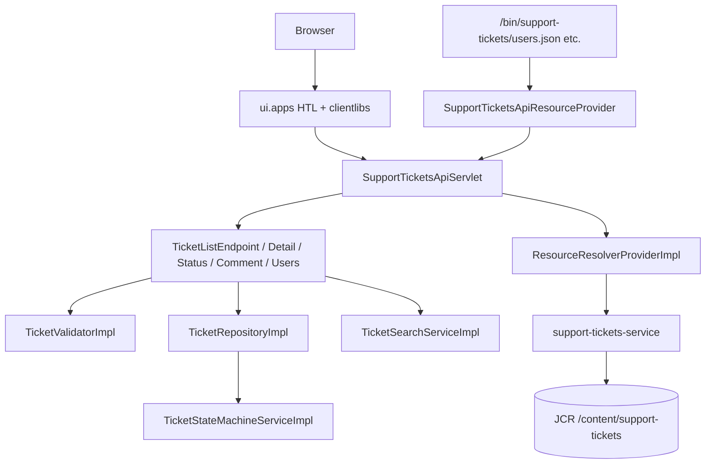

# Pull Request — Support Ticket Management System (Core)

**Project:** AI Practical Assessment  
**Platform:** AEM as a Cloud Service (AEMaaCS)  
**Maven coordinates:** `com.supporttickets:support-tickets:1.0.0-SNAPSHOT`  
**Related:** [acceptance-criteria.md](acceptance-criteria.md), [api-contract.md](api-contract.md), [test-results.md](test-results.md), [code-review-notes.md](code-review-notes.md)

---

## Summary

This pull request delivers the **Core** Support Ticket Management System on AEMaaCS: a JSON REST API, a three-screen browser UI, and JCR-backed persistence for tickets and comments, with seeded AEM users for creator/assignee references.

The implementation follows a **spec-driven workflow**. Planning artifacts (`requirements-analysis.md`, `acceptance-criteria.md`, `design-notes.md`, `data-model.md`, `api-contract.md`, `ui-flow.md`, `implementation-plan.md`) were produced and approved before application code was written. The goal is a small but complete internal support-ticket app that demonstrates correct AEM patterns, backend validation, state-machine enforcement, and automated test coverage — alongside the full lifecycle documentation required by the assessment.

---

## Scope

### Core functionality delivered

| Area | Delivered |
|------|-----------|
| **Ticket creation** | `POST /bin/support-tickets.json`; status forced `OPEN`; optional assignee |
| **Ticket listing** | `GET /bin/support-tickets.json` with keyword search (`q`) and status filter |
| **Ticket detail** | `GET /bin/support-tickets/{id}.json` including comments and `allowedTransitions` |
| **Ticket update** | `PUT /bin/support-tickets/{id}.json` for title, description, priority, assignee |
| **Status transitions** | `PATCH /bin/support-tickets/{id}/status.json` via enforced state machine |
| **Comments** | `POST /bin/support-tickets/{id}/comments.json` |
| **Seeded users** | `GET /bin/support-tickets/users.json` |
| **Validation** | Backend field, enum, and user-existence checks |
| **Error handling** | Structured JSON errors; UI alerts and field errors |
| **Persistence** | JCR nodes under `/content/support-tickets/tickets` |
| **UI** | List, create, and detail pages under `/content/support-app` |

This PR maps to **67 acceptance criteria** in [acceptance-criteria.md](acceptance-criteria.md). Automated test evidence exists for many ACs (see Testing below); manual UI, live AEM IT, and Cypress ACs are **not** evidenced in [test-results.md](test-results.md).

---

## Architecture

| Layer | Responsibility |
|-------|----------------|
| **`core`** | OSGi bundle: servlet, endpoints, services, repository, validation, DTOs, Sling Model (`SupportAppPageModel`) |
| **`ui.config`** | Repoinit, service-user mapping, OSGi configs |
| **`ui.apps`** | HTL components, `clientlib-support-app` JavaScript |
| **`ui.content`** | Support-app pages (`/content/support-app`) |
| **`all`** | Aggregator package for deployment |

**Key design choices:**

- Thin servlet with delegated endpoint classes (`TicketListEndpoint`, `TicketDetailEndpoint`, etc.)
- All ticket/comment writes through `TicketRepositoryImpl` using service-user `ResourceResolver`
- `SupportTicketsApiResourceProvider` supplies synthetic resources for nested `/bin/support-tickets/...` paths so Sling can dispatch to the API servlet

---

## Persistence

| Entity | Storage | Writer |
|--------|---------|--------|
| **Tickets** | `/content/support-tickets/tickets/{uuid}` — `nt:unstructured`, `sling:resourceType` `support-tickets/components/ticket` | `TicketRepositoryImpl` only |
| **Comments** | `{ticket}/comments/{uuid}` — comment resource type | `TicketRepositoryImpl.addComment()` |
| **Users** | AEM principals under `/home/users/support/` (repoinit) — **not** ticket nodes | Repoinit; read via `UserLookupServiceImpl` |

**Setup scripts:** [ui.config/.../RepositoryInitializer~supporttickets.cfg.json](ui.config/src/main/content/jcr_root/apps/supporttickets/osgiconfig/config/org.apache.sling.jcr.repoinit.RepositoryInitializer~supporttickets.cfg.json) creates content paths, service user, seeded users (`agent1`, `agent2`, `supervisor1`), and ACLs.

Ticket IDs are UUID v4 node names. `createdBy` and `assignedTo` store AEM user paths (e.g. `/home/users/support/agent1`).

---

## API

Base path: `/bin/support-tickets`  
Content-Type: `application/json`

| # | Method | URL | Purpose |
|---|--------|-----|---------|
| 1 | `GET` | `/bin/support-tickets.json` | List; `q` (keyword), `status` (filter) |
| 2 | `POST` | `/bin/support-tickets.json` | Create ticket → `201` |
| 3 | `GET` | `/bin/support-tickets/{ticketId}.json` | Detail + comments + `allowedTransitions` |
| 4 | `PUT` | `/bin/support-tickets/{ticketId}.json` | Update fields (**excludes** `status`, `createdBy`) |
| 5 | `PATCH` | `/bin/support-tickets/{ticketId}/status.json` | Status transition only |
| 6 | `POST` | `/bin/support-tickets/{ticketId}/comments.json` | Add comment → `201` |
| 7 | `GET` | `/bin/support-tickets/users.json` | List seeded users |

**Error semantics:** `400` validation, `404` not found, `409` invalid transition, `415` wrong Content-Type, `405` wrong method, `500` internal error. Responses use `ApiErrorResponse` with `code`, `message`, `fields`, and optional `details`.

---

## Business rules

### State machine (backend-enforced)

New tickets are always created with status **`OPEN`**. Status changes only through `PATCH .../status.json`. `TicketRepository.updateStatus()` calls `TicketStateMachineServiceImpl` before persisting.

**Valid transitions:**

| From | To |
|------|-----|
| `OPEN` | `IN_PROGRESS`, `CANCELLED` |
| `IN_PROGRESS` | `RESOLVED`, `CANCELLED` |
| `RESOLVED` | `CLOSED` |
| `CLOSED` | *(terminal)* |
| `CANCELLED` | *(terminal)* |

All other transitions (e.g. `OPEN` → `CLOSED`, `RESOLVED` → `OPEN`, any from terminal states) return **HTTP 409** with `INVALID_TRANSITION`.

`PUT` requests containing `status` or `createdBy` are rejected with **HTTP 400**.

---

## Frontend

| Screen | URL | Capabilities |
|--------|-----|--------------|
| **Ticket list** | `/content/support-app.html` | Table, keyword search, status filter |
| **Create ticket** | `/content/support-app/create.html` | Form; redirects to detail on success |
| **Ticket detail** | `/content/support-app/ticket.html?id={uuid}` | View/edit fields, status update, add comments |

**Clientlibs:** `clientlib-support-app` — `api.js`, `csrf.js`, `create.js`, `list.js`, `detail.js`, `utils.js`

- Mutating requests fetch Granite CSRF token and send **`CSRF-Token`** header (valid HTTP header name)
- Dynamic text rendered via `textContent` in list and detail views

[Manual UI test results: not recorded in test-results.md. CSRF and create-ticket fixes validated on Author `:4502` per session history — see review-fixes.md RF-001, RF-002.]

---

## Validation and error handling

### Backend (`TicketValidatorImpl`)

- Required: title, priority, createdBy on create; message and createdBy on comment
- User paths must exist under `/home/users/support/`
- Length limits: title 200, description 5000, message 2000, search keyword 200
- Enum validation for priority and status

### API (`SupportTicketsApiServlet` + `ApiErrorMapper`)

Central exception mapping: `ValidationException` → 400, `TicketNotFoundException` → 404, `InvalidTransitionException` → 409.

### UI (`utils.js`)

Client-side required-field checks; API errors mapped to alerts and per-field messages.

---

## Testing

### Implemented and executed (evidence in [test-results.md](test-results.md))

**Environment:** Java 21.0.9, AEM Mock in-process (no live AEM instance for Surefire)

| Test class | Tests | Result |
|------------|-------|--------|
| `SupportTicketsApiIntegrationTest` | 11 | PASS |
| `TicketPersistenceIntegrationTest` | 12 | PASS |
| `TicketStateMachineIntegrationTest` | 17 | PASS |
| `TicketValidationIntegrationTest` | 11 | PASS |
| `TicketSearchIntegrationTest` | 13 | PASS |
| `TicketCommentIntegrationTest` | 5 | PASS |
| `TicketRepositoryTest` | 7 | PASS |
| `TicketStateMachineServiceImplTest` | 31 | PASS |
| `TicketValidatorImplTest` | 7 | PASS |
| `UserLookupServiceImplTest` | 2 | PASS |
| `ApiPathParserTest` | 9 | PASS |
| `SupportAppPageModelTest` | 1 | PASS |
| Archetype sample tests (5 classes) | 5 | PASS |
| **Total** | **131** | **PASS** |

State machine coverage includes 5 valid transitions, 11 parameterized invalid transitions (integration), and an exhaustive invalid-transition matrix (unit).

### Not executed (no pass/fail claim)

| Suite | Status |
|-------|--------|
| Live AEM `it.tests` (`-Plocal` Failsafe) | Not executed |
| Cypress UI tests (`ui.tests`) | Not executed (lint only in build) |
| Manual UI formal verification | Not recorded |
| Dispatcher `validate.sh` | Not executed |
| Code coverage (JaCoCo) | Not measured |

### Test limitations

- `SupportTicketsIntegrationTestBase` mocks `UserLookupService` and `QueryBuilder`
- Frontend not covered by Surefire

---

## Build validation

Recorded on **2026-08-31** ([test-results.md](test-results.md)):

| Command | Result | Timestamp |
|---------|--------|-----------|
| `mvn -B -pl core test` | **BUILD SUCCESS** — 131 tests, 0 failures | `2026-08-31T12:08:46+05:30` |
| `mvn -B clean install` | **BUILD SUCCESS** — full reactor | `2026-08-31T12:14:30+05:30` (5:21 min) |

| Component | Version |
|-----------|---------|
| Java | 21.0.9 |
| Maven | 3.9.14 |
| AEM SDK API | `2026.8.27673.20260811T193135Z-260700` |
| JUnit | 5.8.2 |
| AEM Mock | 5.5.4 |

Build also ran HTL validation, FileVault validation, AEM Analyser (warning: outdated analyser plugin version), Dispatcher checksum enforcer, ESLint (`ui.tests`), and webpack build (`ui.frontend.react.forms.af`) without failing the reactor.

[`mvn -PautoInstallSinglePackage` result: not recorded in project artifacts]

---

## Security

| Topic | Implementation |
|-------|----------------|
| **Service user** | `support-tickets-service` via `ResourceResolverProvider`; ACLs on `/content/support-tickets` and `/home/users` paths in repoinit |
| **API authentication** | None in Core (accepted design risk — [CR-002](code-review-notes.md)) |
| **CSRF** | Granite token on mutating browser requests (`CSRF-Token` header) |
| **XSS** | `textContent` for ticket/comment display in `list.js` / `detail.js` |
| **Input validation** | Server-side on all write paths; LIKE escape for search |
| **Secrets** | No credentials in source; `admin`/`admin` in `pom.xml` is local Quickstart default only |

---

## Files / modules changed

| Module / area | Summary of changes |
|---------------|-------------------|
| **`core/`** | API servlet, endpoints, repository, state machine, search, user lookup, validation, ResourceProvider, DTOs, 131 tests |
| **`ui.config/`** | Repoinit (paths, users, ACLs), service-user mapper |
| **`ui.apps/`** | Ticket list/create/detail HTL components, `clientlib-support-app` |
| **`ui.content/`** | `/content/support-app` pages |
| **`all/`** | Package embedding core + ui modules |
| **`dispatcher/`** | Archetype cloud dispatcher config (no support-ticket-specific filter added) |
| **Root docs** | Lifecycle artifacts: requirements through code review, README, tool-workflow, candidate-info |

Archetype boilerplate (HelloWorld, Forms frontend module, sample IT/UI tests) remains from initial scaffold.

---

## Known limitations

| Limitation | Reference |
|------------|-----------|
| Dispatcher may block `/bin/support-tickets` on Publish (`/bin/*` rule commented out) | [CR-001](code-review-notes.md) |
| No API authorization | [CR-002](code-review-notes.md) — accepted for Core |
| No live AEM IT or Cypress execution recorded | [CR-003](code-review-notes.md) |
| QueryBuilder keyword search may differ from traversal fallback on case sensitivity | [CR-004](code-review-notes.md) |
| `api-contract.md` still references `:cq_csrf_token`; code uses `CSRF-Token` | [CR-007](code-review-notes.md) |
| No list pagination | [CR-013](code-review-notes.md) |
| Archetype sample code still in bundle | [CR-005](code-review-notes.md) |

---

## Out of scope

Per [requirements-analysis.md](requirements-analysis.md) Stretch (FR-S01–S07, NFR-S01–S03):

- Authentication, RBAC, protected routes
- User CRUD / role management UI
- Pagination, assignee/priority filters beyond Core, sorting
- OpenAPI / Swagger
- Docker / CI automation
- Delete ticket/comment
- Notifications, audit trail, replication automation beyond standard AEM

---

## Review considerations

Please pay particular attention to:

1. **`SupportTicketsApiResourceProvider`** — nested `/bin/support-tickets/{id}/...` routing; list endpoint uses path servlet registration only
2. **State machine** — `TicketStateMachineServiceImpl` transition map; 31 unit + 17 integration tests
3. **`UserLookupServiceImpl`** — `UserManager.findAuthorizables()` + JCR-SQL2 fallback (Oak authorizable folders are not listed via `Resource.getChildren()`)
4. **`api.js` CSRF** — only `CSRF-Token` header; invalid `:cq_csrf_token` was removed (RF-001)
5. **`TicketRepositoryImpl`** — sole JCR writer; status changes always via state machine
6. **Dispatcher** — verify Publish deployment adds allow rule for `/bin/support-tickets` before go-live
7. **Integration test gaps** — `UserLookupService` mocked in base; consider real implementation test (CR-008)

**Pre-merge checklist for reviewer:**

- [ ] `mvn -B -pl core test` passes locally
- [ ] `mvn -B clean install` passes locally
- [ ] Deploy to Author and smoke-test list/create/detail flows (manual)
- [ ] Confirm repoinit users visible at `GET /bin/support-tickets/users.json`

---

## Related artifacts

| Document | Purpose |
|----------|---------|
| [code-review-notes.md](code-review-notes.md) | Formal review findings |
| [review-fixes.md](review-fixes.md) | Fixes applied during development |
| [test-strategy.md](test-strategy.md) | Test approach |
| [tool-workflow.md](tool-workflow.md) | AI-assisted development workflow |
