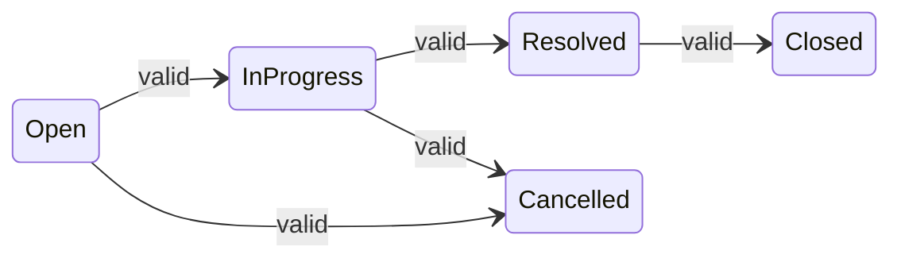
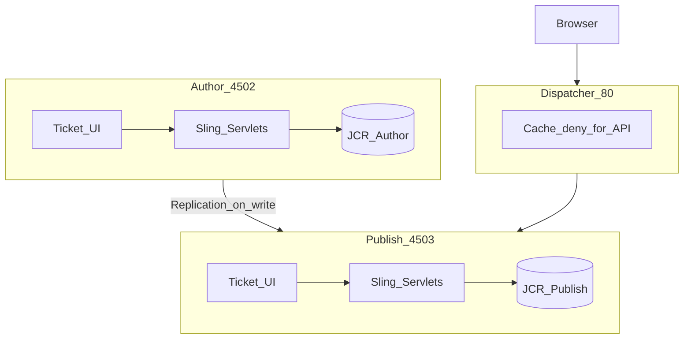
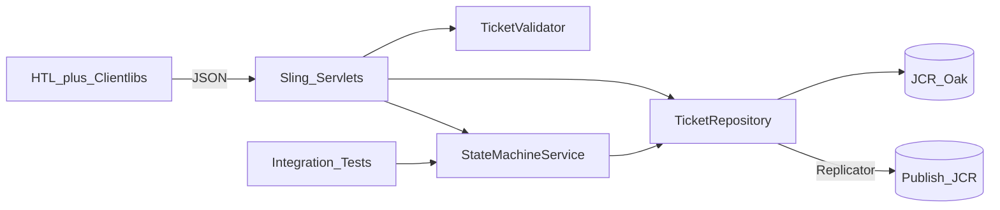

# Requirements Analysis — Support Ticket Management System

**Project:** AI Practical Assessment  
**Platform:** Adobe Experience Manager as a Cloud Service (AEMaaCS)  
**Document version:** 1.0  
**Status:** Draft — pending developer approval of open decisions

---

## Purpose

This document decomposes the Support Ticket Management System requirements for an AEM-native implementation. It separates **Core** from **Stretch**, identifies constraints and ambiguities, records assumptions, and captures risks and architectural recommendations.

Throughout this document, items are tagged:

| Tag | Meaning |
|-----|---------|
| **[Explicit]** | Stated directly in the assessment requirements |
| **[Assumption]** | Not stated; required to proceed without blocking implementation |
| **[Recommendation]** | Engineering judgment; requires developer approval before implementation |

---

## 1. Business Context

**[Explicit]** A small internal application for managing support tickets. Users create, update, comment on, search, and progress tickets through a defined lifecycle.

The assessment evaluates **AI-assisted engineering across the full lifecycle**, not authentication sophistication. Lifecycle artifacts (planning, design, testing, review, reflection) are graded deliverables equal in importance to the application itself.

---

## 2. Functional Requirements

### 2.1 Core (Mandatory)

| ID | Requirement | Source |
|----|-------------|--------|
| FR-C01 | Create a support ticket with title, description, priority, status, assignee, and creator | [Explicit] |
| FR-C02 | List all tickets from persistent storage | [Explicit] |
| FR-C03 | View a single ticket detail including comments | [Explicit] |
| FR-C04 | Update ticket fields: title, description, priority, assignee | [Explicit] |
| FR-C05 | Change ticket status only through an enforced state machine | [Explicit] |
| FR-C06 | Add comments to a ticket | [Explicit] |
| FR-C07 | Keyword search across tickets | [Explicit] |
| FR-C08 | Filter tickets by status | [Explicit] |
| FR-C09 | Users exist as seeded data only (id, name, email, role); no user-management UI | [Explicit] |
| FR-C10 | Backend rejects invalid input; UI shows meaningful error states | [Explicit] |
| FR-C11 | Data survives AEM restart | [Explicit] |

#### State Machine (FR-C05) — [Explicit]

Valid transitions:

| From | To |
|------|-----|
| Open | In Progress |
| In Progress | Resolved |
| Resolved | Closed |
| Open | Cancelled |
| In Progress | Cancelled |

All other transitions (e.g., Open → Closed, Resolved → Open, any transition from Closed or Cancelled) must be **rejected by the backend**.



### 2.2 Stretch (Optional)

| ID | Requirement | Source |
|----|-------------|--------|
| FR-S01 | Third entity or richer data model | [Explicit] |
| FR-S02 | Full user CRUD and role management | [Explicit] |
| FR-S03 | Authentication: login/logout, JWT/session, RBAC, protected routes, API authorization | [Explicit] |
| FR-S04 | Filter by priority and assignee; sorting; pagination | [Explicit] |
| FR-S05 | API documentation (Swagger / OpenAPI) | [Explicit] |
| FR-S06 | Docker setup, CI workflow | [Explicit] |
| FR-S07 | Reusable prompt templates, rules, or specs | [Explicit] |

---

## 3. Non-Functional Requirements

### 3.1 Core

| ID | Requirement | Source |
|----|-------------|--------|
| NFR-C01 | Frontend application | [Explicit] |
| NFR-C02 | Backend API | [Explicit] |
| NFR-C03 | Database persistence with setup/migration scripts and seed data | [Explicit] |
| NFR-C04 | Input validation at API layer | [Explicit] |
| NFR-C05 | Error handling (API and UI) | [Explicit] |
| NFR-C06 | At least one meaningful test tier (integration tests for state machine) | [Explicit] |
| NFR-C07 | README with local setup instructions | [Explicit] |
| NFR-C08 | Full prompt history and lifecycle artifacts in repository | [Explicit] |
| NFR-C09 | No secrets committed to repository | [Explicit] |
| NFR-C10 | Solution built on AEMaaCS using latest SDK | [Explicit] |
| NFR-C11 | Topology: 1 Author + 1 Publisher + 1 Dispatcher | [Explicit] |

### 3.2 Stretch

| ID | Requirement | Source |
|----|-------------|--------|
| NFR-S01 | Additional test tiers: unit tests, edge-case/failure tests | [Explicit] |
| NFR-S02 | Docker / CI automation | [Explicit] |
| NFR-S03 | Persistent project context (rules, specs, templates) | [Explicit] |

### 3.3 Implied Quality Attributes

| ID | Attribute | Notes |
|----|-----------|-------|
| NFR-I01 | Maintainability | Lifecycle artifacts are graded; code must be reviewable |
| NFR-I02 | Local reproducibility | SDK-based environment must be documented end-to-end |
| NFR-I03 | Correctness over features | State machine is the signature judgment piece [Explicit] |

---

## 4. Explicit Technical Constraints

| Constraint | Detail | Source |
|------------|--------|--------|
| Platform | AEM as a Cloud Service | [Explicit] |
| SDK | Latest AEMaaCS SDK | [Explicit] |
| Topology | 1 Author, 1 Publisher, 1 Dispatcher | [Explicit] |
| Persistence | Database mandatory; JCR is acceptable | [Explicit] |
| User management | AEM OOTB user management allowed | [Explicit] |
| Ticket/Comment storage | Developer's choice within AEM | [Explicit] |
| Multi-publisher sync | Do not solve (stretch at most) | [Explicit] |
| Authentication | Optional for Core | [Explicit] |
| Workflow | Spec-driven workflow; read requirements first | [Explicit] |
| Adobe skills | Official Adobe skills may be used | [Explicit] |
| Repository structure | Fixed lifecycle artifact layout | [Explicit] |

### Approved Implementation Preferences

| Decision | Choice | Status |
|----------|--------|--------|
| API style | Custom Sling Servlets returning JSON | Approved |
| UI surface | Both Author and Publish/Dispatcher | Approved |

### Technologies Not Required

External databases (PostgreSQL, MySQL, etc.), separate application servers (Node/Express), JWT libraries, and Docker are **not required** unless chosen for Stretch goals.

---

## 5. Core Acceptance Criteria Mapping

| Acceptance Criterion | Requirement IDs | Verification |
|---------------------|-----------------|--------------|
| Create ticket via UI | FR-C01, NFR-C01 | Manual + `test-results.md` |
| View all tickets from database | FR-C02, FR-C11 | Manual + persistence check |
| Open ticket detail view | FR-C03 | Manual |
| Update fields and reassign | FR-C04 | Manual |
| Add comments | FR-C06 | Manual |
| Valid status transitions only | FR-C05, SEC-C03 | Integration tests (mandatory) |
| Keyword search and status filter | FR-C07, FR-C08 | Manual + recommended integration test |
| Data survives restart | FR-C11 | Manual after AEM restart |
| Backend validation | FR-C10, NFR-C04 | Manual + recommended tests |
| No secrets in repo | NFR-C09 | Code review |
| State-machine integration tests pass | NFR-C06, TEST-C01–C03 | `mvn test` |

---

## 6. Ambiguities, Gaps, and Working Assumptions

### 6.1 Ambiguities (Unresolved in Spec)

| Topic | Gap | Impact |
|-------|-----|--------|
| Keyword search scope | Title only? Title + description? Comments? | Query predicates, acceptance expectations |
| Priority values | Enum not defined | Validation rules, UI dropdowns |
| Role semantics | `User.role` exists but no RBAC in Core | Metadata only unless Stretch |
| Current user without auth | Who is `createdBy` on create? | UI must select or default a seeded user |
| Author vs Publish data | Same JCR tree on both tiers? | Replication and cache rules |
| API base path / versioning | Not specified | Must be defined in `api-contract.md` |
| Comment edit/delete | Not mentioned | Scope boundary |
| Ticket delete | Not mentioned | Scope boundary |
| Initial status on create | Presumably Open | Must be enforced server-side |
| Date/time format | Not specified | API serialization |
| Integration test runtime | Sling Mock vs full SDK | Test setup complexity |

### 6.2 Working Assumptions

| Assumption | Rationale | Tag |
|------------|-----------|-----|
| Keyword search covers **title and description** only | Minimal Core scope; comment search is Stretch | [Assumption] |
| Priority enum: `LOW`, `MEDIUM`, `HIGH`, `CRITICAL` | Common support pattern; backend validates | [Assumption] |
| Status enum: `OPEN`, `IN_PROGRESS`, `RESOLVED`, `CLOSED`, `CANCELLED` | Matches state machine exactly | [Assumption] |
| `createdBy` / `assignedTo` reference seeded AEM user paths | No user UI in Core | [Assumption] |
| Tickets stored under `/content/support-tickets` | AEM-native, replicable | [Recommendation] |
| Comments stored as child nodes under ticket nodes | Natural JCR hierarchy | [Recommendation] |
| Initial ticket status is always `OPEN` | Cannot create in terminal states | [Assumption] |
| No ticket or comment delete in Core | Not in acceptance criteria | [Assumption] |
| Publish is primary end-user surface; Author provides parity | Matches approved UI decision | [Assumption] |
| Replication Author → Publish after mutations | Required for dual-surface UI | [Recommendation] |
| Author is sole write origin for ticket mutations | Prevents data drift | [Recommendation] |
| `createdBy` is immutable after create | Audit integrity | [Recommendation] |
| `status` excluded from general PUT; dedicated status endpoint only | State machine enforcement | [Recommendation] |
| `assignedTo` optional on create | Spec does not require assignee | [Assumption] |
| Timestamps in ISO-8601 UTC | Standard API practice | [Recommendation] |
| Ticket `updatedAt` bumped on field changes and new comments | List sort consistency | [Recommendation] |

---

## 7. AEM-Specific Considerations

### 7.1 Persistence (JCR)

**[Explicit]** JCR is an acceptable persistence mechanism.

**[Recommendation]** Node structure:

```
/content/support-tickets/
  tickets/
    {ticketId}/                    # UUID node name
      jcr:content                  # title, description, priority, status,
                                   # assignedTo, createdBy, createdAt, updatedAt
      comments/
        {commentId}/               # message, createdBy, createdAt
```

| Concern | Approach | Tag |
|---------|----------|-----|
| Schema enforcement | Single `TicketRepository` as sole JCR writer; optional CND node type | [Recommendation] |
| Path initialization | `repoinit` + content package | [Recommendation] |
| Seed users | AEM users under `/home/users/support/` via repoinit or content XML | [Recommendation] |
| Seed tickets | `ui.content` content package (reproducible) | [Recommendation] |
| Search performance | Custom Oak Lucene index on status, title, description | [Recommendation] |
| ID strategy | UUID as immutable JCR node name | [Recommendation] |

### 7.2 Backend API (Sling Servlets)

**[Approved]** Custom Sling Servlets returning JSON.

| Endpoint (illustrative) | Method | Purpose |
|-------------------------|--------|---------|
| `/bin/support-tickets.json` | GET | List, keyword search, status filter |
| `/bin/support-tickets.json` | POST | Create ticket |
| `/bin/support-tickets/{id}.json` | GET | Ticket detail + `allowedTransitions` |
| `/bin/support-tickets/{id}.json` | PUT | Update fields (no status) |
| `/bin/support-tickets/{id}/status.json` | PATCH | Status transition only |
| `/bin/support-tickets/{id}/comments.json` | POST | Add comment |

| Concern | Approach | Tag |
|---------|----------|-----|
| Business logic | OSGi services: `TicketStateMachineService`, `TicketRepository`, `TicketValidator` | [Recommendation] |
| JCR access | Dedicated service user via `ResourceResolverFactory` | [Recommendation] |
| Replication | `Replicator` API after every mutation on Author | [Recommendation] |
| Runmode bindings | Restrict mutating servlets on Publish where possible | [Recommendation] |

### 7.3 Frontend

**[Recommendation]** HTL page + Clientlibs (vanilla JS) calling servlet JSON endpoints.

| Surface | Location | Notes |
|---------|----------|-------|
| Author | `/content/support-app` | Direct servlet access (port 4502) |
| Publish | Replicated page | Access via Dispatcher (port 80) |
| Publish mutations | CSRF token required | Granite `/libs/granite/csrf/token.json` |

### 7.4 Author / Publish / Dispatcher Topology



| Concern | Approach | Tag |
|---------|----------|-----|
| Write authority | Author is source of truth; replicate to Publish | [Recommendation] |
| Dispatcher `/bin` access | Explicit filter rule for servlet paths | [Recommendation] |
| Dispatcher caching | `cache /deny` for `/bin/support-tickets*` and dynamic pages | [Recommendation] |
| CSRF | Required for browser mutations on Publish | [Recommendation] |
| Flush | Dispatcher flush after replication | [Recommendation] |

---

## 8. Security Requirements

### 8.1 Core

| ID | Requirement | Source |
|----|-------------|--------|
| SEC-C01 | No secrets in repository | [Explicit] |
| SEC-C02 | Backend validation prevents invalid records | [Explicit] |
| SEC-C03 | Invalid state transitions rejected server-side | [Explicit] |

### 8.2 Recommended for Core

| ID | Requirement | Source |
|----|-------------|--------|
| SEC-R01 | Service user for servlet JCR access (not admin session) | [Recommendation] |
| SEC-R02 | Output encoding for XSS in description and comments | [Recommendation] |
| SEC-R03 | ACLs scoped to ticket path and service user | [Recommendation] |
| SEC-R04 | Dispatcher filter rules for intended paths and methods only | [Recommendation] |
| SEC-R05 | Structured error responses without stack traces or JCR paths | [Recommendation] |

### 8.3 Stretch

| ID | Requirement | Source |
|----|-------------|--------|
| SEC-S01 | Login/logout via AEM authentication | [Explicit] |
| SEC-S02 | Role-based access (e.g., only agents assign tickets) | [Explicit] |
| SEC-S03 | API authorization checks per endpoint | [Explicit] |

**Known Core limitation [Explicit]:** Without authentication, anyone who can reach the Publish URL can manage all tickets. Document in `design-notes.md` threat model.

---

## 9. Testing Requirements

### 9.1 Mandatory (Core)

| ID | Requirement | Source |
|----|-------------|--------|
| TEST-C01 | Integration tests proving state machine rules | [Explicit] |
| TEST-C02 | Valid transitions succeed | [Explicit] |
| TEST-C03 | Invalid transitions are rejected | [Explicit] |

**[Recommendation]** Test approach:

- `TicketStateMachineServiceTest` using Sling/OSGi mocks (AEM Mock / `AemContext`)
- Runnable via `mvn test` without a running AEM instance
- Minimum test matrix: **5 valid + 8 invalid** transitions

| Valid transitions to test | Invalid transitions to test (minimum) |
|---------------------------|----------------------------------------|
| OPEN → IN_PROGRESS | OPEN → RESOLVED (skip-level) |
| IN_PROGRESS → RESOLVED | OPEN → CLOSED (skip-level) |
| RESOLVED → CLOSED | RESOLVED → IN_PROGRESS (backward) |
| OPEN → CANCELLED | CLOSED → OPEN (terminal) |
| IN_PROGRESS → CANCELLED | CANCELLED → IN_PROGRESS (terminal) |
| | RESOLVED → CANCELLED (invalid path) |
| | IN_PROGRESS → OPEN (backward) |
| | PUT with `status` field rejected (400) |

### 9.2 Stretch

| ID | Requirement |
|----|-------------|
| TEST-S01 | Unit tests for validation and search query building |
| TEST-S02 | Edge-case tests (empty title, unknown assignee, concurrent updates) |
| TEST-S03 | `TicketRepositoryTest` with JCR integration |
| TEST-S04 | UI / end-to-end tests |

### 9.3 Out of Scope for Mandatory Test Tier

| Area | Core test coverage |
|------|-------------------|
| State machine service | Mandatory integration tests |
| Servlet HTTP layer | Optional; recommended for status-in-PUT rejection |
| JCR repository persistence | Stretch |
| UI flows | Manual checklist in `test-results.md` |
| Dispatcher / CSRF | Manual checklist in `test-results.md` |

---

## 10. Documentation and Lifecycle Artifact Requirements

**[Explicit]** The following artifacts are required regardless of application size.

### Application

| Path | Purpose |
|------|---------|
| `src/` | AEM multi-module project (core, ui.apps, ui.content, it.tests) |
| `ui.content/` | Seed content package |
| `tests/` | Test code |

### Planning and design

| Path | Purpose |
|------|---------|
| `README.md` | Setup, run, test instructions |
| `candidate-info.md` | Candidate details |
| `tool-workflow.md` | AI tool workflow description |
| `requirements-analysis.md` | This document |
| `acceptance-criteria.md` | Traceable acceptance criteria |
| `implementation-plan.md` | Phased implementation plan |
| `design-notes.md` | Architecture decisions and threat model |
| `api-contract.md` | REST endpoint specification |
| `data-model.md` | Entity and JCR schema |
| `ui-flow.md` | Screen flows and user interactions |
| `test-strategy.md` | Test approach and matrix |

### Execution and review

| Path | Purpose |
|------|---------|
| `test-results.md` | Test execution results |
| `debugging-notes.md` | Issues encountered and resolved |
| `code-review-notes.md` | Review findings |
| `review-fixes.md` | Fixes applied after review |
| `pr-description.md` | Pull request summary |
| `reflection.md` | Post-implementation reflection |
| `final-ai-usage-summary.md` | AI usage summary |

### Prompt history

| Path | Purpose |
|------|---------|
| `ai-prompts/planning.md` | Planning-phase prompts |
| `ai-prompts/design.md` | Design-phase prompts |
| `ai-prompts/implementation.md` | Implementation-phase prompts |
| `ai-prompts/testing.md` | Testing-phase prompts |
| `ai-prompts/debugging.md` | Debugging-phase prompts |
| `ai-prompts/code-review.md` | Review-phase prompts |
| `ai-prompts/documentation.md` | Documentation-phase prompts |

### Tool-specific

| Path | Purpose |
|------|---------|
| `tool-specific/cursor-workflow/` | Cursor workflow artifacts |

---

## 11. Risks

| Risk | Likelihood | Impact | Mitigation |
|------|------------|--------|------------|
| Dispatcher caches stale ticket data | High | High | `cache /deny` for API paths; `Cache-Control: no-store` headers |
| Author/Publish data drift | Medium | High | Author-only writes; replicate on every mutation |
| State machine only in UI | Medium | Critical | Dedicated status endpoint; integration tests |
| Status accepted via general PUT | Medium | Critical | Reject `status` in PUT; repository enforces |
| JCR search without Oak index | Medium | Medium | Custom Lucene index in `ui.apps` |
| CSRF failure on Publish/Dispatcher | High | High | Granite CSRF token in Clientlibs |
| Unauthenticated open API | Medium | Medium | Document threat model; Stretch auth |
| Non-reproducible seed data | Medium | High | `ui.content` package + repoinit |
| Scope creep via Stretch | High | Medium | Freeze Core first |
| SDK setup friction | High | High | Pin SDK version in README |
| Tests require running AEM | Medium | Medium | Sling Mock tests via `mvn test` |

---

## 12. Critical Technical Review Summary

Findings from adversarial review of requirements and AEM architecture. Expanded rationale will appear in `design-notes.md` and `api-contract.md`.

### 12.1 Passes Acceptance but Fails Engineering Review

| Anti-pattern | Why it might pass | Why it is poor |
|--------------|-------------------|----------------|
| Author-only app with empty Publish | List works on Author | Topology requirement unmet |
| State machine in JavaScript only | UI blocks bad transitions | Backend criterion failed |
| One invalid-transition test | "Tests exist" | Rules not comprehensively proven |
| Hardcoded ticket list in servlet | UI shows data | No persistence |
| Manual replication only | Works after developer activates | Not reproducible |
| Admin session in servlet | All CRUD works | Service user / ACL bypass |
| 200 OK with error in JSON body | "Error handling exists" | Wrong HTTP semantics |

### 12.2 Hidden Requirements (Derived)

| Requirement | Core / Stretch |
|-------------|----------------|
| Replication Author → Publish for dual UI | Core |
| CSRF on Publish mutations | Core |
| Dispatcher filter for `/bin` servlets | Core |
| `allowedTransitions` in ticket detail API | Core (recommended) |
| Structured 4xx error bodies | Core |
| Reproducible seed from content package | Core |
| Oak index for search | Core (recommended) |
| Output encoding for XSS | Core |
| Immutable `createdBy` | Core |
| Status excluded from PUT | Core |
| HTTP 409 for invalid transitions | Core (recommended) |

### 12.3 Key Review Findings by Area

| Area | Primary concern | Core/Stretch | Recommended solution | Document as ADR? |
|------|-----------------|--------------|----------------------|------------------|
| Author vs Publish | Write path ambiguity | Core | Author-only writes; replicate on mutation | Yes |
| JCR | No schema enforcement | Core | Single repository writer | Yes |
| Ownership | `createdBy` mutable via PUT | Core | Immutable after create | Yes |
| Identity | Impersonation without auth | Core | Validate against seeded user list | Yes |
| Authorization | Open API with service user | Core | Document threat model; tight ACLs | Yes |
| Status transitions | Status in PUT bypasses machine | Core | Dedicated status endpoint only | Yes |
| Concurrent updates | Last-write-wins | Stretch | Document LWW for Core | Yes |
| Validation | Servlet-only validation | Core | Validator service in repository layer | Yes |
| Search | Scope undefined | Core | Title + description; case-insensitive | Yes |
| API errors | 500 for validation failures | Core | 400/404/409/500 with structured body | Yes |
| Dispatcher | `/bin` blocked by default | Core | Explicit filter rules in README | Yes |
| Caching | Stale JSON responses | Core | `cache /deny` + no-store headers | Yes |
| CSRF | Publish mutations fail | Core | Granite CSRF token | Yes |
| XSS | Unsanitized comment rendering | Core | HTL `@context='text'`; no `innerHTML` | Yes |
| Seed data | Manual Groovy only | Core | `ui.content` package + repoinit | Yes |
| Persistence | `setProperty` without `commit` | Core | Repository with explicit commit | No |
| Testability | Tests require full SDK | Core | Sling Mock via `mvn test` | Yes |

---

## 13. Recommended Implementation Strategy

### Phase 0 — Foundation

1. Initialize AEMaaCS SDK Maven project (`core`, `ui.apps`, `ui.content`, `it.tests`)
2. Create lifecycle artifact stubs per required repository structure
3. Lock `data-model.md`, `api-contract.md`, `ui-flow.md` before feature code
4. Configure local Author (4502), Publish (4503), Dispatcher (80)

### Phase 1 — Data Layer

1. `repoinit` for `/content/support-tickets` structure and ACLs
2. Seed users and sample tickets via content package
3. Oak Lucene index for search fields

### Phase 2 — Backend (State Machine First)

1. `TicketStateMachineService` with transition map
2. **Integration tests before servlets** (mandatory judgment piece)
3. `TicketRepository` and `CommentRepository` (sole JCR writers)
4. `TicketValidator` OSGi service
5. Sling Servlets for all API endpoints
6. Replication trigger on Author after mutations

### Phase 3 — Frontend

1. HTL page + Clientlibs on Author
2. Ticket list with search and status filter
3. Ticket detail with comments, field edit, status change
4. Error display for structured 4xx responses
5. CSRF token integration for Publish
6. Replicate to Publish; verify through Dispatcher

### Phase 4 — Hardening

1. Dispatcher cache and filter rules
2. Manual test pass documented in `test-results.md`
3. Code review, reflection, and AI usage artifacts
4. Stretch goals only after Core acceptance criteria are green



---

## 14. Decisions Requiring Developer Approval

The following decisions must be explicitly approved before implementation begins. Items marked **(default)** reflect the recommended choice from this analysis.

### Data Model

| # | Decision | Default |
|---|----------|---------|
| 1 | JCR path root: `/content/support-tickets` vs `/var/support-tickets` | `/content/support-tickets` |
| 2 | Ticket ID strategy: UUID node name | UUID |
| 3 | Priority enum: `LOW`, `MEDIUM`, `HIGH`, `CRITICAL` | As listed |
| 4 | Keyword search scope: title + description only | Title + description |
| 5 | Comment capabilities: add-only vs edit/delete | Add-only |

### Identity and Auth

| # | Decision | Default |
|---|----------|---------|
| 6 | How `createdBy` is set without auth: UI dropdown vs fixed default | UI dropdown ("acting as") |
| 7 | AEM login in Core | No (Stretch) |

### API Contract

| # | Decision | Default |
|---|----------|---------|
| 8 | Servlet base path: `/bin/support-tickets` | As listed |
| 9 | Status change via separate `PATCH .../status` endpoint | Separate endpoint |
| 10 | Error response format: `{ "code", "message", "fields"? }` | Structured JSON |
| 11 | Invalid transition HTTP status: 409 Conflict | 409 |

### UI and Topology

| # | Decision | Default |
|---|----------|---------|
| 12 | Frontend: HTL + Clientlibs vs SPA Editor | HTL + Clientlibs |
| 13 | Replication: automatic on every write vs batch | Automatic on write |
| 14 | Dispatcher cache: deny for all ticket API paths | Deny cache |

### Testing

| # | Decision | Default |
|---|----------|---------|
| 15 | Test framework: Sling Mock vs full SDK | Sling Mock |
| 16 | State machine test matrix: 5 valid + 8 invalid minimum | 13 cases |

### Scope and Tooling

| # | Decision | Default |
|---|----------|---------|
| 17 | Ticket delete in Core | Out of scope |
| 18 | Stretch goals in scope for this submission | None until Core complete |
| 19 | Spec workflow location | `tool-specific/cursor-workflow/` |
| 20 | AEM SDK version pin | Latest at project start; document in README |
| 21 | Concurrency policy for Core | Last-write-wins (document) |
| 22 | CSRF implementation | Granite token |
| 23 | XSS strategy | Output encoding minimum |

---

## 15. Traceability to Downstream Artifacts

| This analysis section | Informs |
|-----------------------|---------|
| Section 2 (Functional) | `acceptance-criteria.md`, `ui-flow.md` |
| Section 6 (Assumptions) | `data-model.md`, `api-contract.md` |
| Section 7 (AEM) | `design-notes.md`, `implementation-plan.md` |
| Section 8 (Security) | `design-notes.md` threat model |
| Section 9 (Testing) | `test-strategy.md` |
| Section 12 (Review) | `code-review-notes.md`, `api-contract.md` |
| Section 14 (Decisions) | `implementation-plan.md` (blocked until approved) |

---

## 16. Document History

| Version | Date | Author | Changes |
|---------|------|--------|---------|
| 1.0 | 2026-08-26 | AI-assisted analysis | Initial requirements decomposition, critical review, and decision log |
