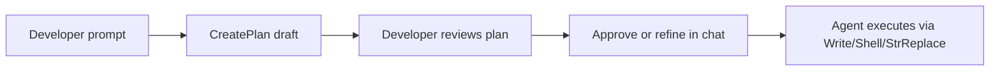

# Cursor Workflow — Support Ticket Management System

**Project:** AI Practical Assessment (AEMaaCS)  
**Primary development environment:** Cursor IDE  
**Document type:** Tool-specific workflow record (Cursor only)  
**Evidence:** Cursor agent transcript `13262a8d-8e65-407b-ab4b-200d6bdc9f58` (Aug 26–31, 2026), repository artifacts  
**General workflow (all tools):** [tool-workflow.md](../../tool-workflow.md)  
**AI usage by lifecycle stage:** [final-ai-usage-summary.md](../../final-ai-usage-summary.md)

This document describes **how Cursor was used** on this project. It records only capabilities and patterns **verified** in the session transcript and repository. Features not observed in project history are listed under [§10 Not evidenced](#10-not-evidenced-in-this-project).

---

## 1. Overview

The Support Ticket Management System was built in a **single long-running Cursor Agent session** (~435 messages, Aug 26–31, 2026). Work followed a **spec-driven** pattern:

1. Developer pastes assignment requirements into Agent chat.
2. Agent explores the workspace, asks structured questions where needed, and drafts plans.
3. Developer approves or redirects via chat prompts.
4. Agent writes lifecycle markdown specs **before** application code.
5. Agent implements Java/JS/config via file edits and Shell commands.
6. Developer validates on local AEM Author; Agent iterates on failures.
7. Agent runs Maven via Shell and documents results in `test-results.md`.

**Workspace at start:** Empty (`d:\ai-practical-assessment`). No pre-existing AEM project.  
**Workspace guidance:** [AGENTS.md](../../AGENTS.md) (module map, Maven commands) — referenced via [CLAUDE.md](../../CLAUDE.md).

---

## 2. Cursor capabilities used

The following **Agent tools** appear in the session transcript. Names match tool invocations recorded in transcript JSONL (`"tool_use","name":"..."`).

| Cursor Agent tool | Role in this project | Example use |
|-------------------|----------------------|-------------|
| **AskQuestion** | Structured multiple-choice decisions before planning | UI topology (Author+Publish); API style (Sling Servlets) |
| **CreatePlan** | Multi-step plans for developer review before execution | Requirements analysis, AEM foundation, Java 21 validation, ui.apps build failure, PR/reflection docs |
| **Read** | Read specs and source files for context | `requirements-analysis.md`, `design-notes.md`, servlet OSGi XML |
| **Write** | Create lifecycle artifacts and new source files | `acceptance-criteria.md`, `TicketRepositoryImpl.java`, `api.js` |
| **StrReplace** | Targeted edits to existing files | POM Java 21 fix, `design-notes.md` state machine §18, debug fixes |
| **Grep** | Search codebase and specs | Cross-check API paths, CSRF references, AC traceability |
| **Glob** | Find files by pattern | Initial workspace scan; locate test classes |
| **Shell** | Run Maven, Java version checks, file moves | `mvn archetype:generate`, `mvn -pl core test`, relocate project to repo root |
| **Task** (`subagent_type: explore`) | Parallel codebase exploration | Code review: core Java architecture + config/security (Aug 31) |
| **WebSearch** | External fact lookup when repo insufficient | AEM archetype/SDK version; Sling filter pattern behaviour |

**Interaction model:** Developer messages in Agent chat; Agent responds with prose and tool calls. No separate evidence of Composer-only or inline-tab workflows for this project.

---

## 3. Plan mode (`CreatePlan`)

Cursor **Plan mode** was used to produce reviewable plans **before** large execution steps. Plans were stored outside the repository under the developer's Cursor plans directory (e.g. `aem_ticket_requirements_analysis_24145e5e.plan.md`). The agent also edited plan files via `StrReplace` (e.g. appending §11 Critical Technical Review).

### Plans created (verified)

| Plan name | Date (approx.) | Purpose |
|-----------|----------------|---------|
| **AEM Ticket Requirements Analysis** | Aug 26, 2026 | Decompose assignment; Core vs Stretch; tagged requirements |
| **AEM Foundation Scaffold** | Aug 27, 2026 | Complete partial archetype v57; Java 21; repo layout |
| **Maven Java 21 Validation** | Aug 27, 2026 | Fix blockers; run build with JDK 21.0.9 |
| **ui.apps Build Failure Analysis** | Aug 27, 2026 | Diagnose HTL compile failure (archetype Forms/CIF samples) |
| **PR and Reflection Docs** | Aug 31, 2026 | Generate `pr-description.md` and `reflection.md` from artifacts |

**Typical flow:**

**Developer role:** Plans were not auto-executed without approval. Example: foundation and Maven validation plans preceded Shell commands.

---

## 4. Structured decisions (`AskQuestion`)

On Aug 26, 2026, before the requirements plan was finalized, the Agent invoked **AskQuestion** with title *"Pre-Implementation Clarifications"*:

| Question ID | Prompt | Developer choice (recorded) |
|-------------|--------|----------------------------|
| `ui_surface` | Where should the UI run in AEM topology? | **Both Author and Publish** |
| `api_style` | Which AEM-native API style? | **Custom Sling Servlets** (JSON at `/bin/support-tickets`) |

These choices were incorporated into `CreatePlan` and all downstream specs (`requirements-analysis.md`, `design-notes.md`, `api-contract.md`).

**Why AskQuestion was used:** Assignment allowed multiple valid AEM topologies and API styles. The Agent did not assume defaults silently.

---

## 5. Session timeline (Cursor Agent)

| Phase | Dates | Cursor activity |
|-------|-------|-----------------|
| **Intake** | Aug 26 | `Glob`/`Grep` empty workspace → `AskQuestion` → `CreatePlan` (requirements) |
| **Adversarial review** | Aug 26 | Developer prompt for critical technical review → `Read` plan → `StrReplace` plan §11 |
| **Spec authoring** | Aug 26–27 | `Read` prior specs → `Write` lifecycle markdown (7 pre-implementation docs) |
| **Foundation** | Aug 27 | `Shell` archetype generate → `CreatePlan` (foundation, Java 21, ui.apps failure) → `Shell` move to flat root → `StrReplace` POMs |
| **Implementation** | Aug 27–30 | `Write`/`StrReplace` in `core`, `ui.apps`, `ui.config`, `ui.content`; `Shell` `mvn test` |
| **Live debugging** | Aug 30 | Developer reports symptoms in chat → Agent `Read`/`Grep` → iterative `StrReplace` |
| **Testing docs** | Aug 31 | `Shell` `mvn -B clean install` → `Write` `test-results.md` |
| **Code review** | Aug 31 | `Task` explore subagents → `Write` `code-review-notes.md`, `review-fixes.md` |
| **Documentation** | Aug 31 | `Write` README, tool-workflow, candidate-info, PR, reflection, AI summary |

---

## 6. Spec-driven workflow in Cursor

The developer issued an explicit implementation instruction (Aug 27):

> *"Use the previously approved requirements analysis, acceptance criteria, architecture/design, JCR data model, API contract, implementation plan as the source of truth… Do not introduce design changes that conflict with the approved specification without explicitly identifying the conflict…"*

**How the Agent followed this:**

| Rule | Cursor behaviour (evidenced) |
|------|------------------------------|
| Specs before code | No servlet implementation until `api-contract.md` existed |
| Read before write | `Read` on `requirements-analysis.md`, `acceptance-criteria.md` before each new spec |
| Flag conflicts | Abandoned `SupportTicketsApiFilter` when Author testing contradicted Sling resolution model |
| Ambiguity protocol | Identify → refer to spec → recommend → explain before `Write`/`StrReplace` |

**Source-of-truth hierarchy:** Approved markdown specs → implementation → tests mapped to AC IDs.

---

## 7. Implementation pattern

### 7.1 File authoring

| Artifact type | Primary Cursor tools |
|---------------|---------------------|
| Lifecycle markdown | `Write` (new files at repo root) |
| Java OSGi bundle | `Write` + `StrReplace` under `core/src/` |
| HTL / clientlibs | `Write`/`StrReplace` under `ui.apps/` |
| Repoinit / OSGi config | `Write` under `ui.config/` |
| Content pages | `Write` under `ui.content/` |

### 7.2 Build validation via Shell

The Agent ran Maven through **Shell** (not a separate terminal session documented outside transcript):

| Command | Purpose | Recorded result |
|---------|---------|-----------------|
| `mvn archetype:generate` | Initial AEM v57 scaffold | Partial output under `support-tickets/` |
| `mvn -pl core test` | Backend regression after changes | 131 tests, 0 failures |
| `mvn -B clean install` | Full reactor validation | BUILD SUCCESS (`test-results.md`) |
| `java --version` / `mvn -version` | Java 21 alignment | JDK 21.0.9, Maven 3.9.14 |

**Developer correction:** After archetype generation, developer directed moving modules from nested `support-tickets/` to **flat repo root** — executed via `Shell` (`Move-Item`).

### 7.3 Phased implementation (from `implementation-plan.md`)

Agent followed plan phases with Shell checkpoints:

1. State machine + unit tests first (`TicketStateMachineServiceImpl`)
2. Repository, validator, search, user lookup
3. Servlet, endpoints, ResourceProvider
4. HTL, clientlibs, pages
5. Frontend JS (`list.js`, `create.js`, `detail.js`, `api.js`)

---

## 8. Debugging in Cursor Agent

Debugging was **chat-driven**: developer described runtime symptoms; Agent traced code with `Read`/`Grep`; proposed fix; developer approved or reported failure; Agent iterated.

### 8.1 Nested API 404 — three Agent cycles

| Cycle | Agent action | Developer validation | Outcome |
|-------|--------------|----------------------|---------|
| 1 | Assumed path servlet covers nested URLs | Author: `/users.json` 404 | Fail |
| 2 | `Write` `SupportTicketsApiFilter` | Author: still 404 | Fail — filter after resolution |
| 3 | `Write` `SupportTicketsApiResourceProvider`; remove filter | Endpoint reachable; `mvn -pl core test` | Pass |

**Tools:** `Read` servlet registration XML, `WebSearch` on Sling filter patterns, `StrReplace`/`Write` for ResourceProvider.

### 8.2 Empty `users.json` — two Agent cycles

| Cycle | Agent action | Developer validation | Outcome |
|-------|--------------|----------------------|---------|
| 1 | `StrReplace` repoinit ACLs | Still `[]`; ACLs confirmed present | Fail |
| 2 | Rewrite `UserLookupServiceImpl` (UserManager + JCR-SQL2); add tests | `mvn -pl core test`; manual dropdown | Pass |

### 8.3 Create ticket — developer approval gate

| Step | Detail |
|------|--------|
| Symptom | Developer: no POST in Network tab; CSRF GET returns 200 |
| Agent diagnosis | `headers[':cq_csrf_token']` invalid → `fetch()` throws synchronously |
| Agent proposal | Fix CSRF header + add create redirect |
| Developer | *"implement 1 and 2"* (explicit approval before edit) |
| Agent | `StrReplace` `api.js`, `create.js` |
| Validation | Developer: POST visible in Network tab |

**Pattern:** Runtime AEM behaviour could not be verified by Cursor alone — developer observations were required to confirm or reject Agent hypotheses.

---

## 9. Code review in Cursor

On Aug 31, 2026, the developer requested formal review artifacts with **no code changes**.

**Cursor approach:**

1. `Read` / `Grep` / `Glob` across `core`, `ui.config`, `ui.apps`
2. **Two parallel `Task` subagents** (`subagent_type: explore`, `model: fast`):
   - Explore core Java architecture (servlets, services, repository, state machine)
   - Explore config and security (repoinit, service user, clientlibs CSRF)
3. `Write` findings → `code-review-notes.md` (14 findings)
4. `Write` fix log → `review-fixes.md` (RF-001–RF-006 + proposed Part B)

**Developer decision:** Review-only — findings documented, not fixed in the review pass.

---

## 10. Not evidenced in this project

The following Cursor-related capabilities were **not observed** in transcript or repository history. They are **not claimed** as part of this workflow:

| Capability | Status |
|------------|--------|
| Cursor Tab / inline autocomplete | Not documented |
| Cursor Composer (separate from Agent chat) | Not distinguished in transcript |
| Cursor Rules (`.cursor/rules/`) | No `.cursor/rules/` in repository |
| MCP server integrations | Not used |
| Bugbot / automated PR review | Not used |
| Cloud Agents / background agents | Not used |
| `@` file/symbol attachments in prompts | Not explicitly recorded |
| In-repo `ai-prompts/*.md` export | **Not present** (required path in `requirements-analysis.md` §10) |
| Plan files in repository | Stored under developer `.cursor/plans/`, not committed |

---

## 11. Prompt history and artifacts

| Item | Location | Status |
|------|----------|--------|
| **Full Agent transcript** | `13262a8d-8e65-407b-ab4b-200d6bdc9f58` (Cursor project transcripts) | ~435 messages; **not committed to repo** |
| **Plan snapshots** | `~/.cursor/plans/*.plan.md` (developer machine) | 5 plans verified; not in repo |
| **Lifecycle specs** | Repository root `*.md` | Committed |
| **This document** | `tool-specific/cursor-workflow/cursor-workflow.md` | Committed |

For assessment submission, export or attach the Cursor transcript per course instructions if in-repo prompt files are required.

---

## 12. Developer ↔ Agent responsibilities

| Responsibility | Developer | Cursor Agent |
|----------------|-----------|--------------|
| Assignment intent | Provides full requirements text | Decomposes into specs |
| Architecture choices | Selects via AskQuestion + approval | Recommends alternatives in plans |
| Runtime validation | AEM Author `:4502`, browser Network tab | Cannot replace live AEM |
| Build truth | Approves Shell commands | Runs Maven; captures Surefire output |
| Reject bad suggestions | Reports 404/empty JSON after deploy | Revises diagnosis (filter → ResourceProvider) |
| Honest test reporting | Requires evidence-based docs | Writes `test-results.md` from actual Shell output |
| Scope control | Accepts Core only; defers Stretch | Documents but does not implement Stretch |

---

## 13. Effective Cursor practices (from this project)

Practices that worked well with **verified** outcomes:

1. **AskQuestion early** — locked Author+Publish and Sling Servlets before 67 ACs were written.
2. **CreatePlan before large Shell operations** — foundation and Java 21 fixes were planned, then executed.
3. **Specs as chat context** — Agent `Read` prior artifacts before each `Write`, reducing contradictions.
4. **Shell after every backend change** — `mvn -pl core test` as objective gate (131/131 PASS).
5. **Developer symptom reports in chat** — enabled iterative debugging when AEM Mock was insufficient.
6. **Explicit approval before sensitive fixes** — *"implement 1 and 2"* for CSRF/redirect.
7. **Task explore for review** — parallel subagents accelerated code review without changing code.
8. **Document gaps honestly** — Agent instructed not to claim Cypress, live IT, or manual UI without evidence.

Practices that **failed first attempt** (Agent corrected after developer feedback):

- REQUEST filter for nested `/bin` paths → replaced with ResourceProvider
- ACL-only fix for user listing → required UserManager rewrite
- `:cq_csrf_token` header in generated `api.js` → replaced with `CSRF-Token`

---

## 14. Related documents

| Document | Relationship |
|----------|--------------|
| [tool-workflow.md](../../tool-workflow.md) | Tool-agnostic workflow (includes Maven, AEM Mock, Quickstart) |
| [final-ai-usage-summary.md](../../final-ai-usage-summary.md) | AI usage by lifecycle stage |
| [reflection.md](../../reflection.md) | First-person engineering reflection |
| [candidate-info.md](../../candidate-info.md) | Submission checklist and AI declaration |
| [review-fixes.md](../../review-fixes.md) | Debug fixes applied during Cursor sessions (RF-001–RF-006) |
| [test-results.md](../../test-results.md) | Maven/Surefire evidence from Agent Shell runs |

---

## Document history

| Version | Date | Changes |
|---------|------|---------|
| 1.0 | 2026-08-31 | Initial Cursor-specific workflow from transcript `13262a8d-8e65-407b-ab4b-200d6bdc9f58` and repository artifacts |
