# Tool Workflow — Support Ticket Management System

**Project:** AI Practical Assessment  
**Platform:** AEM as a Cloud Service (AEMaaCS)  
**Document type:** AI-assisted development workflow record  
**Primary evidence:** Cursor agent session transcript (`13262a8d-8e65-407b-ab4b-200d6bdc9f58`), repository artifacts, [test-results.md](test-results.md)

This document describes **how tools were used** during the project. It distinguishes AI suggestions, developer decisions, actual implementation, and validation at each stage.

---

## 1. Tools used

| Tool | Role in this project | Evidence |
|------|----------------------|----------|
| **Cursor IDE (Agent)** | Primary AI pair-programming environment for planning, implementation, debugging, documentation | Agent transcript |
| **Cursor Plan mode** (`CreatePlan`) | Structured planning before major phases (requirements, foundation, Maven validation) | Transcript: Aug 26–27, 2026 |
| **Cursor AskQuestion** | Developer choice on UI topology and API style | Transcript: Aug 26, 2026 |
| **Cursor Shell** | Maven builds, Java version checks, AEM archetype generation, file moves | Transcript; [test-results.md](test-results.md) |
| **Cursor Read / Grep / Glob** | Repository inspection, spec cross-check, debugging | Transcript throughout |
| **Cursor Task (explore subagent)** | Parallel codebase exploration during code review | Transcript: Aug 31, 2026 |
| **Cursor Write / StrReplace** | Lifecycle artifact and source file authoring | Repository files |
| **Apache Maven** | Build, test, package deploy | `pom.xml`, test-results |
| **JUnit 5 + AEM Mock** | Automated Core tests (131 tests) | `core/src/test` |
| **AEM SDK Quickstart** | Manual runtime verification on Author `:4502` | Developer reports in transcript |
| **Adobe AEM Project Archetype v57** | Initial Maven multi-module scaffold | Transcript: Aug 27, 2026 |
| **WebSearch** | AEM archetype/SDK version lookup during foundation | Transcript: Aug 27, 2026 |

**Not used / not evidenced in project history:**

| Tool | Status |
|------|--------|
| Docker (application runtime) | Not used for app deployment in recorded workflow |
| Cypress execution | Module builds; **no spec run recorded** |
| Cloud Manager pipeline | Target platform; **no pipeline run in artifacts** |
| JaCoCo / coverage tools | **Not measured** |
| Separate reflection.md artifact | **[Not present in repository]** |

---

## 2. Purpose of each tool

| Tool | Purpose |
|------|---------|
| **Cursor Agent** | End-to-end assistance: decompose requirements, generate specs, implement Java/JS/config, debug live AEM issues, produce lifecycle docs |
| **CreatePlan** | Capture multi-step plans for developer review before execution (requirements analysis, foundation scaffold, Java 21 validation) |
| **AskQuestion** | Resolve ambiguities requiring human approval (Author+Publish UI vs Author-only; Sling Servlets vs alternatives) |
| **Shell (Maven)** | Objective validation — build success/failure, test counts, timestamps |
| **AEM Mock** | Fast in-process integration tests without live AEM |
| **AEM Quickstart** | Runtime validation of servlets, repoinit, CSRF, user listing, UI flows |
| **Task explore subagent** | Accelerate code review by scanning core, config, and clientlibs in parallel |

---

## 3. When each tool was used

| Phase | Approx. date | Tools |
|-------|--------------|-------|
| Requirements intake | Aug 26, 2026 | Cursor Agent, AskQuestion, CreatePlan |
| Critical technical review | Aug 26, 2026 | Cursor Agent (adversarial analysis) |
| Lifecycle spec authoring | Aug 26, 2026 | Cursor Write → `requirements-analysis.md`, `acceptance-criteria.md`, `design-notes.md`, `data-model.md`, `api-contract.md`, `ui-flow.md`, `implementation-plan.md` |
| AEM archetype scaffold | Aug 27, 2026 | Shell (`mvn archetype:generate`), Cursor Agent |
| Project root relocation | Aug 27, 2026 | Shell (file move), developer-directed correction |
| Java 21 / Maven validation | Aug 27, 2026 | Shell, CreatePlan, Cursor StrReplace (minimal POM fixes) |
| Core implementation (phases 2–5) | Aug 27–30, 2026 | Cursor Agent, Shell (`mvn test`) |
| UI implementation (phases 6–9) | Aug 28–30, 2026 | Cursor Write/StrReplace in `ui.apps`, `ui.content` |
| Live AEM debugging | Aug 30, 2026 | Developer testing on Author; Cursor diagnosis |
| Test strategy / results docs | Aug 31, 2026 | Cursor Write, Shell (`mvn clean install`) |
| Formal code review | Aug 31, 2026 | Cursor Read/Grep, Task explore, Write → `code-review-notes.md`, `review-fixes.md` |
| README / tool-workflow | Aug 31, 2026 | Cursor Write (this document) |

---

## 4. Planning workflow

```mermaid
flowchart LR
    A[Assignment requirements] --> B[AI requirements decomposition]
    B --> C[AskQuestion: UI + API choices]
    C --> D[CreatePlan draft]
    D --> E[Critical technical review]
    E --> F[requirements-analysis.md]
    F --> G[acceptance-criteria.md]
    G --> H[design-notes.md + data-model + api-contract + ui-flow]
    H --> I[implementation-plan.md]
    I --> J[Developer approval → implement]
```

**Process:**

1. **AI suggestion:** Decompose assignment into Core vs Stretch, tag [Explicit]/[Assumption]/[Recommendation].
2. **Developer decision:** Chose **Author + Publish UI** and **Sling Servlets API** via AskQuestion.
3. **AI suggestion:** Adversarial critical review (Author/Publish, CSRF, state machine depth, Dispatcher).
4. **Actual implementation:** Specs written to markdown files; no application code until `implementation-plan.md` approved.
5. **Validation:** Specs cross-reference each other; acceptance criteria trace to requirement IDs.

**Source of truth hierarchy:** Approved specs → implementation. AI instructed not to contradict specs without flagging conflict.

---

## 5. Design workflow

| Step | Actor | Output |
|------|-------|--------|
| Architecture (17 areas) | AI draft from requirements | `design-notes.md` |
| JCR data model | AI draft | `data-model.md` |
| REST contract (7 endpoints) | AI draft | `api-contract.md` |
| State machine design | AI + spec alignment | `design-notes.md` §18, `api-contract.md` |
| UI flow (3 screens) | AI draft | `ui-flow.md` |
| Developer review | Developer | Specs marked "Approved for implementation" |

**Key design decisions (developer-approved via spec approval):**

- JCR persistence (not external RDBMS)
- Service user `support-tickets-service` for all ticket writes
- Status changes only via `PATCH .../status.json`
- No authentication in Core
- Seeded users as AEM principals under `/home/users/support`

---

## 6. Implementation workflow

**Spec-driven rule** (developer instruction, Aug 27): Use approved specs as source of truth; identify ambiguities before coding; do not silently change design.

| Phase | Implementation approach | Build checkpoint |
|-------|------------------------|------------------|
| 1 — Scaffold | AEM archetype v57 → relocate to repo root | `mvn validate` |
| 2 — Infra | repoinit, service-user mapping in `ui.config` | Packages install |
| 3 — State machine | `TicketStateMachineServiceImpl` + unit tests first | `mvn test` |
| 4 — Services | Repository, validator, search, user lookup | `mvn install` |
| 5 — API | Servlet, endpoints, ResourceProvider | curl/Author smoke |
| 6–7 — UI | HTL components, clientlibs, `ui.content` pages | Pages render |
| 8 — Dispatcher | Archetype dispatcher modules | Build only |
| 9 — Frontend JS | `list.js`, `create.js`, `detail.js`, `api.js` | Manual UI |

**Actor breakdown:**

- **AI suggestion:** Class structure, endpoint decomposition, test scaffolding, repoinit scripts.
- **Developer decision:** Approve implementation start; direct project root fix; request "ask before implementing" on later debug fixes.
- **Actual implementation:** Java, JS, HTL, OSGi configs committed in repository modules.
- **Validation:** `mvn -pl core test` after each significant backend change.

---

## 7. Debugging workflow

Debugging combined **developer runtime reports** with **AI code path analysis**. Each cycle: reproduce symptom → trace code → propose fix → developer approves → implement → validate.

### Example 1 — Nested API 404 (`/bin/support-tickets/users.json`)

| Stage | Detail |
|-------|--------|
| **Symptom (developer)** | `Resource at '/bin/support-tickets/users.json' not found` on Author |
| **AI diagnosis** | Path servlet only matches `/bin/support-tickets.json`; nested paths need resolution |
| **AI suggestion 1** | `SupportTicketsApiFilter` to forward requests |
| **Actual implementation 1** | Filter added |
| **Validation** | Still 404 on Author — filter runs after resource resolution |
| **AI diagnosis 2** | REQUEST-scope filter too late; need ResourceProvider |
| **Actual implementation 2** | `SupportTicketsApiResourceProvider` + servlet resource-type binding; filter removed |
| **Validation** | Endpoint reachable; `mvn -pl core test` pass |

### Example 2 — Empty users array (`[]`)

| Stage | Detail |
|-------|--------|
| **Symptom (developer)** | `GET /users.json` returns `[]` |
| **AI suggestion** | Add repoinit ACLs on `/home/users` and `/home/users/support` |
| **Actual implementation** | ACLs added to repoinit |
| **Validation** | Still `[]` after ACL fix (developer feedback: service user has `jcr:all` on path) |
| **AI diagnosis** | `Resource.getChildren()` does not list Oak authorizables |
| **Actual implementation** | `UserLookupServiceImpl` rewritten with `UserManager.findAuthorizables()` + JCR-SQL2 fallback |
| **Validation** | `UserLookupServiceImplTest` added; `mvn -pl core test` pass; manual users.json populated |

### Example 3 — Create ticket "Unable to reach server"

| Stage | Detail |
|-------|--------|
| **Symptom (developer)** | `api.createTicket()` fails; no POST in Network tab; CSRF token GET returns 200 |
| **AI diagnosis** | `headers[':cq_csrf_token']` is invalid HTTP header name → `fetch()` throws before network |
| **Developer decision** | "implement 1 and 2" (CSRF fix + redirect) after AI asked before implementing |
| **Actual implementation** | Removed `:cq_csrf_token` from `api.js`; added redirect in `create.js` |
| **Validation** | Developer confirmed POST visible in Network tab on Author |

**Pattern:** AI hypotheses were validated against developer observations (Network tab, ACL inspection, OSGi state) before fixes were applied.

---

## 8. Testing workflow

| Step | Tool | Actor |
|------|------|-------|
| Write tests alongside features | JUnit 5, AEM Mock | AI + TDD guidance from implementation plan |
| Run Core tests | `mvn -pl core test` | AI via Shell |
| Map tests to ACs | `@DisplayName("AC-xxx ...")` | AI in integration test classes |
| Document strategy | — | AI → `test-strategy.md` (what/why/tier; no fabricated results) |
| Execute and record | `mvn -B clean install` | AI via Shell → `test-results.md` |
| Manual / live AEM | Browser, Quickstart | Developer (partially recorded in transcript) |

**Validation rules enforced:**

- Do not mark tests passed without Surefire evidence
- Distinguish AEM Mock tests from live `it.tests` / Cypress
- Mark unexecuted suites as `[Result not available in project artifacts]`

**Recorded result:** 131/131 Core tests PASS ([test-results.md](test-results.md)).

---

## 9. Code-review workflow

| Step | Tool | Output |
|------|------|--------|
| Developer request | — | "Generate Code Review Artifacts" |
| Static analysis | Read, Grep, Glob | Finding drafts |
| Parallel exploration | Task explore subagents | Core architecture + config/security notes |
| Findings document | Write | `code-review-notes.md` (14 findings, 7 positives) |
| Fix log | Write | `review-fixes.md` (6 implemented fixes, 13 proposed/deferred) |
| Code changes during review | — | **None** (review-only per instruction) |

**Review method:** Cross-check implementation against specs, tests, and build results. Severity-rated findings (Critical/High/Medium/Low).

---

## 10. Documentation workflow

Lifecycle artifacts were generated **in dependency order**:

1. `requirements-analysis.md`
2. `acceptance-criteria.md`
3. `design-notes.md`
4. `data-model.md`
5. `api-contract.md`
6. `ui-flow.md`
7. `implementation-plan.md`
8. *(implementation in source)*
9. `test-strategy.md`
10. `test-results.md`
11. `code-review-notes.md` + `review-fixes.md`
12. `README.md` + `tool-workflow.md` (this file)

**AI role:** Draft documents from specs, code, and execution logs.  
**Developer role:** Approve specs, request artifacts, provide runtime debug data.  
**Validation:** Documents cite only verifiable repository content; gaps explicitly marked.

---

## 11. How specifications were used as source of truth

| Practice | Example |
|----------|---------|
| Implementation gated on approved specs | No servlet code until `api-contract.md` existed |
| AC IDs in tests | `ac002_postCreateReturns201` maps to AC-002 |
| Conflict flagging | API filter approach abandoned when it conflicted with Sling resolution model |
| No invented features | Stretch items (auth, pagination) documented but not coded |
| Doc-code drift flagged | CSRF header mismatch recorded in code review (CR-007) |

When ambiguous, AI was instructed to: (1) identify ambiguity, (2) refer to spec, (3) consider AEM-native options, (4) recommend approach, (5) explain before implementing.

---

## 12. How AI-generated suggestions were reviewed

| Review mechanism | Applied when |
|------------------|--------------|
| **Developer explicit approval** | Implementation start, Maven validation plan, "implement 1 and 2" for CSRF/redirect |
| **Ask before implementing** | Frontend create-ticket debug (developer instruction) |
| **Build/test gate** | Every backend change → `mvn -pl core test` |
| **Runtime developer feedback** | ACL fix insufficient → deeper UserManager fix |
| **Adversarial pre-review** | Critical technical review before coding |
| **Formal code review** | Post-implementation static analysis |

**Rejected or superseded AI suggestions:**

- `SupportTicketsApiFilter` — implemented then **removed** after Author testing proved ineffective
- ACL-only fix for empty users — **insufficient**; UserManager rewrite required

---

## 13. How implementation decisions were validated

| Decision | Validation method | Result |
|----------|-------------------|--------|
| Java 21 for build | `java --version`, `mvn -version`, `mvn clean install` | BUILD SUCCESS |
| State machine transitions | 31 unit + 17 integration tests | PASS |
| API status codes | `SupportTicketsApiIntegrationTest` | PASS |
| ResourceProvider for nested paths | Author endpoint smoke + unit tests | Endpoint reachable |
| User lookup via UserManager | `UserLookupServiceImplTest` + manual `users.json` | Users returned |
| CSRF header fix | Developer Network tab observation | POST sent |
| Full reactor | `mvn -B clean install` | BUILD SUCCESS, 131 tests |

**Not validated in artifacts:** Publish/Dispatcher end-to-end, Cypress E2E, Cloud Manager deploy.

---

## 14. Examples of iterative debugging

### Iteration A — API routing (3 cycles)

1. **AI:** Path servlet should work → **Fail** on nested URLs  
2. **AI:** Request filter → **Implemented** → **Fail** on Author (404 before filter)  
3. **AI:** ResourceProvider + resource-type servlet → **Implemented** → **Pass**

### Iteration B — User visibility (2 cycles)

1. **AI:** Repoinit ACLs → **Implemented** → **Fail** (`[]` persists)  
2. **AI:** UserManager + JCR-SQL2 query → **Implemented** + unit test → **Pass**

### Iteration C — Frontend create (1 cycle)

1. **AI:** Diagnose `fetch()` TypeError from invalid header → **Developer approves** → fix `api.js` → **Pass** (network request visible)

---

## 15. Human / developer decision points

| Decision | Options considered | Choice made | Impact |
|----------|-------------------|-------------|--------|
| UI topology | Author-only vs Author+Publish vs both | **Author + Publish** | Dual-surface design, Dispatcher/CSRF concerns |
| API style | Sling Servlets vs Sling Models POST | **Sling Servlets** | `/bin/support-tickets` JSON API |
| Project root location | Nested `support-tickets/` vs flat | **Flat under `ai-practical-assessment/`** | Developer-directed correction |
| Java version for build | Java 11 (default PATH) vs Java 21 | **Java 21** | Matches `.cloudmanager/java-version` |
| Debug fix approval | AI proposes CSRF + redirect fixes | **"implement 1 and 2"** | Changes applied to `api.js`, `create.js` |
| Code review scope | Fix now vs document only | **Document only** | No code changes during formal review |
| Open API / no auth | Accept vs implement Stretch auth | **Accept for Core** | Documented risk in review |

---

## Summary: suggestion vs decision vs implementation vs validation

| Category | Meaning in this project |
|----------|-------------------------|
| **AI suggestion** | Proposed architecture, code, fix, or document draft from Cursor Agent |
| **Developer decision** | Approval, rejection, or redirection via explicit message or AskQuestion |
| **Actual implementation** | Files committed in `core`, `ui.apps`, `ui.config`, `ui.content`, etc. |
| **Actual validation** | Maven test output, Surefire reports, developer runtime observation — recorded in `test-results.md` or transcript |

**Prompt history location:** Cursor agent transcript `13262a8d-8e65-407b-ab4b-200d6bdc9f58` (~435 messages, Aug 26–31, 2026). **Not stored as a file in the repository.** For assessment submission, export or link per course instructions.

**Reflection artifact:** [Not present in repository at time of writing]

---

## Related documents

- [README.md](README.md) — Setup and usage
- [implementation-plan.md](implementation-plan.md) — Phased task plan
- [test-results.md](test-results.md) — Execution evidence
- [code-review-notes.md](code-review-notes.md) — Review findings
- [review-fixes.md](review-fixes.md) — Fix log
