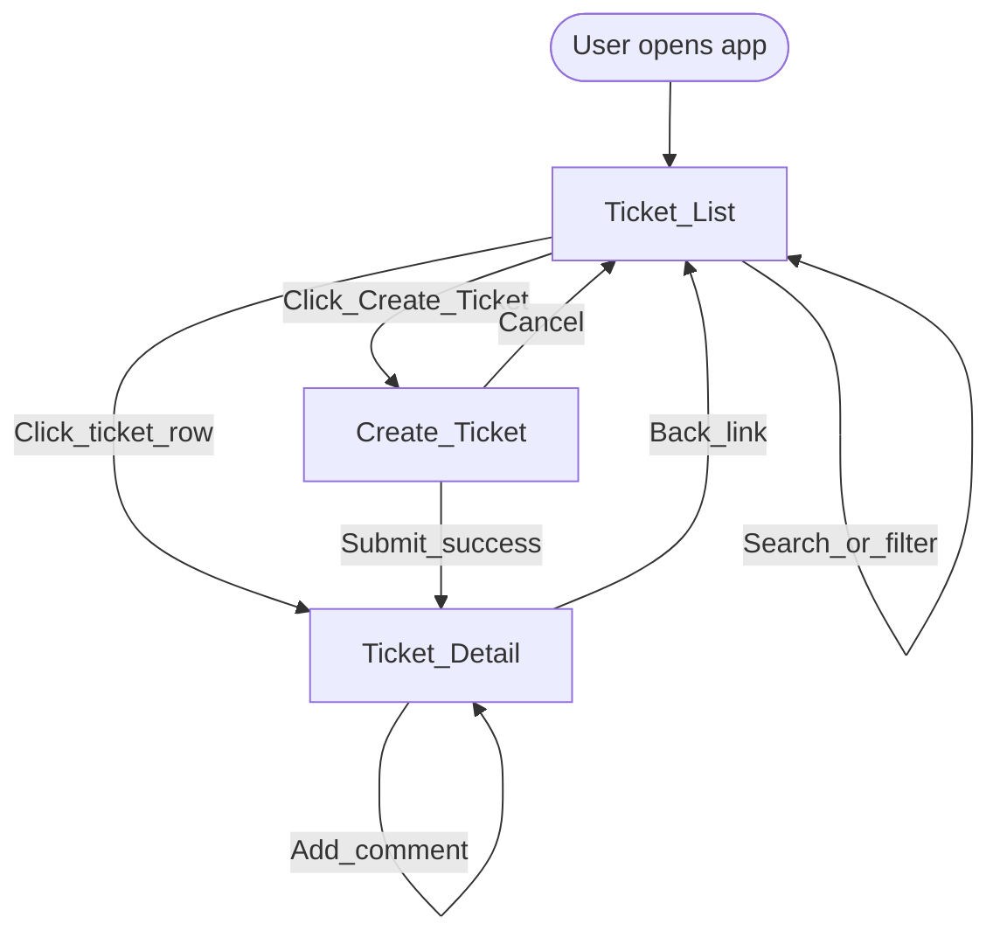
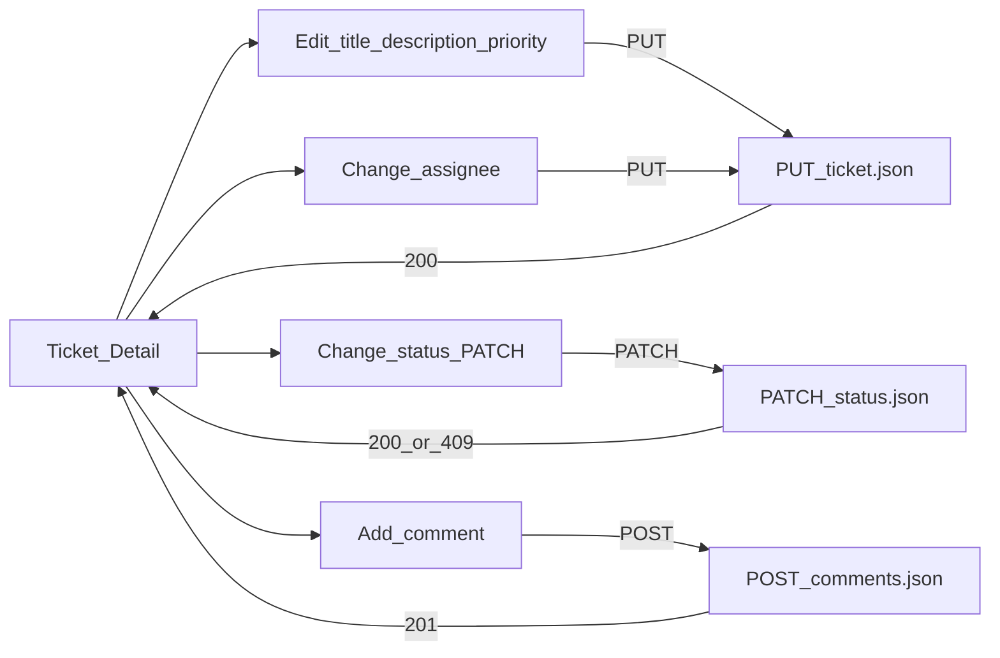
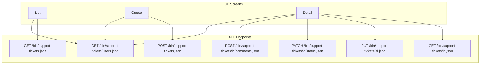

# UI Flow — Support Ticket Management System

**Project:** AI Practical Assessment  
**Platform:** AEM as a Cloud Service (AEMaaCS)  
**Source documents:** [api-contract.md](api-contract.md), [acceptance-criteria.md](acceptance-criteria.md), [design-notes.md](design-notes.md), [data-model.md](data-model.md)  
**Document version:** 1.0  
**Status:** Approved for implementation  
**Implementation:** Not yet implemented — design only

---

## 1. Purpose

This document defines the **minimum practical Core UI** for the Support Ticket Management System. The interface is intentionally simple and professional: three screens, table-based list, form-based create/edit, and explicit error handling. No authentication UI, no user management, no delete, no pagination, and no visual complexity beyond what Core requires.

### Design principles

| Principle | Application |
|-----------|-------------|
| API as source of truth | All ticket data loaded and saved via JSON servlets |
| Backend enforces rules | UI hints (`allowedTransitions`) are advisory; errors shown when API rejects |
| Minimal screens | List, Create, Detail — no separate edit or reassign pages |
| Progressive disclosure | Search/filter on list; edit/status/comment on detail |
| Accessible feedback | Loading, empty, error, and success states on every async action |
| Safe rendering | User content via `textContent` / HTL text context only |

### Technology (from architecture)

- **HTL** page shells under `/content/support-app/`
- **Clientlibs** (vanilla JS + CSS) for dynamic behaviour
- **fetch** API for JSON calls
- **CSRF** token on mutating requests (Publish/Dispatcher)

---

## 2. Screen inventory

| Screen | URL (Publish example) | Core flows covered |
|--------|----------------------|-------------------|
| **Ticket List** | `/content/support-app.html` | List, search, filter |
| **Create Ticket** | `/content/support-app/create.html` | Create |
| **Ticket Detail** | `/content/support-app/ticket.html?id={ticketId}` | Detail, edit, reassign, status change, comment, errors |

**Global:** Error handling patterns apply on all screens (flow 10).

---

## 3. User-flow diagram

### 3.1 Primary navigation



### 3.2 Detail screen actions



### 3.3 API interaction map



---

## 4. Global UI patterns

### 4.1 Shared layout

| Element | Description |
|---------|-------------|
| **App header** | Title: "Support Tickets"; persistent on all screens |
| **Alert region** | Top-of-page banner for errors and success messages (`role="alert"`) |
| **Back link** | Create and Detail screens link back to List |
| **Acting as** | Not global — `createdBy` selected on Create and Comment forms only |

### 4.2 API client behaviour

| Concern | Behaviour |
|---------|-----------|
| Base URL | `/bin/support-tickets` (relative) |
| Headers | `Accept: application/json`; `Content-Type: application/json` on mutations |
| CSRF | Fetch token from `/libs/granite/csrf/token.json` before POST/PUT/PATCH; send `:cq_csrf_token` header |
| Error parse | Read JSON body `{ code, message, fields, details }` on 4xx/5xx |
| User display | Map user path to display name from cached `GET /users.json` response |

### 4.3 Flow 10 — Handle backend errors (global)

Applies to **every** mutating and loading action on all screens.

| Error type | HTTP | UI behaviour |
|------------|------|--------------|
| Validation | `400` | Show banner with `message`; inline errors from `fields` map next to inputs |
| Not found | `404` | Banner: "Ticket not found."; on Detail → offer link back to List |
| Invalid transition | `409` | Banner: `message` or "Status change not allowed."; refresh `allowedTransitions` from `details` if present |
| Server error | `500` | Banner: generic "Something went wrong. Please try again." |
| Network failure | — | Banner: "Unable to reach server. Check connection and try again." |

**Rules:**

- Never show raw stack traces or JCR paths.
- Preserve form input on validation errors (do not clear fields).
- On 409 status change: reset status dropdown to current value from refreshed detail.
- Dismissible banner; auto-clear on next successful action (optional).

| State | Presentation |
|-------|--------------|
| **Loading** | Disable submit buttons; show "Saving…" / "Loading…" text on action button or inline spinner (CSS) |
| **Empty** | N/A for errors |
| **Error** | Red/neutral alert banner + field highlights |
| **Success** | Green/neutral brief banner: "Ticket saved.", "Status updated.", "Comment added." — auto-hide after 3s |

---

## 5. Screen: Ticket List

**Route:** `/content/support-app.html`  
**Flows:** 1 List tickets · 2 Search · 3 Filter by status

### Purpose

Display all tickets from persistent storage. Allow keyword search and status filtering. Entry point to create a ticket or open a ticket detail.

### Fields (display only)

| Column / control | Source | Notes |
|------------------|--------|-------|
| Search input | User entry | Placeholder: "Search title or description…" |
| Status filter dropdown | User selection | Options: All, Open, In Progress, Resolved, Closed, Cancelled |
| Table: Title | `ticket.title` | Clickable → Detail |
| Table: Status | `ticket.status` | Human label (e.g. "In Progress") |
| Table: Priority | `ticket.priority` | Human label |
| Table: Assignee | `ticket.assignedTo` | Display name or "Unassigned" |
| Table: Updated | `ticket.updatedAt` | Formatted relative or short date |

### Actions

| Action | Trigger | Result |
|--------|---------|--------|
| Load list | Page load | Fetch tickets |
| Search | Submit search form or debounced input (300ms) | Reload with `?q=` |
| Filter by status | Change dropdown | Reload with `?status=` |
| Combined search + filter | Both active | `?q=&status=` |
| Create ticket | "Create Ticket" button | Navigate to Create screen |
| Open detail | Click title row | Navigate to `ticket.html?id={id}` |

### Validation

| Input | Rule |
|-------|------|
| Search `q` | Optional; max 200 chars (truncate or warn client-side) |
| Status filter | Must be valid enum or "All" (omit param) |

Invalid status from API → show error banner (unlikely if dropdown is controlled).

### API interaction

| When | Call |
|------|------|
| Page load | `GET /bin/support-tickets.json` |
| Search | `GET /bin/support-tickets.json?q={encoded}` |
| Filter | `GET /bin/support-tickets.json?status={STATUS}` |
| Combined | `GET /bin/support-tickets.json?q={q}&status={status}` |
| Assignee names | `GET /bin/support-tickets/users.json` once; cache in memory for table labels |

### Loading state

- Initial load: table body shows single row "Loading tickets…" or skeleton rows.
- Search/filter reload: dim table or show inline "Updating…" — keep previous results visible until replace (optional) or show loading row.

### Empty state

| Condition | Message |
|-----------|---------|
| No tickets in system | "No tickets yet." + prominent "Create Ticket" button |
| Search/filter no match | "No tickets match your search." + "Clear filters" link |

### Error state

| Condition | Message |
|-----------|---------|
| `GET` fails (500/network) | Banner: unable to load tickets; "Retry" button re-fetches |
| `400` on query | Banner with API `message` |

### Success feedback

- None required on list (read-only). Navigating away after create shows success on Detail or Create redirect.

---

## 6. Screen: Create Ticket

**Route:** `/content/support-app/create.html`  
**Flow:** 4 Create ticket

### Purpose

Create a new support ticket with required metadata. Ticket is always created with status `OPEN` (server-enforced).

### Fields

| Field | Control | Required | Notes |
|-------|---------|----------|-------|
| Title | Text input | Yes | Max 200 chars |
| Description | Textarea | No | Max 5000 chars |
| Priority | Select | Yes | Low, Medium, High, Critical |
| Acting as (`createdBy`) | Select | Yes | Populated from `GET /users.json` |
| Assignee (`assignedTo`) | Select | No | Includes "Unassigned" empty option |

**Not shown:** Status (always Open on create).

### Actions

| Action | Trigger | Result |
|--------|---------|--------|
| Load form | Page load | Fetch users for dropdowns |
| Submit | "Create Ticket" button | `POST` create; redirect to Detail on success |
| Cancel | "Cancel" link | Navigate to List (no save) |

### Validation

| Field | Client-side (UX) | Server authoritative |
|-------|------------------|---------------------|
| Title | Required; non-blank after trim | `400` `fields.title` |
| Priority | Required selection | `400` `fields.priority` |
| Acting as | Required selection | `400` `fields.createdBy` |
| Assignee | If selected, must be valid user | `400` `fields.assignedTo` |
| Description | Max length indicator optional | `400` if too long |

Client validation mirrors server rules; **submit still relies on API rejection** (AC-111).

### API interaction

| When | Call |
|------|------|
| Page load | `GET /bin/support-tickets/users.json` |
| Submit | `POST /bin/support-tickets.json` with CSRF header |

**Request body:**

```json
{
  "title": "...",
  "description": "...",
  "priority": "HIGH",
  "createdBy": "/home/users/support/agent1",
  "assignedTo": "/home/users/support/agent2"
}
```

Omit `assignedTo` or send `null` when unassigned.

### Loading state

- Page load: dropdowns show "Loading…" until users fetched.
- Submit: disable form; button text "Creating…".

### Empty state

- N/A (form screen). User list empty → banner "No users configured." disable submit.

### Error state

| Condition | UI |
|-----------|-----|
| `400` validation | Banner + inline field errors from `fields` |
| `500` / network | Banner; form values preserved |
| Users fetch fails | Banner; disable submit |

### Success feedback

- Redirect to `ticket.html?id={newId}` with optional query `?created=1`.
- Detail screen shows banner: "Ticket created successfully."

---

## 7. Screen: Ticket Detail

**Route:** `/content/support-app/ticket.html?id={ticketId}`  
**Flows:** 5 Open detail · 6 Edit · 7 Reassign · 8 Change status · 9 Add comment

### Purpose

View full ticket information, edit fields, change assignee, transition status through the state machine, and add comments. Single screen consolidates all mutation flows to minimize navigation.

### Layout sections

1. **Ticket fields** (editable form)
2. **Status** (separate control — not part of main save)
3. **Comments** (read-only list + add form)
4. **Metadata** (read-only: created by, created at, updated at)

### Fields

#### Editable (flows 6, 7) — saved via one "Save changes" action

| Field | Control | Required | Notes |
|-------|---------|----------|-------|
| Title | Text input | Yes | |
| Description | Textarea | No | |
| Priority | Select | Yes | LOW / MEDIUM / HIGH / CRITICAL |
| Assignee | Select | No | "Unassigned" + users list (flow 7) |

#### Status (flow 8) — separate action

| Field | Control | Notes |
|-------|---------|-------|
| Current status | Read-only badge | e.g. "Open" |
| New status | Select | Options = `allowedTransitions` from API only |
| Apply status | Button "Update status" | Triggers PATCH, not PUT |

#### Read-only metadata

| Field | Source |
|-------|--------|
| Ticket ID | `ticket.id` (short display or full UUID) |
| Created by | Display name from user path |
| Created at | Formatted `createdAt` |
| Updated at | Formatted `updatedAt` |

#### Comments (flow 9)

| Field | Control | Required |
|-------|---------|----------|
| Comment list | Rendered thread | — |
| New comment message | Textarea | Yes |
| Acting as | Select | Yes |

**Not shown:** Comment edit/delete; status in main form; `createdBy` edit.

### Actions

| Action | API | Flow |
|--------|-----|------|
| Load detail | `GET .../{id}.json` | 5 |
| Save changes | `PUT .../{id}.json` (title, description, priority, assignedTo) | 6, 7 |
| Update status | `PATCH .../{id}/status.json` | 8 |
| Add comment | `POST .../{id}/comments.json` | 9 |
| Back to list | Navigation | — |

**Separation:** "Save changes" does **not** include status. Status has its own button to reinforce state machine boundary (AC-034).

### Validation

| Action | Client-side | Server |
|--------|-------------|--------|
| Save | Title required; priority required | `400` field errors |
| Status | Only `allowedTransitions` in dropdown | `409` if bypass attempted |
| Comment | Message required; acting as required | `400` field errors |

If `allowedTransitions` is empty (terminal state): hide status dropdown; show message "No further status changes available."

### API interaction

| When | Call |
|------|------|
| Page load | `GET /bin/support-tickets/{ticketId}.json` |
| Page load | `GET /bin/support-tickets/users.json` (if not cached) |
| Save changes | `PUT /bin/support-tickets/{ticketId}.json` + CSRF |
| Update status | `PATCH /bin/support-tickets/{ticketId}/status.json` + CSRF |
| Add comment | `POST /bin/support-tickets/{ticketId}/comments.json` + CSRF |

**PUT body** (partial fields allowed — send all editable fields on save):

```json
{
  "title": "...",
  "description": "...",
  "priority": "HIGH",
  "assignedTo": "/home/users/support/agent1"
}
```

**PATCH status body:**

```json
{ "status": "IN_PROGRESS" }
```

**POST comment body:**

```json
{
  "message": "...",
  "createdBy": "/home/users/support/agent1"
}
```

After successful comment: append to list or re-fetch detail; clear comment textarea.

### Loading state

| Action | Loading UI |
|--------|------------|
| Initial load | Centered "Loading ticket…" replaces content area |
| Save | Button "Saving…"; disable editable fields |
| Status update | Button "Updating…"; disable status controls |
| Add comment | Button "Adding…"; disable comment form |

### Empty state

| Section | Condition | Message |
|---------|-----------|---------|
| Comments | `comments.length === 0` | "No comments yet." |
| Status dropdown | `allowedTransitions.length === 0` | "This ticket is in a final state." |

### Error state

| Condition | UI |
|-----------|-----|
| `404` on load | Full-page message: "Ticket not found." + link to List |
| `400` on save/comment | Banner + field errors |
| `409` on status | Banner: use `message` or "That status change is not allowed."; re-fetch detail to sync dropdown |
| `500` / network | Banner + Retry for load; preserve form on save failure |

### Success feedback

| Action | Message |
|--------|---------|
| Save changes | "Ticket saved." |
| Status update | "Status updated to {label}." |
| Add comment | "Comment added." |
| Arrival from create (`?created=1`) | "Ticket created successfully." |

Brief banner; auto-dismiss after 3 seconds. Update read-only `updatedAt` from API response.

---

## 8. Flow-to-screen matrix

| # | Flow | Screen | Primary action |
|---|------|--------|----------------|
| 1 | List tickets | List | Page load → GET list |
| 2 | Search tickets | List | Search input → GET with `q` |
| 3 | Filter by status | List | Status dropdown → GET with `status` |
| 4 | Create ticket | Create | POST → redirect Detail |
| 5 | Open ticket detail | Detail | GET detail by `id` query param |
| 6 | Edit ticket | Detail | PUT title, description, priority |
| 7 | Reassign ticket | Detail | PUT `assignedTo` (same Save button) |
| 8 | Change status | Detail | PATCH status (separate button) |
| 9 | Add comment | Detail | POST comment |
| 10 | Handle backend errors | All | Global alert region + field errors |

---

## 9. Status and priority display labels

Human-readable labels for table and badges (API values unchanged):

| API value | Display label |
|-----------|---------------|
| `OPEN` | Open |
| `IN_PROGRESS` | In Progress |
| `RESOLVED` | Resolved |
| `CLOSED` | Closed |
| `CANCELLED` | Cancelled |
| `LOW` | Low |
| `MEDIUM` | Medium |
| `HIGH` | High |
| `CRITICAL` | Critical |

---

## 10. Visual design guidelines (minimal)

| Aspect | Guideline |
|--------|-----------|
| Layout | Single column, max-width ~960px, centered |
| Typography | System font stack; clear heading hierarchy |
| Colour | Neutral background; subtle borders; status badges with muted colours |
| Spacing | Consistent 8px grid; adequate form field spacing |
| Buttons | Primary (solid) for main action; secondary (outline) for Cancel |
| Table | Simple striped or bordered rows; hover on clickable title |
| Forms | Labels above inputs; required marked with asterisk |
| Accessibility | Labels associated with inputs; alert region `role="alert"`; keyboard-focusable controls |

**Explicitly excluded:** Dashboards, charts, avatars, dark mode, toast libraries, modal dialogs, side navigation, bulk actions, ticket delete, inline user management.

---

## 11. Author vs Publish behaviour

| Surface | Notes |
|---------|-------|
| **Author (4502)** | Same UI; CSRF may not be required for dev |
| **Publish (4503)** | Same UI |
| **Dispatcher (80)** | Same UI; CSRF required on mutations; primary test target for AC-152 |

No Author-only UI features in Core.

---

## 12. Component mapping (HTL — implementation reference)

| HTL component | Screen | Notes |
|---------------|--------|-------|
| `support-tickets/components/page` | All | App shell, header, clientlib includes |
| `support-tickets/components/ticket-list` | List | Table + search/filter markup |
| `support-tickets/components/ticket-form` | Create | Create form |
| `support-tickets/components/ticket-detail` | Detail | Edit + status + comments |

Clientlibs: `support-tickets.app` (list.js, detail.js, create.js, api.js, csrf.js, app.css).

*Implementation deferred — this section is structural reference only.*

---

## 13. Traceability

| UI flow | Acceptance criteria |
|---------|---------------------|
| List | AC-010, AC-011 |
| Search | AC-070 – AC-073 |
| Status filter | AC-080 – AC-082 |
| Create | AC-001, AC-003 – AC-006 |
| Detail view | AC-020 – AC-022 |
| Edit / reassign | AC-030 – AC-033 |
| Status change | AC-040 – AC-044, AC-050 – AC-057, AC-102 |
| Comments | AC-060 – AC-062 |
| Error handling | AC-110, AC-111 |
| Users dropdown | AC-120 |
| Dispatcher | AC-152 |

---

## 14. Document History

| Version | Date | Author | Changes |
|---------|------|--------|---------|
| 1.0 | 2026-08-27 | AI-assisted | Initial Core UI flow design |
